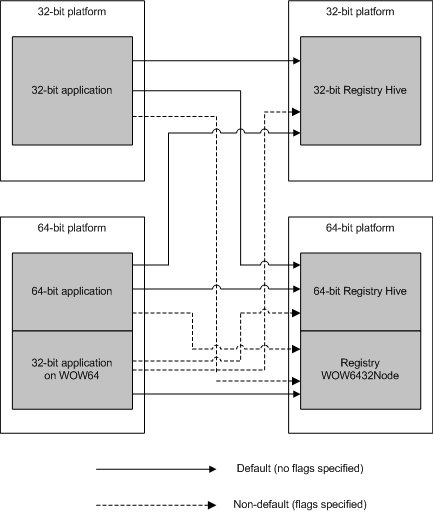

# Getting and Providing Data on a 64-bit Computer

Client applications and scripts that access standard WMI 32-bit providers continue to operate normally when running on a 64-bit operating system. Only two preinstalled providers, the [System Registry provider](/previous-versions/windows/desktop/regprov/system-registry-provider) and the [View provider](view-provider.md), have 64-bit versions which run side-by-side with the 32-bit versions. However, a 32-bit application that requests 32-bit Windows Driver Model (WDM) instances receives the default 64-bit WDM class instances on a 64-bit operating system.

## Accessing Default and Nondefault Provider Data

Generally, provider writers do not include both 32-bit and 64-bit versions of a provider in the same operating system. If no 64-bit provider exists, a 32-bit provider can continue to run through the facilities of WOW64. A 64-bit provider can likewise supply data to a 32-bit application. For more information, see [Providing WMI Data on a 64-bit Platform](providing-wmi-data-on-a-64-bit-platform.md).

If two versions exist, client applications and scripts can use the context parameters available in the [COM API](com-api-for-wmi.md) and the [Scripting API](scripting-api-for-wmi.md) to connect explicitly to a specific nondefault WMI provider, if it is available. For more information, see [Requesting WMI Data on a 64-bit Platform](requesting-wmi-data-on-a-64-bit-platform.md).

The following diagram shows the default and nondefault connections, using the registry as an example for which two providers can exist side-by-side on a 64-bit platform.

## Related topics

<dl> <dt>

[Requesting WMI Data on a 64-bit Platform](requesting-wmi-data-on-a-64-bit-platform.md)
</dt> <dt>

[Providing WMI Data on a 64-bit Platform](providing-wmi-data-on-a-64-bit-platform.md)
</dt> </dl>

 

 
