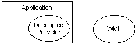

# Incorporating a Provider in an Application

When creating an application that is to be instrumented, the best practice is to include the provider as a component within the application itself. This practice permits Windows Management Instrumentation (WMI) to interact with the service provider directly instead of indirectly through the program API. Decoupling the provider from WMI also puts the application in control of the provider lifespan, instead of WMI. For more information about writing a provider that runs in the WMI process, see [Supplying Data to WMI by Writing a Provider](supplying-data-to-wmi-by-writing-a-provider.md). For more information about hosting model and security settings for the provider, see [Provider Hosting and Security](provider-hosting-and-security.md).

The following diagram illustrates the relationship between WMI, a decoupled provider, and an application.



For more information about decoupled provider methods, see [**IWbemDecoupledRegistrar**](/windows/desktop/api/Wbemprov/nn-wbemprov-iwbemdecoupledregistrar) and [**IWbemDecoupledBasicEventProvider**](/windows/desktop/api/Wbemprov/nn-wbemprov-iwbemdecoupledbasiceventprovider).

> [!Note]  
> The decoupled provider supports instance, method, event providers, and event consumers. It does not support class and property providers. For more information, see [Writing a Class Provider](writing-a-class-provider.md) and [Writing a Property Provider](writing-a-property-provider.md).

 

The code examples in this topic require the following references and \#include statements to compile correctly.


```C++
#define _WIN32_DCOM
#include <iostream>
using namespace std;
#include <comdef.h>
#include <wbemidl.h>
#pragma comment(lib, "wbemuuid.lib")
```


The following procedure uses C++ code examples to describe how to incorporate a decoupled provider in your application. The initialization method of the application performs the following steps so that WMI only interacts with a registered decoupled provider.

**To implement a decoupled provider in a C++ application**

1.  Initialize the COM library for use by the calling thread.

    The following code example shows how to initialize the COM library.

    ```C++
    HRESULT hr = S_OK ;
    hr = CoInitializeEx (0, COINIT_MULTITHREADED );
    ```

    

2.  Set the default process security level.

    This level establishes the security level required of other processes to access the client process' information. The authentication level should be RPC\_C\_AUTHN\_LEVEL\_DEFAULT. For more information, see [Maintaining WMI Security](maintaining-wmi-security.md).

    The following code example shows how to set the default security level.

    ```C++
    hr = CoInitializeSecurity (NULL, 
        -1, 
        NULL, 
        NULL,
        RPC_C_AUTHN_LEVEL_DEFAULT,
        RPC_C_IMP_LEVEL_IMPERSONATE,
        NULL, 
        EOAC_DYNAMIC_CLOAKING, 
        NULL);

    if (FAILED(hr))
    {
      CoUninitialize();
      cout << "Failed to initialize security. Error code = 0x"
           << hex << hr << endl;
      return;
    }
    ```

    

3.  Register the decoupled provider registrar.

    The following code example shows how to register the decoupled provider registrar.

    ```C++
    CLSID CLSID_WbemDecoupledRegistrar;
    IID IID_IWbemDecoupledRegistrar;
    IWbemDecoupledRegistrar *myRegistrar = NULL;

    hr = CoCreateInstance(CLSID_WbemDecoupledRegistrar,
                          NULL,
                          CLSCTX_INPROC_SERVER,
                          IID_IWbemDecoupledRegistrar,
                          (void**)&myRegistrar);
    if (SUCCEEDED(hr))
    {
        IUnknown *pIUnknown = NULL;
        // CMyProv is the class added for WMI instance / event provider
        HRESULT hr = CMyProv::CreateInstance(NULL,&pIUnknown);
        if ( SUCCEEDED(hr))
        {
            hr = myRegistrar->Register(0,
                NULL,
                NULL,
                NULL,
                L"root\\cimv2",
                L"DecoupledInstanceProvider",
                pIUnknown);

                pIUnknown->Release();
        }
    }

    if (FAILED (hr))
    {
        if ( myRegistrar )
        {
            myRegistrar->Release () ;
        }
    }
    ```

    

4.  Register the decoupled event provider.

    The following code example shows how to register the decoupled event provider.

    ```C++
    IWbemDecoupledBasicEventProvider *myEvtRegistrar;

    // -- Create an instance of IWbemDecoupledEventProvider
    hr = CoCreateInstance(CLSID_WbemDecoupledBasicEventProvider,
                          NULL,
                          CLSCTX_INPROC_SERVER,
                          IID_IWbemDecoupledBasicEventProvider,
                          (void**)&myEvtRegistrar);

    if (SUCCEEDED(hr))
    {
       // -- Register the DecoupledEventProvider
       hr = myEvtRegistrar->Register(0,
                                     NULL,
                                     NULL,
                                     L"root\\cimv2",
                                     L"DecoupledEventProvider",
                                     NULL, NULL);
       if (SUCCEEDED(hr))
       {
          IWbemServices *pService = NULL;
          hr = myEvtRegistrar->GetService (0, NULL, &pService);
          if (SUCCEEDED(hr))
          {
             IWbemObjectSink *pSink = NULL;
             hr = myEvtRegistrar->GetSink ( 0, NULL, &pSink );
             if (SUCCEEDED(hr))
             {
                // Provide events
             }
          }
       } 
    }
    ```

    

5.  Make the [calls to WMI](making-calls-to-wmi.md) required by the provider's functionality. For more information, see [Manipulating Class and Instance Information](manipulating-class-and-instance-information.md). For more information if the provider services a request for data from a script or application, see [Impersonating a Client](impersonating-a-client.md).

Just prior to terminating, the application must clean up after itself. The following procedure describes how to unregister the decoupled provider so that WMI does not attempt to query it for information.

The following procedure describes how to unregister the decoupled provider.

**To unregister the decoupled provider**

1.  Unregister and release the registrar.

    The following code example shows how to unregister and release the registrar.

    ```C++
    myRegistrar->UnRegister();
    myRegistrar->Release();
    ```

    

2.  Unregister and release the event provider.

    The following code example shows how to unregister and release the event provider.

    ```C++
    myEvtRegistrar->UnRegister();
    myEvtRegistrar->Release();
    ```

    

3.  Clean up the COM server.

    The following code example shows how to uninitialize the COM library.

    ```C++
    CoUninitialize();
    ```

    

## Related topics

<dl> <dt>

[Setting Namepace Security Descriptors](setting-namespace-security-descriptors.md)
</dt> <dt>

[Securing Your Provider](securing-your-provider.md)
</dt> <dt>

[Developing a WMI Provider](developing-a-wmi-provider.md)
</dt> </dl>

 

 


