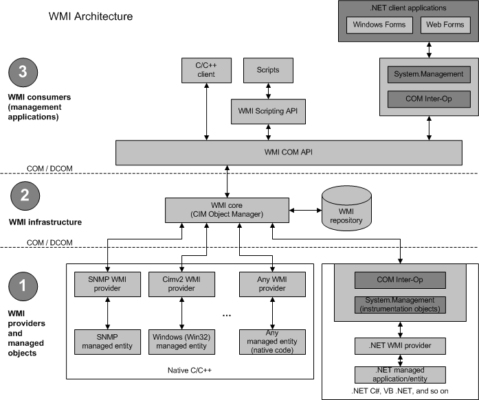

# WMI Architecture

WMI provides a uniform interface for any local or remote applications or scripts that obtain management data from a computer system, a network, or an enterprise. The uniform interface is designed such that WMI client applications and scripts do not have to call a wide variety of operating system application programming interfaces (APIs). Many APIs cannot be called by automation clients like scripts or Visual Basic applications. Other APIs do not make calls to remote computers.

To obtain data from WMI, write a client script or application that accesses [WMI Classes](wmi-classes.md) or provide data to WMI by writing a [*WMI provider*](gloss-p.md). For more information, see [Using WMI](using-wmi.md).

## Objects, Consumers, and Infrastructure of WMI

The following diagram shows the relationship between the WMI infrastructure and the WMI providers and managed objects, and it also shows the relationship between the WMI infrastructure and the WMI consumers.

## WMI Components

The following list describes the key WMI components:

-   Managed objects and WMI providers

    A WMI provider is a COM object that monitors one or more [*managed objects*](gloss-m.md) for WMI. A managed object is a logical or physical enterprise component, such as a hard disk drive, network adapter, database system, operating system, process, or service.

    Similar to a driver, a provider supplies WMI with data from a managed object and handles messages from WMI to the managed object. WMI providers consist of a DLL file and a [*Managed Object Format (MOF)*](gloss-m.md) file that defines the classes for which the provider returns data and performs operations. Providers, like WMI C++ applications, use the [COM API for WMI](com-api-for-wmi.md). For more information, see [Providing Data to WMI](providing-data-to-wmi.md).

    An example of a provider is the preinstalled [Registry provider](/previous-versions/windows/desktop/regprov/system-registry-provider), which accesses data in the system registry. The Registry provider has one [*WMI class*](gloss-w.md), [**StdRegProv**](/previous-versions/windows/desktop/regprov/stdregprov), with many methods but no properties. Other preinstalled providers, such as the [Win32 provider](/windows/desktop/CIMWin32Prov/win32-provider), usually have classes with many properties but few methods, such as [**Win32\_Process**](/windows/desktop/CIMWin32Prov/win32-process) or [**Win32\_LogicalDisk**](/windows/desktop/CIMWin32Prov/win32-logicaldisk). The Registry provider DLL file, Stdprov.dll, contains the code that dynamically returns data when requested by client scripts or applications.

    WMI MOF and DLL files are located in %WINDIR%\\System32\\Wbem, along with the [WMI Command-Line Tools](wmi-command-line-tools.md), such as [**Winmgmt.exe**](winmgmt.md) and [**Mofcomp.exe**](mofcomp.md). Provider classes, such as [**Win32\_LogicalDisk**](/windows/desktop/CIMWin32Prov/win32-logicaldisk), are defined in MOF files, and then compiled into the WMI repository at system startup.

-   [WMI infrastructure](wmi-infrastructure.md)

    The WMI infrastructure is a Microsoft Windows operating system component know as the WMI service(winmgmt). The WMI infrastructure has two components: the WMI Core, and the [*WMI repository*](gloss-w.md).

    The WMI repository is organized by WMI [*namespaces*](gloss-n.md). The WMI service creates some namespaces such as root\\default, root\\cimv2, and root\\subscription at system startup and preinstalls a default set of class definitions, including the [Win32 Classes](/windows/desktop/CIMWin32Prov/win32-provider), the [WMI System Classes](wmi-system-classes.md), and others. The remaining namespaces found on your system are created by providers for other parts of the operating system or products. For more information and a list of WMI providers found in most operating system versions, see [WMI Providers](wmi-providers.md).

    The WMI service acts as an intermediary between the providers, management applications, and the WMI repository. Only static data about objects is stored in the repository, such as the classes defined by providers. WMI obtains most data dynamically from the provider when a client requests it. You also can set up subscriptions to receive event notifications from a provider. For more information, see [Monitoring Events](monitoring-events.md).

-   WMI consumers

    A WMI consumer is a management application or script that interacts with the WMI infrastructure. A management application can query, enumerate data, run provider methods, or subscribe to events by calling either the [COM API for WMI](com-api-for-wmi.md) or the [Scripting API for WMI](scripting-api-for-wmi.md). The only data or actions available for a managed object, such as a disk drive or a service, are those that a provider supplies.

## Related topics

<dl> <dt>

[Using WMI](using-wmi.md)
</dt> <dt>

[WMI Providers](wmi-providers.md)
</dt> <dt>

[Creating a WMI Application or Script](creating-a-wmi-application-or-script.md)
</dt> <dt>

[WMI Tasks for Scripts and Applications](wmi-tasks-for-scripts-and-applications.md)
</dt> <dt>

[Providing Data to WMI](providing-data-to-wmi.md)
</dt> <dt>

[WMI Classes](wmi-classes.md)
</dt> <dt>

[Monitoring Events](monitoring-events.md)
</dt> <dt>

[Calling a Method](calling-a-method.md)
</dt> </dl>

 

 
