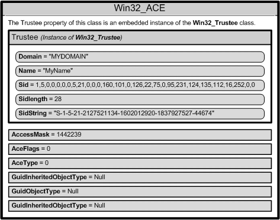

# WMI Security Descriptor Objects

WMI has objects and methods that allow you to read and manipulate security descriptors to determine who has access to securable objects.

-   [The Role of Security Descriptors](#the-role-of-security-descriptors)
-   [Access Control and WMI Security Objects](#access-control-and-wmi-security-objects)
-   [Win32\_SecurityDescriptor Object](/windows)
-   [DACL and SACL](#dacl-and-sacl)
-   [Win32\_ACE, Win32\_Trustee, Win32\_SID](/windows)
-   [Example: Checking Who has Access to Printers](#example-checking-who-has-access-to-printers)
-   [Related topics](#related-topics)

## The Role of Security Descriptors

Security descriptors define the security attributes of securable objects such as files, registry keys, WMI namespaces, printers, services, or shares. A security descriptor contains information about the owner and primary group of an object. A provider can compare the resource security descriptor to the identity of a requesting user, and determine whether or not the user has the right to access the resource that a user is requesting. For more information, see [Access to WMI Securable Objects](access-to-wmi-securable-objects.md).

Some WMI methods, such as [**GetSD**](--systemsecurity-getsd.md), return a security descriptor in the binary byte array format. Starting with Windows Vista, use the methods of the [**Win32\_SecurityDescriptorHelper**](/previous-versions/windows/desktop/secrcw32prov/win32-securitydescriptorhelper) class to convert a binary security descriptor to an instance of [**Win32\_SecurityDescriptor**](/previous-versions/windows/desktop/secrcw32prov/win32-securitydescriptor), which can be manipulated more easily. For more information, see [Changing Access Security on Securable Objects](changing-access-security-on-securable-objects.md).

## Access Control and WMI Security Objects

The following is a list of WMI security objects:

-   [**Win32\_SecurityDescriptor**](/previous-versions/windows/desktop/secrcw32prov/win32-securitydescriptor)
-   [**Win32\_ACE**](/previous-versions/windows/desktop/secrcw32prov/win32-ace)
-   [**Win32\_Trustee**](/previous-versions/windows/desktop/secrcw32prov/win32-trustee)
-   [**Win32\_SID**](/previous-versions/windows/desktop/secrcw32prov/win32-sid)

The following diagram shows the relationships among WMI security objects.


For more information about the role of access security, see [Security Best Practices](/windows/desktop/SecBP/best-practices-for-the-security-apis), [Maintaining WMI Security](maintaining-wmi-security.md), and [Access Control](/windows/desktop/SecAuthZ/access-control).

## Win32\_SecurityDescriptor Object

The following table lists the [**Win32\_SecurityDescriptor**](/previous-versions/windows/desktop/secrcw32prov/win32-securitydescriptor) class properties.


| Property         | Description                                                                                                                                                                                                                                                                                                                                                                                                  |
|------------------|--------------------------------------------------------------------------------------------------------------------------------------------------------------------------------------------------------------------------------------------------------------------------------------------------------------------------------------------------------------------------------------------------------------|
| **ControlFlags** | Set of control bits that qualify the meaning of an SD or its individual members. For more information about setting the **ControlFlags** bit values, see [**Win32\_SecurityDescriptor**](/previous-versions/windows/desktop/secrcw32prov/win32-securitydescriptor).<br/>                                                                                                                                                                      |
| **DACL**         | [Discretionary Access Control List (ACL)](/windows/desktop/SecAuthZ/access-control-lists) of users and groups, and their access rights to a secured object. This property contains an array of [**Win32\_ACE**](/previous-versions/windows/desktop/secrcw32prov/win32-ace) instances that represent [Access Control Entries](/windows/desktop/SecAuthZ/access-control-entries). For more information, see [Creating a DACL](/windows/desktop/SecBP/best-practices-for-the-security-apis).<br/> |
| **Group**        | Group to which this secured object belongs. This property contains an instance of [**Win32\_Trustee**](/previous-versions/windows/desktop/secrcw32prov/win32-trustee) that contains the name, domain, and security identifier (SID) of the group to which the owner belongs.<br/>                                                                                                                                                             |
| **Owner**        | Owner of this secured object. This property contains an instance of [Win32\_Trustee](/previous-versions/windows/desktop/secrcw32prov/win32-trustee) that contains the name, domain, and security identifier (SID) of the owner.<br/>                                                                                                                                                                                                          |
| **SACL**         | [System Access Control List (ACL)](/windows/desktop/SecAuthZ/access-control-lists) contains an array of [**Win32\_ACE**](/previous-versions/windows/desktop/secrcw32prov/win32-ace) instances that represent the type of access attempts that generate audit records for users or groups. For more information, see [SACL for a New Object](/windows/desktop/SecAuthZ/sacl-for-a-new-object).<br/>                                                                        |


 

## DACL and SACL

The arrays of [**Win32\_ACE**](/previous-versions/windows/desktop/secrcw32prov/win32-ace) objects in the discretionary access control list (DACL) and system access control list {SACL) create a link between a user or group and their access rights.

When a DACL property does not contain an access control entry (ACE), access rights are not granted and access to the object is denied.

> [!Note]  
> A **NULL** DACL gives full access to everyone, which is a serious security risk. For more information, see [Creating a DACL](/windows/desktop/SecBP/creating-a-dacl).

 

## Win32\_ACE, Win32\_Trustee, Win32\_SID

A [**Win32\_ACE**](/previous-versions/windows/desktop/secrcw32prov/win32-ace) object contains an instance of the [**Win32\_Trustee**](/previous-versions/windows/desktop/secrcw32prov/win32-trustee) class that identifies a user or group, and an **AccessMask** property that is a bitmask, which specifies the actions that a user or group can take. For example, a user or group might be granted the right to read a file but not write to the file. A **Win32\_ACE** object also contains an ACE that indicates whether or not it is an allow or a deny access.

> [!Note]  
> The [**Win32\_ACE**](/previous-versions/windows/desktop/secrcw32prov/win32-ace) order in a DACL is important because both allow and deny access control entry (ACE) are permitted in a DACL. For more information, see [Order of ACEs in a DACL](/windows/desktop/SecAuthZ/order-of-aces-in-a-dacl).

 

Each user account or group represented by a [**Win32\_Trustee**](/previous-versions/windows/desktop/secrcw32prov/win32-trustee) has a security identifier (SID) that uniquely identifies an account, and specifies the access privileges of the account. How you specify the SID data depends on the operating system. For more information, see [Changing Access Security on Securable Objects](changing-access-security-on-securable-objects.md).

The following diagram shows the contents of one [**Win32\_ACE**](/previous-versions/windows/desktop/secrcw32prov/win32-ace) instance.



## Example: Checking Who has Access to Printers

The following VBScript code example shows how to use the printer security descriptor. The script calls the [**GetSecurityDescriptor**](/windows/desktop/CIMWin32Prov/getsecuritydescriptor-method-in-class-win32-printer) method in the [**Win32\_Printer**](/windows/desktop/CIMWin32Prov/win32-printer) class to obtain the descriptor then determines if there is a Discretionary Access Control List (DACL) present in the security descriptor. If there is a DACL, then the script obtains the list of Access Control Entries (ACE) from the DACL. Each ACE is represented by an instance of [**Win32\_ACE**](/previous-versions/windows/desktop/secrcw32prov/win32-ace). The script checks every ACE to get the name of the user and determine whether the user has access to the printer. The user is represented in by an instance of [**Win32\_Trustee**](/previous-versions/windows/desktop/secrcw32prov/win32-trustee) embedded in the **Win32\_ACE** instance.


```VB
SE_DACL_PRESENT = &h4
ACCESS_ALLOWED_ACE_TYPE = &h0
ACCESS_DENIED_ACE_TYPE  = &h1

strComputer = "."
Set objWMIService = GetObject("winmgmts:" _
    & "{impersonationLevel=impersonate, (Security)}!\\" & strComputer & "\root\cimv2")

Set colInstalledPrinters =  objWMIService.ExecQuery _
    ("Select * from Win32_Printer")

For Each objPrinter in colInstalledPrinters
   Wscript.Echo "Name: " & objPrinter.Name 
' Get security descriptor for printer
    Return = objPrinter.GetSecurityDescriptor( objSD )
    If ( return <> 0 ) Then
 WScript.Echo "Could not get security descriptor: " & Return
 wscript.Quit Return
    End If
' Extract the security descriptor flags
    intControlFlags = objSD.ControlFlags
    If intControlFlags AND SE_DACL_PRESENT Then
' Get the ACE entries from security descriptor
        colACEs = objSD.DACL
    For Each objACE in colACEs
' Get all the trustees and determine which have access to printer
        WScript.Echo objACE.Trustee.Domain & "\" & objACE.Trustee.Name
        If objACE.AceType = ACCESS_ALLOWED_ACE_TYPE Then
            WScript.Echo vbTab & "User has access to printer"
        ElseIf objACE.AceType = ACCESS_DENIED_ACE_TYPE Then
            WScript.Echo vbTab & "User does not have access to the printer"
        End If
    Next
    Else
    WScript.Echo "No DACL found in security descriptor"
End If
Next
```


## Related topics

<dl> <dt>

[Changing Access Security on Securable Objects](changing-access-security-on-securable-objects.md)
</dt> <dt>

[Security Descriptor Helper Class](/previous-versions/windows/desktop/secrcw32prov/win32-securitydescriptorhelper)
</dt> <dt>

[Security Best Practices](/windows/desktop/SecBP/best-practices-for-the-security-apis)
</dt> <dt>

[Maintaining WMI Security](maintaining-wmi-security.md)
</dt> <dt>

[Access Control](/windows/desktop/SecAuthZ/access-control)
</dt> <dt>

[Access to WMI Namespaces](access-to-wmi-namespaces.md)
</dt> </dl>

 

