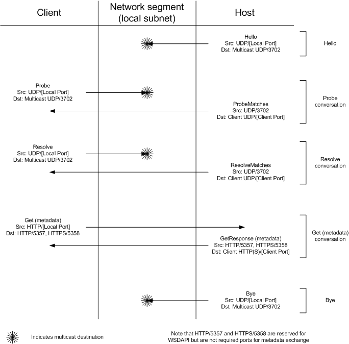

# Discovery and Metadata Exchange Message Patterns

Device Profile for Web Services (DPWS) hosts and clients communicate over the network using a series of SOAP messages over UDP and HTTP.

The following diagram shows an overview of the expected UDP and HTTP traffic between a DPWS host and client.

[Hello](hello-message.md), [Bye](bye-message.md), [Probe](probe-message.md), [Resolve](resolve-message.md), and [Get](get--metadata-exchange--http-request-and-message.md) messages are all generated without network solicitation; these messages are used to announce device state or to issue a search request. [ProbeMatches](probematches-message.md), [ResolveMatches](resolvematches-message.md), and [GetResponse](getresponse--metadata-exchange--message.md) messages are generated in response to Probe, Resolve and Get messages.

[Hello](hello-message.md), [Bye](bye-message.md), [Resolve](resolve-message.md), and [ResolveMatches](resolvematches-message.md) messages will always occur over UDP. Similarly, [Get](get--metadata-exchange--http-request-and-message.md) and [GetResponse](getresponse--metadata-exchange--message.md) metadata messages will always occur over HTTP or HTTPS. [Probe](probe-message.md) and [ProbeMatches](probematches-message.md) messages are normally transmitted over UDP, but take place over an HTTP or HTTPS connection in a directed discovery scenario. For more information about directed discovery message patterns, see [Troubleshooting Applications Using Directed Discovery](troubleshooting-applications-using-directed-discovery.md).

The following list shows the typical sequence of messages on the wire. Not all messages are mandatory.

1.  [Hello](hello-message.md)
2.  [Probe](probe-message.md)
3.  [ProbeMatches](probematches-message.md)
4.  [Resolve](resolve-message.md)
5.  [ResolveMatches](resolvematches-message.md)
6.  [Get](get--metadata-exchange--http-request-and-message.md) (metadata exchange request)
7.  [GetResponse](getresponse--metadata-exchange--message.md)
8.  [Bye](bye-message.md)

## Related topics

<dl> <dt>

[About Web Services on Devices](about-web-services-for-devices.md)
</dt> </dl>

 

 

