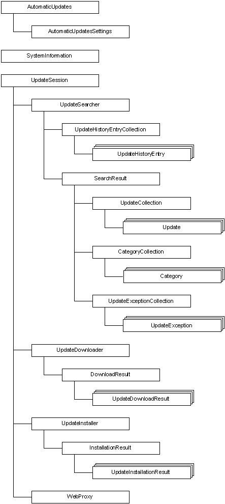

# Windows Update Agent Object Model

Programmers using Windows Update Agent (WUA) begin by adding a reference to Wuapi.dll to their current project (in Visual C++, Microsoft Visual Basic, or C\#) or by referencing Wuapi.h and Wuguid.lib in a C or C++ project. The first step in using the WUA API is to create an instance of one of the interfaces by creating an object from the appropriate coclass.

The following illustration describes the WUA object model. For more information, see the "[WUA Objects and Associated Tasks](#wua-objects-and-associated-tasks)" section. For a complete list of all the WUA interfaces, see [Interfaces](interfaces.md).

## WUA Objects and Associated Tasks

The following table lists the WUA objects and the typical tasks that are associated with the WUA objects.

| Object                                                                | Description                                                                                                                                                                                                                                 |
|-----------------------------------------------------------------------|---------------------------------------------------------------------------------------------------------------------------------------------------------------------------------------------------------------------------------------------|
| [**AutomaticUpdates**](/windows/desktop/api/Wuapi/nn-wuapi-iautomaticupdates)                         | Begin, pause, or resume Automatic Updates.                                                                                                                                                                                                  |
| [**AutomaticUpdatesSettings**](/windows/desktop/api/Wuapi/nn-wuapi-iautomaticupdatessettings)         | Retrieve or set the day and time to install updates. Specify how users are notified of an Automatic Updates event.                                                                                                                          |
| [**Category**](/windows/desktop/api/Wuapi/nn-wuapi-icategory)                                         | Retrieve information about the update's category, including the name, ID, description, owner, and intended product. Retrieve a collection of updates that belong to this category. Retrieve a collection of the parent or child categories. |
| [**CategoryCollection**](/windows/desktop/api/Wuapi/nn-wuapi-icategorycollection)                     | Access a collection of Category objects.                                                                                                                                                                                                    |
| [**DownloadResult**](/windows/desktop/api/Wuapi/nn-wuapi-idownloadresult)                             | Retrieve information about the result of a download.                                                                                                                                                                                        |
| [**InstallationResult**](/windows/desktop/api/Wuapi/nn-wuapi-iinstallationresult)                     | Retrieve information about the result of an installation or uninstallation. Determine whether a system restart is required to complete the installation or uninstallation.                                                                  |
| [**SearchResult**](/windows/desktop/api/Wuapi/nn-wuapi-isearchresult)                                 | Retrieve information about the result of a search for categories or updates. Retrieve a collection of categories found on the destination computer by the search. Retrieve a collection of updates found by the search.                     |
| [**SystemInformation**](/windows/desktop/api/Wuapi/nn-wuapi-isysteminformation)                       | Retrieve information about OEM hardware and system restart requirements on the destination computer.                                                                                                                                        |
| [**Update**](/windows/desktop/api/Wuapi/nn-wuapi-iupdate)                                             | Retrieve most information about the update, including bundled updates, source requirements, identity, description, uninstall options, download priority, size, and deadline.                                                                |
| [**UpdateCollection**](/windows/desktop/api/Wuapi/nn-wuapi-iupdatecollection)                         | Access a collection of Update objects.                                                                                                                                                                                                      |
| [**UpdateDownloader**](/windows/desktop/api/Wuapi/nn-wuapi-iupdatedownloader)                         | Start an asynchronous or synchronous download of the files that are associated with the updates.                                                                                                                                            |
| [**UpdateDownloadResult**](/windows/desktop/api/Wuapi/nn-wuapi-iupdatedownloadresult)                 | Retrieve information about the result of the download for one update.                                                                                                                                                                       |
| [**UpdateException**](/windows/desktop/api/Wuapi/nn-wuapi-iupdateexception)                           | Retrieve the description and context of an exception that is thrown when an update error occurs.                                                                                                                                            |
| [**UpdateExceptionCollection**](/windows/desktop/api/Wuapi/nn-wuapi-iupdateexceptioncollection)       | Access a collection of UpdateException objects.                                                                                                                                                                                             |
| [**UpdateHistoryEntry**](/windows/desktop/api/Wuapi/nn-wuapi-iupdatehistoryentry)                     | Retrieve information about an update that has been installed or uninstalled, including the processed application, date, and description.                                                                                                    |
| [**UpdateHistoryEntryCollection**](/windows/desktop/api/Wuapi/nn-wuapi-iupdatehistoryentrycollection) | Access a collection of UpdateHistoryEntry objects.                                                                                                                                                                                          |
| [**UpdateInstallationResult**](/windows/desktop/api/Wuapi/nn-wuapi-iupdateinstallationresult)         | Retrieve information about the result of the installation or uninstallation for an update.                                                                                                                                                  |
| [**UpdateInstaller**](/windows/desktop/api/Wuapi/nn-wuapi-iupdateinstaller)                           | Start an asynchronous or synchronous installation or uninstallation of an update. Start an interactive dialog sequence to guide the user through the steps to install updates.                                                              |
| [**UpdateSearcher**](/windows/desktop/api/Wuapi/nn-wuapi-iupdatesearcher)                             | Searches for updates on the server by criteria such as the update type, the ID, or the category.                                                                                                                                            |
| [**UpdateSession**](/windows/desktop/api/Wuapi/nn-wuapi-iupdatesession)                               | Start a session to search, download, install, or uninstall the updates for an application.                                                                                                                                                  |
| [**WebProxy**](/windows/desktop/api/Wuapi/nn-wuapi-iwebproxy)                                         | Retrieve and set HTTP proxy settings.                                                                                                                                                                                                       |

 

 

 

