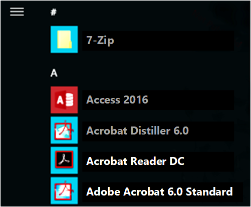

# Troubleshooting packaging, deployment, and query of Windows apps

Use these suggestions to troubleshoot problems you experience when packaging, deploying, or querying a Windows app package (.msix/.appx) as a developer.

> [!NOTE]
> This article is intended for developers. If you are not a developer and you are looking for help with a Windows app installation error, see [Windows support](https://support.microsoft.com/hub/4338813/windows-help?os=windows-10).

## Get diagnostic information

When an API fails, it returns an error code that describes the problem. If the error code doesn't provide enough information, you find more diagnostic information in the detailed event logs.

To access the packaging and deployment event logs by using **Event Viewer**, follow these steps:

1. Perform one of the following steps:

    * Click **Start** on the Windows menu, type **Event Viewer**, and **press Enter**.
    * Run **eventvwr.msc**.

2. In the left page, expand **Event Viewer (Local)** > **Applications and Services Logs** > **Microsoft** > **Windows**.
3. Check for available logs under these categories:

    * **AppxPackagingOM** > **Microsoft-Windows-AppxPackaging/Operational**
    * **AppXDeployment-Server** > **Microsoft-Windows-AppXDeploymentServer/Operational**

Start by looking at the logs under **AppXDeployment-Server**. If the error was caused by **0x80073CF0** or **ERROR_INSTALL_OPEN_PACKAGE_FAILED**, additional details may be present in the **AppxpackagingOM** logs.

You can also use the [Get-AppxLog](/powershell/module/appx/get-appxlog) command in PowerShell to get the first few logged events. The following example displays the logs associated with the most recent deployment operation.

```PowerShell
Get-Appxlog
```

The following example displays the logs associated with the most recent deployment operation in an interactive table in a separate window.

```PowerShell
Get-Appxlog | Out-GridView
```

## Common error codes

This table lists some of the most common error codes. If you need further help with one of these errors, or if you're encountering an error code not in this list, see [additional help options](#get-additional-help).

<table>
<colgroup>
<col style="width: 33%" />
<col style="width: 33%" />
<col style="width: 33%" />
</colgroup>
<thead>
<tr class="header">
<th>Error code</th>
<th>Value</th>
<th>Description and possible causes</th>
</tr>
</thead>
<tbody>
<tr class="even">
<td><strong>E_FILENOTFOUND</strong></td>
<td>0x80070002</td>
<td>File or path is not found. This can occur during a COM  typelib validation requires that the path for the directory actually exist within your MSIX package.<br/></td>
</tr>
<tr class="odd">
<td><strong>ERROR_BAD_FORMAT</strong></td>
<td>0x8007000B</td>
<td>The package isn't correctly formatted and needs to be re-built or re-signed.<br/> You may get this error if there is a mismatch between the signing certificate subject name and the AppxManifest.xml publisher name.<br/> See <a href="how-to-sign-a-package-using-signtool.md">How to sign an app package using SignTool</a>.<br/></td>
</tr>
<tr class="even">
<td><strong>E_INVALIDARG</strong></td>
<td>0x80070057</td>
<td>One or more arguments are not valid. If you check the AppXDeployment-Server event log and see the following event: "While installing the package, the system failed to register the windows.repositoryExtension extension due to the following error: The parameter is incorrect." <br/> You may get this error if the manifest elements DisplayName or Description contain characters disallowed by Windows firewall; namely  |  and  all , due to which Windows fails to create the AppContainer profile for the package. Please remove these characters from the manifest and try installing the package. <br/></td>
</tr>
<tr class="even">
<td><strong>ERROR_INSTALL_OPEN_</strong><br/> <strong>PACKAGE_FAILED</strong><br/></td>
<td>0x80073CF0</td>
<td>The package couldn't be opened.<br/> Possible causes:<br/>
<ul>
<li>The package is unsigned.</li>
<li>The publisher name doesn't match the signing certificate subject.</li>
<li>The file:// prefix is missing or the package couldn't be found at the specified location.</li>
</ul>
For more information, check the <strong>AppxPackagingOM</strong> event log.<br/></td>
</tr>
<tr class="odd">
<td><strong>ERROR_INSTALL_PACKAGE_</strong><br/> <strong>NOT_FOUND</strong><br/></td>
<td>0x80073CF1</td>
<td>The package couldn't be found.<br/> You may get this error while removing a package that isn't installed for the current user.<br/></td>
</tr>
<tr class="even">
<td><strong>ERROR_INSTALL_INVALID_</strong><br/> <strong>PACKAGE</strong><br/></td>
<td>0x80073CF2</td>
<td>The package data isn't valid.<br/></td>
</tr>
<tr class="odd">
<td><strong>ERROR_INSTALL_RESOLVE_</strong><br/> <strong>DEPENDENCY_FAILED</strong><br/></td>
<td>0x80073CF3</td>
<td>The package failed update, dependency, or conflict validation.<br/> Possible causes:<br/>
<ul>
<li>The incoming package conflicts with an installed package.</li>
<li>A specified package dependency can't be found.</li>
<li>The package doesn't support the correct processor architecture.</li>
</ul>
For more informtion, check the <strong>AppXDeployment-Server</strong> event log.<br/></td>
</tr>
<tr class="even">
<td><strong>ERROR_INSTALL_OUT_</strong><br/> <strong>OF_DISK_SPACE</strong><br/></td>
<td>0x80073CF4</td>
<td>There isn't enough disk space on your computer. Free some space and try again.<br/></td>
</tr>
<tr class="odd">
<td><strong>ERROR_INSTALL_NETWORK_</strong><br/> <strong>FAILURE</strong><br/></td>
<td>0x80073CF5</td>
<td>The package can't be downloaded.<br/></td>
</tr>
<tr class="even">
<td><strong>ERROR_INSTALL_</strong><br/> <strong>REGISTRATION_FAILURE</strong><br/></td>
<td>0x80073CF6</td>
<td>The package can't be registered.<br/> For more information, check the <strong>AppXDeployment-Server</strong> event log.<br/></td>
</tr>
<tr class="odd">
<td><strong>ERROR_INSTALL_</strong><br/> <strong>DEREGISTRATION_EFAILURE</strong><br/></td>
<td>0x80073CF7</td>
<td>The package can't be unregistered.<br/> You may get this error while removing a package.<br/> For more information, check the <strong>AppXDeployment-Server</strong> event log.<br/></td>
</tr>
<tr class="even">
<td><strong>ERROR_INSTALL_CANCEL</strong></td>
<td>0x80073CF8</td>
<td>The user canceled the install request.<br/></td>
</tr>
<tr class="odd">
<td><strong>ERROR_INSTALL_FAILED</strong></td>
<td>0x80073CF9</td>
<td>Package install failed. Contact the software vendor.<br/> For more information, check the <strong>AppXDeployment-Server</strong> event log.<br/></td>
</tr>
<tr class="even">
<td><strong>ERROR_REMOVE_FAILED</strong></td>
<td>0x80073CFA</td>
<td>Package removal failed.<br/> You may get this error for failures that occur during package uninstall.<br/> For more information, see <a href="/uwp/api/windows.management.deployment.packagemanager.removepackageasync"><strong>RemovePackageAsync</strong></a>.<br/></td>
</tr>
<tr class="odd">
<td><strong>ERROR_PACKAGE_</strong><br/> <strong>ALREADY_EXISTS</strong><br/></td>
<td>0x80073CFB</td>
<td>The provided package is already installed, and reinstallation of the package is blocked. <br/> You may get this error if installing a package that is not bitwise identical to the package that is already installed. Note that the digital signature is also part of the package. Hence if a package is rebuilt or resigned, it is no longer bitwise identical to the previously installed package. Two possible options to fix this error are: (1) Increment the version number of the app, then rebuild and resign the package (2) Remove the old package for every user on the system before installing the new package. <br/></td>
</tr>
<tr class="even">
<td><strong>ERROR_NEEDS_REMEDIATION</strong></td>
<td>0x80073CFC</td>
<td>The app can't be started. Try reinstalling the app.<br/></td>
</tr>
<tr class="odd">
<td><strong>ERROR_INSTALL_</strong><br/> <strong>PREREQUISITE_FAILED</strong><br/></td>
<td>0x80073CFD</td>
<td>A specified install prerequisite couldn't be satisfied.<br/></td>
</tr>
<tr class="even">
<td><strong>ERROR_PACKAGE_</strong><br/> <strong>REPOSITORY_CORRUPTED</strong><br/></td>
<td>0x80073CFE</td>
<td>The package repository is corrupted.<br/> You may get this error if the folder referenced by this registry key doesn't exist or is corrupted: <br/> <strong>HKLM\Software\Microsoft\Windows\</strong><br/> <strong>CurrentVersion\Appx\PackageRepositoryRoot</strong><br/> To recover from this state, refresh your PC.<br/></td>
</tr>
<tr class="odd">
<td><strong>ERROR_INSTALL_</strong><br/> <strong>POLICY_FAILURE</strong><br/></td>
<td>0x80073CFF</td>
<td>To install this app, you need a developer license or a sideloading-enabled system. <br/> You may get this error if the package doesn't meet one of the following requirements:<br/>
<ul>
<li>The app is deployed using F5 in Visual Studio on a computer with a Windows developer license.</li>
<li>The package is signed with a Microsoft signature and deployed as part of Windows or from the Microsoft Store.</li>
<li>The package is signed with a trusted signature and installed on a computer with a developer license, a domain-joined computer with the AllowAllTrustedApps policy enabled, or a computer with a Windows Sideloading license with the AllowAllTrustedApps policy enabled.</li>
</ul></td>
</tr>
<tr class="even">
<td><strong>ERROR_PACKAGE_UPDATING</strong></td>
<td>0x80073D00</td>
<td>The app can't be started because it's currently updating.<br/></td>
</tr>
<tr class="odd">
<td><strong>ERROR_DEPLOYMENT_</strong><br/> <strong>BLOCKED_BY_POLICY</strong><br/></td>
<td>0x80073D01</td>
<td>The package deployment operation is blocked by policy. Contact your system administrator.<br/> Possible causes:<br/>
<ul>
<li>Package deployment is blocked by Application Control Policies.</li>
<li>Package deployment is blocked by the &quot;Allow deployment operations in special profiles&quot; policy.</li>
</ul>
One of the possible reasons is a need for a roaming profile. For information about setting up Roaming User Profiles on user accounts, see <a href="/previous-versions/windows/it-pro/windows-server-2012-R2-and-2012/jj649079(v=ws.11)">Deploy Roaming User Profiles</a>. If there are no policies configured on your system and you still see this error, perhaps you are logged in with a temporary profile. Log out and log in again, then try the operation again.<br/></td>
</tr>
<tr class="even">
<td><strong>ERROR_PACKAGES_IN_USE</strong></td>
<td>0x80073D02</td>
<td>The package couldn't be installed because resources it modifies are currently in use.<br/></td>
</tr>
<tr class="odd">
<td><strong>ERROR_RECOVERY_</strong><br/> <strong>FILE_CORRUPT</strong><br/></td>
<td>0x80073D03</td>
<td>The package couldn't be recovered because data that's necessary for recovery is corrupted.<br/></td>
</tr>
<tr class="even">
<td><strong>ERROR_INVALID_</strong><br/> <strong>STAGED_SIGNATURE</strong><br/></td>
<td>0x80073D04</td>
<td>The signature isn't valid. To register in developer mode, AppxSignature.p7x and AppxBlockMap.xml must be valid or shouldn't be present.<br/> If you are a developer using F5 with Visual Studio, ensure that your built project directory doesn't contain signature or block map files from previous versions of the package.<br/></td>
</tr>
<tr class="odd">
<td><strong>ERROR_DELETING_EXISTING_</strong><br/> <strong>APPLICATIONDATA_STORE_FAILED</strong><br/></td>
<td>0x80073D05</td>
<td>An error occurred while deleting the package's previously existing application data.<br/> You can get this error if the <a href="/previous-versions/hh441475(v=vs.110)">simulator</a> is running. Close the simulator. You can also get this error if there are files open in the app data (for example, if you have a log file open in a text editor).<br/></td>
</tr>
<tr class="even">
<td><strong>ERROR_INSTALL_</strong><br/> <strong>PACKAGE_DOWNGRADE</strong><br/></td>
<td>0x80073D06</td>
<td>The package couldn't be installed because a higher version of this package is already installed.<br/></td>
</tr>
<tr class="odd">
<td><strong>ERROR_SYSTEM_</strong><br/> <strong>NEEDS_REMEDIATION</strong><br/></td>
<td>0x80073D07</td>
<td>An error in a system binary was detected. To fix the problem, try refreshing the PC. <br/></td>
</tr>
<tr class="even">
<td><strong>ERROR_APPX_INTEGRITY_</strong><br/> <strong>FAILURE_EXTERNAL</strong><br/></td>
<td>0x80073D08</td>
<td>A corrupted non-Windows binary was detected on the system. <br/></td>
</tr>
<tr class="odd">
<td><strong>ERROR_RESILIENCY_</strong><br/> <strong>FILE_CORRUPT</strong><br/></td>
<td>0x80073D09</td>
<td>The operation couldn't be resumed because data that's necessary for recovery is corrupted. <br/></td>
</tr>
<tr class="even">
<td><strong>ERROR_INSTALL_FIREWALL_</strong><br/> <strong>SERVICE_NOT_RUNNING</strong><br/></td>
<td>0x80073D0A</td>
<td>The package couldn't be installed because the Windows Firewall service isn't running. Enable the Windows Firewall service and try again.<br/></td>
</tr>
<tr class="odd">
<td><strong>ERROR_PACKAGE_MOVE_FAILED</strong></td>
<td>0x80073D0B</td>
<td>The package move operation failed.<br/></td>
</tr>
<tr class="even">
<td><strong>ERROR_INSTALL_VOLUME_</strong><br/> <strong>NOT_EMPTY</strong><br/></td>
<td>0x80073D0C</td>
<td>The deployment operation failed because the volume is not empty.<br/></td>
</tr>
<tr class="odd">
<td><strong>ERROR_INSTALL_VOLUME_</strong><br/> <strong>OFFLINE</strong><br/></td>
<td>0x80073D0D</td>
<td>The deployment operation failed because the volume is offline. For a package update, the volume refers to the installed volume of all package versions.<br/></td>
</tr>
<tr class="even">
<td><strong>ERROR_INSTALL_VOLUME_</strong><br/> <strong>CORRUPT</strong><br/></td>
<td>0x80073D0E</td>
<td>The deployment operation failed because the specified volume is corrupt.<br/></td>
</tr>
<tr class="even">
<td><strong>ERROR_NEEDS_REGISTRATION</strong><br/> <strong></strong><br/></td>
<td>0x80073D0F</td>
<td>The deployment operation failed because the specified application needs to be registered first.<br/></td>
</tr>
<tr class="odd">
<td><strong>ERROR_INSTALL_WRONG_</strong><br/> <strong>PROCESSOR_ARCHITECTURE</strong><br/></td>
<td>0x80073D10</td>
<td>The deployment operation failed because the package targets the wrong processor architecture.<br/></td>
</tr>
<tr class="even">
<td><strong>ERROR_DEV_SIDELOAD_</strong><br/> <strong>LIMIT_EXCEEDED</strong><br/></td>
<td>0x80073D11</td>
<td>You have reached the maximum number of developer sideloaded packages allowed on this device. Please uninstall a sideloaded package and try again.<br/></td>
</tr>
<tr class="odd">
<td><strong>ERROR_INSTALL_OPTIONAL_</strong><br/> <strong>PACKAGE_REQUIRES_</strong><br/> <strong>MAIN_PACKAGE</strong><br/></td>
<td>0x80073D12</td>
<td>A main app package is required to install this optional package. Install the main package first and try again.<br/></td>
</tr>
<tr class="even">
<td><strong>ERROR_PACKAGE_NOT_</strong><br/> <strong>SUPPORTED_ON_FILESYSTEM</strong><br/></td>
<td>0x80073D13</td>
<td>This app package type is not supported on this filesystem.<br/></td>
</tr>
<tr class="odd">
<td><strong>ERROR_PACKAGE_MOVE_</strong><br/> <strong>BLOCKED_BY_STREAMING</strong><br/></td>
<td>0x80073D14</td>
<td>Package move operation is blocked until the application has finished streaming.<br/></td>
</tr>
<tr class="even">
<td><strong>ERROR_INSTALL_OPTIONAL_</strong><br/> <strong>PACKAGE_APPLICATIONID_</strong><br/> <strong>NOT_UNIQUE</strong><br/></td>
<td>0x80073D15</td>
<td>A main or another optional app package has the same application ID as this optional package. Change the application ID for the optional package to avoid conflicts.<br/></td>
</tr>
<tr class="odd">
<td><strong>ERROR_PACKAGE_STAGING_</strong><br/> <strong>ONHOLD</strong><br/></td>
<td>0x80073D16</td>
<td>This staging session has been held to allow another staging operation to be prioritized.<br/></td>
</tr>
<tr class="even">
<td><strong>ERROR_INSTALL_INVALID_</strong><br/> <strong>RELATED_SET_UPDATE</strong><br/></td>
<td>0x80073D17</td>
<td>A related set cannot be updated because the updated set is invalid. All packages in the related set must be updated at the same time.<br/></td>
</tr>
<tr class="odd">
<td><strong>ERROR_INSTALL_OPTIONAL_</strong><br/> <strong>PACKAGE_REQUIRES_MAIN_</strong><br/> <strong>PACKAGE_FULLTRUST_CAPABILITY</strong><br/></td>
<td>0x80073D18</td>
<td>An optional package with a FullTrust entry point requires the main package to have the <strong>runFullTrust</strong> capability.<br/></td>
</tr>
<tr class="even">
<td><strong>ERROR_DEPLOYMENT_BLOCKED_</strong><br/> <strong>BY_USER_LOG_OFF</strong><br/></td>
<td>0x80073D19</td>
<td>An error occurred because a user was logged off.<br/></td>
</tr>
<tr class="even">
<td><strong>ERROR_PROVISION_OPTIONAL_</strong><br/> <strong>PACKAGE_REQUIRES_MAIN_</strong><br/> <strong>PACKAGE_PROVISIONED</strong><br/></td>
<td>0x80073D1A</td>
<td>An optional package provision requires the dependency main package to also be provisioned.<br/></td>
</tr>
<tr class="odd">
<td><strong>ERROR_PACKAGES_REPUTATION_</strong><br/> <strong>CHECK_FAILED</strong><br/></td>
<td>0x80073D1B</td>
<td>The packages failed the <a href="/windows/security/threat-protection/windows-defender-smartscreen/windows-defender-smartscreen-overview">SmartScreen reputation check</a>.<br/></td>
</tr>
<tr class="even">
<td><strong>ERROR_PACKAGES_REPUTATION_</strong><br/> <strong>CHECK_TIMEDOUT</strong><br/></td>
<td>0x80073D1C</td>
<td>The <a href="/windows/security/threat-protection/windows-defender-smartscreen/windows-defender-smartscreen-overview">SmartScreen reputation check</a> operation timed out.<br/></td>
</tr>
<tr class="odd">
<td><strong>ERROR_DEPLOYMENT_OPTION_</strong><br/> <strong>NOT_SUPPORTED</strong><br/></td>
<td>0x80073D1D</td>
<td>The current deployment option is not supported.<br/></td>
</tr>
<tr class="even">
<td><strong>ERROR_APPINSTALLER_</strong><br/> <strong>ACTIVATION_BLOCKED</strong><br/></td>
<td>0x80073D1E</td>
<td>Activation is blocked due to the .appinstaller update settings for this app.<br/></td>
</tr>
<tr class="odd">
<td><strong>ERROR_REGISTRATION_FROM_</strong><br/> <strong>REMOTE_DRIVE_NOT_SUPPORTED</strong><br/></td>
<td>0x80073D1F</td>
<td>Remote drives are not supported. Use <strong>\\server\share</strong> to register a remote package.<br/></td>
</tr>
<tr class="even">
<td><strong>ERROR_APPX_RAW_</strong><br/> <strong>DATA_WRITE_FAILED</strong><br/></td>
<td>0x80073D20</td>
<td>Failed to process and write downloaded package data to disk.<br/></td>
</tr>
<tr class="odd">
<td><strong>ERROR_DEPLOYMENT_BLOCKED_</strong><br/> <strong>BY_VOLUME_POLICY_PACKAGE</strong><br/></td>
<td>0x80073D21</td>
<td>The deployment operation was blocked due to a per-package-family policy restricting deployments on a non-system volume. Per policy, this app must be installed to the system drive, but that's not set as the default. In Storage settings, make the system drive the default location to save new content, then retry the install.<br/></td>
</tr>
<tr class="even">
<td><strong>ERROR_DEPLOYMENT_BLOCKED_</strong><br/> <strong>BY_VOLUME_POLICY_MACHINE</strong><br/></td>
<td>0x80073D22</td>
<td>The deployment operation was blocked due to a machine-wide policy restricting deployments on a non-system volume. Per policy, this app must be installed to the system drive, but that's not set as the default. In Storage settings, make the system drive the default location to save new content, then retry the install.<br/></td>
</tr>
<tr class="odd">
<td><strong>ERROR_DEPLOYMENT_BLOCKED_</strong><br/> <strong>BY_PROFILE_POLICY</strong><br/></td>
<td>0x80073D23</td>
<td>The deployment operation was blocked because special profile deployment is not allowed (special profiles are user profiles where changes are discarded after the user signs out). Try logging into an account that is not a special profile. You can try logging out and logging back into the current account, or try logging into a different account.<br/></td>
</tr>
<tr class="even">
<td><strong>ERROR_DEPLOYMENT_FAILED_</strong><br/> <strong>CONFLICTING_MUTABLE_PACKAGE_</strong><br/> <strong>DIRECTORY</strong><br/></td>
<td>0x80073D24</td>
<td>The deployment operation failed due to a conflicting package's <a href="/uwp/schemas/appxpackage/uapmanifestschema/element-desktop6-mutablepackagedirectory">mutable package directory</a>. To install this package, remove the existing package with the conflicting mutable package directory.<br/></td>
</tr>
<tr class="odd">
<td><strong>ERROR_SINGLETON_RESOURCE_</strong><br/> <strong>INSTALLED_IN_ACTIVE_USER</strong><br/></td>
<td>0x80073D25</td>
<td>The package installation failed because a singleton resource was specified and another user with that package installed is logged in. Make sure that all active users with the package installed are logged out and retry installation.<br/></td>
</tr>
<tr class="even">
<td>ERROR_DIFFERENT_VERSION_<strong></strong><br/> <strong>OF_PACKAGED_SERVICE_INSTALLED</strong><br/></td>
<td>0x80073D26</td>
<td>The package installation failed because a different version of the service is installed. Try installing a newer version of the package.<br/></td>
</tr>
<tr class="odd">
<td><strong>ERROR_SERVICE_EXISTS_</strong><br/> <strong>AS_NON_PACKAGED_SERVICE</strong><br/></td>
<td>0x80073D27</td>
<td>The package installation failed because a version of the service exists outside of an .msix/.appx package. Contact your software vendor.<br/></td>
</tr>
<tr class="even">
<td><strong>ERROR_PACKAGED_SERVICE_</strong><br/> <strong>REQUIRES_ADMIN_PRIVILEGES</strong><br/></td>
<td>0x80073D28</td>
<td>The package installation failed because administrator privileges are required. Contact an administrator to install this package.<br/></td>
</tr>
<tr class="odd">
<td><strong>ERROR_REDIRECTION_TO_</strong><br/> <strong>DEFAULT_ACCOUNT_NOT_ALLOWED</strong><br/></td>
<td>0x80073D29</td>
<td>The package deployment failed because the operation would have redirected to default account, when the caller said not to do so.<br/></td>
</tr>
<tr class="even">
<td><strong>ERROR_PACKAGE_LACKS_</strong><br/> <strong>CAPABILITY_TO_DEPLOY_ON_HOST</strong><br/></td>
<td>0x80073D2A</td>
<td>The package deployment failed because the package requires a capability to natively target this host.<br/></td>
</tr>
<tr class="odd">
<td><strong>ERROR_UNSIGNED_PACKAGE_</strong><br/> <strong>INVALID_CONTENT</strong><br/></td>
<td>0x80073D2B</td>
<td>The package deployment failed because its content is not valid for an unsigned package.<br/></td>
</tr>
<tr class="even">
<td><strong>ERROR_UNSIGNED_PACKAGE_</strong><br/> <strong>INVALID_PUBLISHER_NAMESPACE</strong><br/></td>
<td>0x80073D2C</td>
<td>The package deployment failed because its publisher is not in the unsigned namespace.<br/></td>
</tr>
<tr class="odd">
<td><strong>ERROR_SIGNED_PACKAGE_</strong><br/> <strong>INVALID_PUBLISHER_NAMESPACE</strong><br/></td>
<td>0x80073D2D</td>
<td>The package deployment failed because its publisher is not in the signed namespace.<br/></td>
</tr>
<tr class="even">
<td><strong>ERROR_PACKAGE_EXTERNAL_</strong><br/> <strong>LOCATION_NOT_ALLOWED</strong><br/></td>
<td>0x80073D2E</td>
<td>The package deployment failed because its publisher is not in the signed namespace.<br/></td>
</tr>
<tr class="even">
<td><strong>ERROR_INSTALL_FULLTRUST_</strong><br/> <strong>HOSTRUNTIME_REQUIRES_MAIN_</strong><br/> <strong>PACKAGE_FULLTRUST_CAPABILITY</strong><br/></td>
<td>0x80073D2F</td>
<td>A host runtime dependency resolving to a package with full trust content requires the main package to have the <strong>runFullTrust</strong> capability.<br/></td>
</tr>
<tr class="odd">
<td><strong>APPX_E_PACKAGING_INTERNAL</strong></td>
<td>0x80080200</td>
<td>The packaging API has encountered an internal error.<br/></td>
</tr>
<tr class="even">
<td><strong>APPX_E_INTERLEAVING_</strong><br/> <strong>NOT_ALLOWED</strong><br/></td>
<td>0x80080201</td>
<td>The package isn't valid because its contents are interleaved.<br/></td>
</tr>
<tr class="odd">
<td><strong>APPX_E_RELATIONSHIPS_</strong><br/> <strong>NOT_ALLOWED</strong><br/></td>
<td>0x80080202</td>
<td>The package isn't valid because it contains OPC relationships.<br/></td>
</tr>
<tr class="even">
<td><strong>APPX_E_MISSING_</strong><br/> <strong>REQUIRED_FILE</strong><br/></td>
<td>0x80080203</td>
<td>The package isn't valid because it's missing a manifest or block map, or a code integrity file is present but a signature file is missing.<br/> Ensure that the package isn't missing one or more of these required files:<br/>
<ul>
<li>\AppxManifest.xml</li>
<li>\AppxBlockMap.xml</li>
</ul>
If the package contains \AppxMetadata\CodeIntegrity.cat, it must also contain \AppxSignature.p7x.<br/></td>
</tr>
<tr class="odd">
<td><strong>APPX_E_INVALID_MANIFEST</strong></td>
<td>0x80080204</td>
<td>The package's AppxManifest.xml file isn't valid.<br/></td>
</tr>
<tr class="even">
<td><strong>APPX_E_INVALID_BLOCKMAP</strong></td>
<td>0x80080205</td>
<td>The package's AppxBlockMap.xml file isn't valid.<br/></td>
</tr>
<tr class="odd">
<td><strong>APPX_E_CORRUPT_CONTENT</strong></td>
<td>0x80080206</td>
<td>The package contents can't be read because it's corrupted.<br/></td>
</tr>
<tr class="even">
<td><strong>APPX_E_BLOCK_</strong><br/> <strong>HASH_INVALID</strong><br/></td>
<td>0x80080207</td>
<td>The computed hash value of the block doesn't match the has value stored in the block map.<br/></td>
</tr>
<tr class="odd">
<td><strong>APPX_E_REQUESTED_</strong><br/> <strong>RANGE_TOO_LARGE</strong><br/></td>
<td>0x80080208</td>
<td>The requested byte range is over 4 GB when translated to a byte range of blocks.<br/></td>
</tr>
<tr class="even">
<td><strong>TRUST_E_NOSIGNATURE</strong></td>
<td>0x800B0100</td>
<td>No signature is present in the subject.<br/> You may get this error if the package is unsigned or the signature isn't valid. The package must be signed to be deployed.<br/></td>
</tr>
<tr class="odd">
<td><strong>CERT_E_UNTRUSTEDROOT</strong></td>
<td>0x800B0109</td>
<td>A certificate chain processed, but terminated in a root certificate which isn't trusted by the trust provider.<br/> See <a href="/previous-versions/br230260(v=vs.110)">Signing a package</a>.<br/></td>
</tr>
<tr class="even">
<td><strong>CERT_E_CHAINING</strong></td>
<td>0x800B010A</td>
<td>A certificate chain couldn't be built to a trusted root certification authority.<br/> See <a href="/previous-versions/br230260(v=vs.110)">Signing a package</a>.<br/></td>
</tr>
<tr class="odd">
<td><strong>APPX_E_INVALID_</strong> <br/> <strong>SIP_CLIENT_DATA</strong> <br/></td>
<td>0x80080209</td>
<td>The <a href="/windows/win32/api/mssip/ns-mssip-sip_subjectinfo"><strong>SIP_SUBJECTINFO</strong></a>structure used to sign the package didn't contain the required data<br/></td>
</tr>
<tr class="even">
<td><strong>APPX_E_INVALID_</strong> <br/> <strong>KEY_INFO</strong> <br/></td>
<td>0x8008020A</td>
<td>The <a href="/windows/win32/api/appxpackaging/ns-appxpackaging-appx_key_info"><strong>APPX_KEY_INFO</strong></a> structure used to encrypt or decrypt the package contains invalid data.<br/></td>
</tr>
<tr class="odd">
<td><strong>APPX_E_INVALID_</strong><br/> <strong>CONTENTGROUPMAP</strong><br/></td>
<td>0x8008020B</td>
<td>The .msix/.appx package's content group map is invalid.<br/></td>
</tr>
<tr class="even">
<td><strong>APPX_E_INVALID_</strong><br/> <strong>APPINSTALLER</strong><br/></td>
<td>0x8008020C</td>
<td>The <a href="/windows/msix/app-installer/app-installer-root">.appinstaller file</a> for the package is invalid.<br/></td>
</tr>
<tr class="odd">
<td><strong>APPX_E_DELTA_BASELINE_</strong><br/> <strong>VERSION_MISMATCH</strong><br/></td>
<td>0x8008020D</td>
<td>The baseline package version in delta package does not match the version in the baseline package to be updated.<br/></td>
</tr>
<tr class="even">
<td><strong>APPX_E_DELTA_PACKAGE_</strong><br/> <strong>MISSING_FILE</strong><br/></td>
<td>0x8008020E</td>
<td>The delta package is missing a file from the updated package.<br/></td>
</tr>
<tr class="odd">
<td><strong>APPX_E_INVALID_</strong><br/> <strong>DELTA_PACKAGE</strong><br/></td>
<td>0x8008020F</td>
<td>The delta package is invalid.<br/></td>
</tr>
<tr class="even">
<td><strong>APPX_E_DELTA_APPENDED_</strong><br/> <strong>PACKAGE_NOT_ALLOWED</strong><br/></td>
<td>0x80080210</td>
<td>The delta appended package is not allowed for the current operation.<br/></td>
</tr>
<tr class="odd">
<td><strong>APPX_E_INVALID_</strong><br/> <strong>PACKAGING_LAYOUT</strong><br/></td>
<td>0x80080211</td>
<td>The packaging layout file is invalid.<br/></td>
</tr>
<tr class="even">
<td><strong>APPX_E_INVALID_</strong><br/> <strong>PACKAGESIGNCONFIG</strong><br/></td>
<td>0x80080212</td>
<td>The packageSignConfig file is invalid.<br/></td>
</tr>
<tr class="odd">
<td><strong>APPX_E_RESOURCESPRI_</strong><br/> <strong>NOT_ALLOWED</strong><br/></td>
<td>0x80080213</td>
<td>The resources.pri file is not allowed when there are no resource elements in the package manifest.<br/></td>
</tr>
<tr class="even">
<td><strong>APPX_E_FILE_</strong><br/> <strong>COMPRESSION_MISMATCH</strong><br/></td>
<td>0x80080214</td>
<td>The compression state of file in baseline and updated package does not match.<br/></td>
</tr>
<tr class="odd">
<td><strong>APPX_E_INVALID_</strong><br/> <strong>PAYLOAD_PACKAGE_EXTENSION</strong><br/></td>
<td>0x80080215</td>
<td>Non .appx extensions are not allowed for payload packages targeting older platforms.<br/></td>
</tr>
<tr class="even">
<td><strong>APPX_E_INVALID_</strong><br/> <strong>ENCRYPTION_EXCLUSION_FILE_LIST</strong><br/></td>
<td>0x80080216</td>
<td>The encryptionExclusionFileList file is invalid.<br/></td>
</tr>
</tbody>
</table>

## Applications don't start and their names are dimmed

On a Windows 10-based computer, you cannot start some applications, and the application names appear dimmed.



When you try to open an application by selecting the dimmed name, you may receive one of the following error messages:

> There's a problem with \<*application name*>. Contact your system administrator about repairing or reinstalling it  
> Error: This app can't open

Additionally, the following event entries are logged in the "Microsoft-Windows-TWinUI/Operational" log under **Applications and Services\Microsoft\Windows\Apps**:

> Log Name: Microsoft-Windows-TWinUI/Operational  
> Source: Microsoft-Windows-Immersive-Shell  
> Date: <*date*>  
> Event ID: 5960  
> Task Category: (5960)  
> Level: Error  
> Keywords:  
> Description:  
> Activation of the app Microsoft.BingNews_8wekyb3d8bbwe!AppexNews for the Windows. Launch contract was blocked with error 0x80073CFC because its package is in state: Modified.  

### Cause

This issue occurs because the registry entry for the status value of application's corresponding package was modified.

### Resolution

> [!WARNING]
> Serious problems might occur if you modify the registry incorrectly by using Registry Editor or by using another method. These problems might require that you reinstall the operating system. Microsoft cannot guarantee that these problems can be solved. Modify the registry at your own risk.

To fix this issue:

1. Start Registry Editor, and then locate the **HKEY_LOCAL_MACHINE\SOFTWARE\Microsoft\Windows\CurrentVersion\AppModel\StateChange\PackageList** subkey.
2. To back up the subkey data, right-click **PackageList**, select **Export**, and then save the data as a registry file.
3. For each of the applications that are listed in the Event ID 5960 log entries, follow these steps:  
   1. Locate the **PackageStatus** entry.
   2. Set the value of **PackageStatus** to zero (**0**).
   > [!NOTE]  
   > If there are no entries for the application under **PackageList**, then the issue has some other cause. In the case of the example event in this article, the full subkey is **HKEY_LOCAL_MACHINE\SOFTWARE\Microsoft\Windows\CurrentVersion\AppModel\StateChange\PackageList\Microsoft.BingNews_8wekyb3d8bbwe!AppexNews\PackageStatus**
4. Restart the computer.

## Get additional help

If you need further help with resolving a problem you are experience when packaging, deploying, or querying a Windows app package (.msix/.appx) as a developer, refer to these additional developer support resources.

- [Microsoft Q&A](/answers/topics/uwp.html?filter=all&sort=active) offers relevant and timely answers to your technical problems from a community of experts and Microsoft engineers.
- For community assistance with development questions, there are our [forums](https://social.msdn.microsoft.com/Forums/newthread?category=windowsapps&forum=wpdevelop&prof=required), and [StackOverflow](https://stackoverflow.com/questions).
- The [Windows developer support](https://developer.microsoft.com/windows/support) site explains other support options.

## Related topics

- [How to sign an app package using SignTool](how-to-sign-a-package-using-signtool.md)
- [How to troubleshoot app package signature errors](how-to-troubleshoot-app-package-signature-errors.md)
