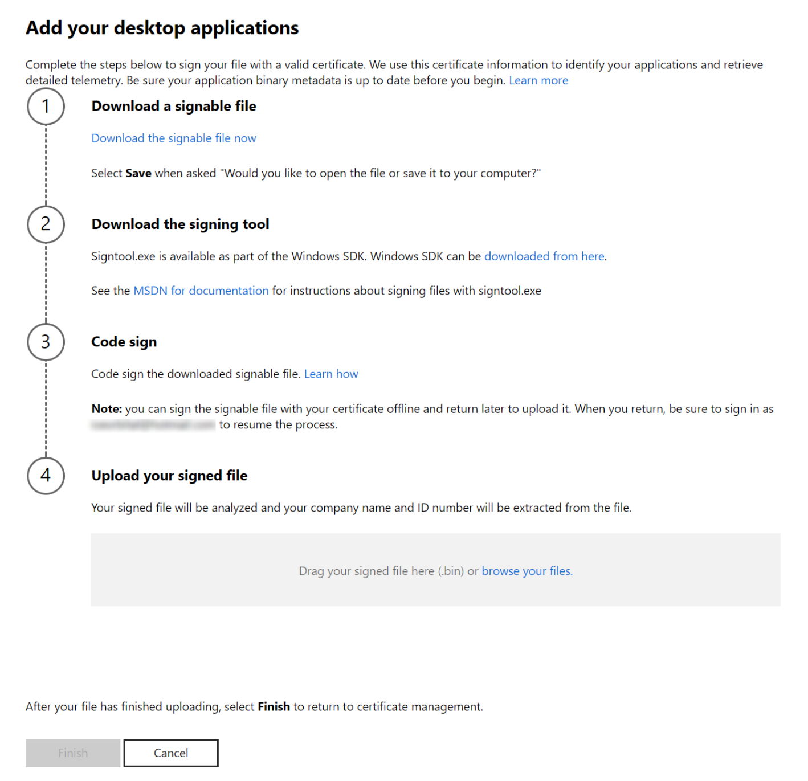
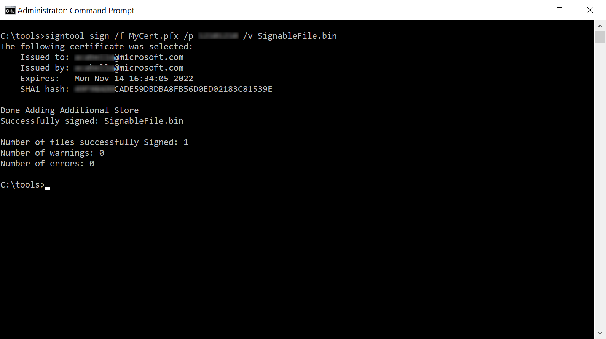
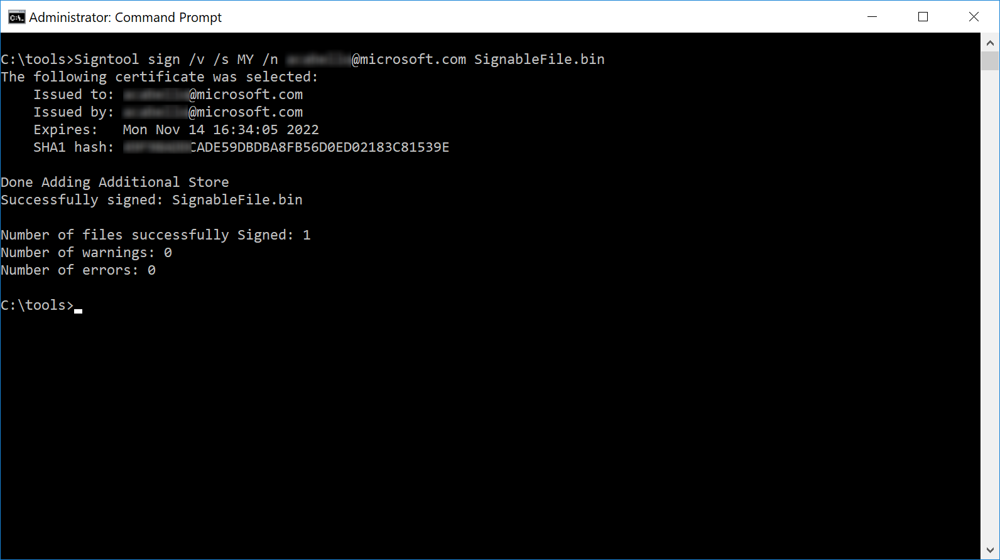
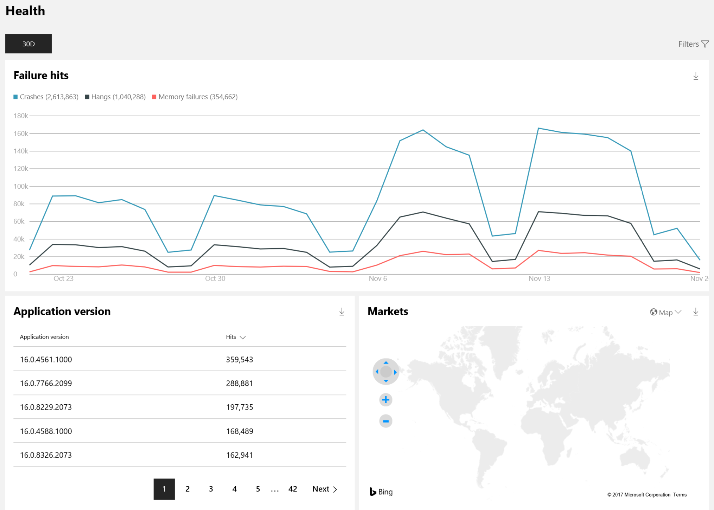

# Windows Desktop Application Program

> [!NOTE]
> You can access analytics data in Desktop Application Program through Insights dashboard in Partner Center. In Insights dashboard, please navigate to Windows Desktop Applications section and click on Overview to view the data. 

You can get detailed telemetry data and analytics reports that let you see how your Windows desktop applications are doing through the new Windows Desktop Application Program.

There's no charge to access this data all you need to do is [sign up](https://login.microsoftonline.com/common/oauth2/authorize?client_id=4990cffe-04e8-4e8b-808a-1175604b879f&response_mode=form_post&response_type=code+id_token&scope=openid+profile&state=OpenIdConnect.AuthenticationProperties%3deJsPaLaK4fU55nKvN21CjU6FsdJ0aPGfhsjGAZ0HR9bE6rgwHHX4izvRt_w-0VUlIF0ClCya4cVY6Uv4qTAqDrH8LTwFpjFGWVW2BAIJmAAuxBLZGTPS_DYy0wwgvTh1orWTCMvBdlOu_kF8vwNe4mjtk9JRMvYaETyspKrJi-s5Z2K7lKIPqnlFkwSU-aoot-3NxTeQ0wu6_RJ1nf_kLFatEkVAqokDSYTKkpv7zF6gA3YYriMFoC9_f2uxuXpI-STckg&nonce=637177463062493881.YjhiOTZjYTMtOTVhZS00OGM1LWI4MDItNWE5MThjMjA1ZjZmMTAyZDRiMGQtMDJhNC00ZDJmLWFkM2QtM2FjZDJkNjcxYWQy&redirect_uri=https%3a%2f%2fpartner.microsoft.com%2faad%2fauthPostGateway&resource=797f4846-ba00-4fd7-ba43-dac1f8f63013&mkt=en-US) and accept the [Windows Desktop Application Program Agreement](https://go.microsoft.com/fwlink/?linkid=853677), then upload a signed file using the same certificate you used to sign your application executable files.

## Join the Windows Desktop Application Program

**If your company already has a Partner Center account**: Sign into your Partner Center account (using the Microsoft account associated with the account owner) and navigate to the **Programs** page (either in **Account settings** or by selecting **All** in the left navigation menu). Under **Windows Desktop Application Program**, click **Get Started** to join the program at no additional cost. If you have an Azure AD tenant associated with your Partner Center account, users you've added will be able to access the Windows Desktop Application Program. Coming soon, we ll allow you to set more granular access for this program.

> [!Tip]  
> If your company has a Partner Center account, but you don't have access to it, ask your administrator to [add you as a user](/windows/uwp/publish/add-users-groups-and-azure-ad-applications). Note that only the account owner can join the Windows Desktop Application Program.

 

**If your company doesn't have a Partner Center account**: You can [sign up for the Windows Desktop Application Program directly](https://login.microsoftonline.com/common/oauth2/authorize?client_id=4990cffe-04e8-4e8b-808a-1175604b879f&response_mode=form_post&response_type=code+id_token&scope=openid+profile&state=OpenIdConnect.AuthenticationProperties%3dWc5R_wIKVD0EbOy2UUxS0_0GQJnIAbD-eisMn7Gb4cJL18fRdelvbtj5_R0zoGlsebcnAxIvwKS5kx4Ma4mLMbU4l9ULsE9ajiZU4wtchLJXyJGsPCjCBUNV7TY1SzwXAI-LepSoXkqa8xSywVb7JZ3Xed-Lcw-kwEShFOwt0SdSdc1nNevHbPOhotOeFQcqbo0HESVYXk6pZORJ_OYimG99onp_zSTyludOvvaTd9GYKUgX9exCU5IHReP7MzJDHOgqTg&nonce=637177463071243612.NDU4MjE2ZTMtNmVkMi00YWNiLWEzZGEtMjYyNDRkODI0M2FmOTM3MmE1NzgtMzQ1OC00M2ZkLWJhMDktYzI4YTNhNzdiYTk0&redirect_uri=https%3a%2f%2fpartner.microsoft.com%2faad%2fauthPostGateway&resource=797f4846-ba00-4fd7-ba43-dac1f8f63013&mkt=en-US) at no cost. Coming soon, we'll provide the option to [associate an Azure AD tenant with your account](/windows/uwp/publish/add-users-groups-and-azure-ad-applications) so that other people in your company can also sign in.

## Add your desktop applications

Once you've joined the program, you'll need to add your Windows desktop applications to your dashboard so that we can start showing you your analytics reports.

We use code signing to establish your company's identity and retrieve analytics for apps you publish.

We'll provide you a file and ask you to sign it with the same valid, non-expired, non-revoked code signing certificates that you use to sign your desktop applications. After that, you'll upload that signed file to your dashboard. This lets us know that any desktop applications signed with the same certificate belong to your account. We do not use your certificate information for any other purpose.

> [!Important]  
> You do not need to repeat this process if you release a new desktop application. Once you've uploaded the signed file, we ll automatically identify any new applications that are signed with the same certificate, and we'll automatically retrieve analytics for those products. You also don't need to distribute the provided file within your applications or submit any kind of mapping for your products

 

**To add one or more desktop applications**

1.  From your dashboard, select **Add desktop applications**.
2.  On the next page, download the signable file by selecting **Download the file**, then save the file to your computer.
3.  Sign the file you just downloaded using the same code-signing certificate that you use to authenticate your desktop application(s). You can use SignTool.exe (available in Microsoft Visual Studio and as part of the [Windows SDK](https://developer.microsoft.com/windows/downloads/windows-10-sdk)) to sign this file. More details about this process are described below.
4.  Upload the file you just signed by dragging it into the field (or click to browse your files).
5.  Select **Submit** to complete the process.



If you use more than one code-signing certificate, you can repeat the steps above for each of your certificates. You can download, sign, and upload a file for each current certificate that you use to sign your applications. However, you can only use one certificate per downloaded file.

After you complete these steps, we'll identify which Windows desktop applications are signed with the same certificate that you used to sign our file. In most cases, we ll begin showing you analytic reports within 48 hours, although it can occasionally take a bit longer.

## Use signtool.exe to sign the downloaded file

Microsoft provides a tool for signing files, SignTool.exe, with Visual Studio and in the [Windows SDK](https://developer.microsoft.com/windows/downloads/windows-10-sdk). You can use this tool to perform and verify the code signing process. More info about SignTool.exe is available [here](/dotnet/framework/tools/signtool-exe).

Here are two of the most common ways to use this tool to sign the signable file.

-   If you have access to the code-signing certificate as a [Personal Information Exchange (PFX)](/windows-hardware/drivers/install/personal-information-exchange---pfx--files) file:

    ``` syntax
    signtool sign /f MyCert.pfx /p MyCertPassword /v SignableFile.bin
    ```

    

-   If the code-signing certificate is available in your local certificate store:

    ``` syntax
    Signtool sign /v /s MY /n CertSubjectName SignableFile.bin
    ```

    

After you sign the file, you can verify that it's been successfully signed with a valid certificate with the following:

``` syntax
signtool verify /a SignableFile.bin
```

## Viewing your analytic data

After your signed files have been uploaded and we've identified your desktop applications, your dashboard will show an overview of your applications along with key metrics.

Our telemetry data will show health information such as crashes for each application associated with your certificate. Your dashboard will show an overview of your applications along with key metrics. You can select any application to view its [Health report](#health-report), [Installs report](#installs-report), and [Blocks report](#application-blocks-report) in the dashboard. You can also [retrieve analytic data programmatically by using the Microsoft Store analytics API](#retrieve-analytic-data-using-the-microsoft-store-analytics-api).

> [!Note]  
> If we detect that an application's metadata has been updated to use a new name, we ll begin to report new data under the new name. Historical data associated with the old name will be preserved for 30 days.
> 
> Analytics will not be available for an application until it has been installed on at least 100 devices.


### Health report

The **Health** report lets you get data related to the performance and quality of your app, including crashes and unresponsive events. Where applicable, you can view stack traces and/or CAB files for further debugging.



You can filter the data in a number of ways, allowing you to:

-   View a summary of all failure types, sorted by number of hits
-   Drill down into a particular failure and download stack traces to debug the issue faster
-   Compare a new release of your application to the previous releases
-   View health data in aggregate or by region, allowing you to isolate issues that are specific to a region
-   Compare performance of your desktop applications across Windows versions, or on a specific version, such as the latest Windows 10 release
-   View health info for one particular executable file included in your application

Select **Upload symbols** in the top of the **Failures** table to upload a .zip file containing your application's [symbol files](/windows-hardware/drivers/debugger/symbols-and-symbol-files). These symbol files will be indexed and used to produce more accurate stack traces. Symbol file types within the .zip should be .pdb, .dll, or .exe. After you successfully upload your .zip file, you should see fewer **!Unknown** values for new failures in your application's failure list in approximately 5 days.

### Installs report

The **Installs** report lets you see how many devices an application was installed on for any given day, and the average number of devices each application version was installed on over the last 30 days.

You can filter the data in a number of ways, allowing you to:

-   View a summary of your installs, sorted by popularity
-   Compare a new release of your application to the previous releases
-   View install data in aggregate or by region
-   Compare performance of your desktop applications across Windows versions, or on a specific version, such as the latest Windows 10 release or Windows Insider Fast and Slow releases

### Application blocks report

The **Application blocks** report lets you see info about Windows 10 devices on which your application is impacting Windows 10 upgrades. You can see how many devices are impacted on a given day along with the average number of devices over the last 30 days.

The types of upgrade blocks included are as follows: 

<table>
<tr><th>Category</th><th>Issue</th><th>Description</th><th>Guidance provided to users</th></tr>
<tr><td>Potential sediment</td><td>Will block the upgrade</td><td>The application will not work on the new OS release version. User action is required during setup to proceed with the upgrade.</td><td>Remove the application before upgrading and check with the developer for a compatible version of the application.</td></tr>
<tr><td>Temporary sediment</td><td>May block upgrade. Need to test the application.</td><td>Microsoft is investigating upgrade issues related to this application. The upgrade will not be rolled out to users who may be impacted.</td><td>Remove the application before upgrading and check with the developer for a compatible version of the application.</td></tr>
<tr><td>Runtime notification</td><td>May not function correctly in the new OS release version, but will not block the upgrade</td><td>The application will not prevent the upgrade, but issues were detected that may prevent it from functioning correctly in the new OS release version.</td><td>No action is required for the upgrade to proceed, but be sure to test the application on the new OS release version, and check with the developer for a compatible version, if needed.</td></tr>
</table>

### Retrieve analytic data using the Microsoft Store analytics API

The Microsoft Store analytics API lets you programmatically retrieve analytics data for applications that you have added to your account.

This API offers the following methods specific to the Windows Desktop Application Program:

-   [Installs](/windows/uwp/monetize/get-desktop-app-installs)
-   [Failure hits](/windows/uwp/monetize/get-desktop-application-error-reporting-data)
-   [Failure details](/windows/uwp/monetize/get-details-for-an-error-in-your-desktop-application)
-   [Stack trace](/windows/uwp/monetize/get-the-stack-trace-for-an-error-in-your-desktop-application)
-   [CAB file](/windows/uwp/monetize/download-the-cab-file-for-an-error-in-your-desktop-application)
-   [Upgrade blocks](/windows/uwp/monetize/get-desktop-block-data)
-   [Upgrade block details](/windows/uwp/monetize/get-desktop-block-data-details)


For more info about using this API, see [Access analytic data using Store services](/windows/uwp/monetize/access-analytics-data-using-windows-store-services).

## Managing your desktop application metadata

We use the file name, file version, product name and product version metadata in your executable files to infer the logical groupings of executables into applications.. If executable files don't have accurate metadata, they may appear together under an **Unknown** application name, or the application name will default to the individual executable name.

Keeping the metadata of your apps and files up to date helps make sure they are represented correctly in your dashboard. Here are a few recommendations:

-   Use your certificate to sign every executable file that you want to see in your analytics report, not only your setup executables.
-   Provide consistent product name and product version information for all executable files that belong in the same application (i.e., *My application*). If some of your executable files are distributed with multiple applications, give them unique names (i.e., *Shared components*) so you can see analytics for those executables separately from the applications they were distributed with.
-   Every time you make changes to your metadata, you may see a new entry for your application in your dashboard. If you make a change, new incoming telemetry data will reflect your changes, but your old telemetry data will still appear as an **Unknown** application.
-   When you revise a file, make sure to update the application version and product version numbers.
    > [!Tip]  
    > Use [**VERSIONINFO**](/windows/desktop/menurc/versioninfo-resource) resources to set the **FileDescription**, **FileVersion**, **ProductName**, and **ProductVersion** for your files and applications. The following example defines a **VERSIONINFO** resource:
    >
    > ``` syntax
    > #define VER_PRODUCTNAME_STR      "Sample App"
    > #define VER_PRODUCTVERSION       3,10,349,0
    > #define VER_PRODUCTVERSION_STR   "3.10.349.0\0"
    > #define VER_FILEDESCRIPTION_STR  "Sample File"
    > #define VER_FILEVERSION          3,10,349,0
    > #define VER_FILEVERSION_STR      "3.10.349.0\0"
    > #define VER_COMPANYNAME_STR     "XYZ Corp."
    > #define VER_LEGALCOPYRIGHT_STR   "Copyright \251 XYZ Corp." 
    >  
    > VS_VERSION_INFO VERSIONINFO
    > FILEVERSION VER_FILEVERSION
    > PRODUCTVERSION VER_PRODUCTVERSION
    > FILEFLAGSMASK VER_FILEFLAGSMASK
    > FILEFLAGS VER_FILEFLAGS
    > FILEOS VER_FILEOS
    > FILETYPE VER_FILETYPE
    > FILESUBTYPE VER_FILESUBTYPE
    > BEGIN
    >     BLOCK "StringFileInfo"
    >     BEGIN
    >         BLOCK "040904E4"
    >         BEGIN
    >             VALUE "ProductName",      VER_PRODUCTNAME_STR
    >             VALUE "ProductVersion",   VER_PRODUCTVERSION_STR
    >             VALUE "FileDescription",  VER_FILEDESCRIPTION_STR
    >             VALUE "FileVersion",      VER_FILEVERSION_STR
    >             VALUE "CompanyName",      VER_COMPANYNAME_STR
    >             VALUE "LegalCopyright",   VER_LEGALCOPYRIGHT_STR
    >         END
    >     END
    >      
    > END 
    > ```

     

## Add and manage account users

You can use Azure Active Directory to add and manage additional users in your Windows Desktop Application Program account. You can add individual users, groups of users, or Azure AD applications, giving each one a predefined role (Manager or Developer).

### Associate Azure Active Directory with your account

In order to add and manage account users, you must first associate your account with your organization's Azure Active Directory. If your organization already uses Office 365 or other business services from Microsoft, you already have Azure AD. Otherwise, you can create a new Azure AD tenant at no additional charge.

See [Associate Azure Active Directory with your Partner Center account](/windows/uwp/publish/associate-azure-ad-with-dev-center) for more info. While the topic focuses on the Windows apps developer program, associating a tenant works the same way for the Windows Desktop Application Program.

### Add users, groups, and Azure AD applications to your account

Once you've set up the Azure AD association, you can add users by going to the Users section under Account settings. Each user is assigned a role that defines their access to the account. You can also add groups of users and Azure AD applications to grant them access to your Partner Center account. For more info about adding users, see [Add users, groups, and Azure AD applications](/windows/uwp/publish/add-users-groups-and-azure-ad-applications).

Each user, group, or Azure AD application that you add to your account must be assigned a role. This process is described at [Set roles or custom permissions for account users](/windows/uwp/publish/set-custom-permissions-for-account-users). However, note that for the Windows Desktop Application Program, there is no ability to assign custom permissions or to restrict access by product. Instead, each user must be assigned one of the following standard roles.


| Role      | Description                                                                                                                                                                                                                                                                                                                                                                                                                                                                                                                                                                                                                                                                                                                                                                                                                                                                                                                                                                                                                                                                     |
|-----------|---------------------------------------------------------------------------------------------------------------------------------------------------------------------------------------------------------------------------------------------------------------------------------------------------------------------------------------------------------------------------------------------------------------------------------------------------------------------------------------------------------------------------------------------------------------------------------------------------------------------------------------------------------------------------------------------------------------------------------------------------------------------------------------------------------------------------------------------------------------------------------------------------------------------------------------------------------------------------------------------------------------------------------------------------------------------------------|
| Manager   | Can upload and remove certificates and can view all analytic data. Has complete access to the account, except for changing financial info. This includes managing users, but note that the ability to create and delete users in the Azure AD tenant is dependent on the account's permission in Azure AD. That is, if a user is assigned the Manager role, but does not have global administrator permissions in the organization's Azure AD, they will not be able to create new users or delete users from the directory (though they can change a user's account role).<br/> Note that if your account is associated with more than one Azure AD tenant, a Manager can't see complete details for a user (including first name, last name, password recovery email, and whether they are an Azure AD global administrator) unless they are signed in to the same tenant as that user with an account that has global administrator permissions for that tenant. However, they can add and remove users in any tenant that is associated with the account. <br/> |
| Developer | Can view applications and certificate details associated with the account, and can view the **Health** and **Installs** report. Can't view financial info or account settings.<br/>                                                                                                                                                                                                                                                                                                                                                                                                                                                                                                                                                                                                                                                                                                                                                                                                                                                                                       |


 

## FAQ

-   **Why don't I see any data for an application?** We won't show data until we detect enough users to gather meaningful information. If you've just released your application, it may take some time to reach this minimum adoption threshold. Another reason why you might not see data is if you haven't signed a file with the certificate for a certain application. Make sure you upload files signed with every certificate that you use to sign your applications.
-   **Can I access this data through an API?** Yes, the data will be made available through a public API when the program is available to all developers.
-   **What about applications with older certificates?** Unfortunately, we do not support submitting certificates that are expired or revoked, even if you renew them with the same key.
-   **Why do I see an application I don't recognize?** If the certificate you use to sign files in your application is also used by someone else in your company to sign another application, you will see telemetry for that application too. In the future, we'll provide an option to hide applications from your dashboard. If your company account is attached to an Azure AD tenant, you can request your admin to modify user permissions so that only specific applications are visible to you.
-   **How can I provide feedback on the experience or get support?** If you need assistance, you can create a support request [here](https://developer.microsoft.com/windows/support/). To share your feedback, use the **Feedback** link (under **Account settings**) and select the **Analytics** area to let us know what you think. 
 

