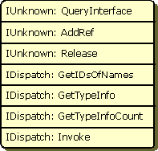

# ActiveX Client and Object Interaction

ActiveX clients can access objects in two different ways:

-   By using the [**IDispatch**](/previous-versions/windows/desktop/api/oaidl/nn-oaidl-idispatch) *interface*.

-   By calling one of the member functions directly in the object's *virtual function table* (VTBL).

An Automation interface is a group of related functions that provide a service. All ActiveX objects must implement the **IUnknown** interface because it manages all of the other interfaces that are supported by the object. The **IDispatch** interface, which derives from the **IUnknown** interface, consists of functions that allow access to the methods and properties of ActiveX objects.

A *custom interface* is a COM interface that is not defined as part of OLE. Any user-defined interface is a custom interface.

The VTBL lists the addresses of all the properties and methods that are members of an object, including the member functions of the interfaces that it supports. The first three members of the VTBL are the members of the **IUnknown** interface. Subsequent entries are members of the other supported interfaces.

The following figure shows the VTBL for an object that supports the **IUnknown** and [**IDispatch**](/previous-versions/windows/desktop/api/oaidl/nn-oaidl-idispatch) interfaces.

If an object does not support [**IDispatch**](/previous-versions/windows/desktop/api/oaidl/nn-oaidl-idispatch), the member entries of the object's custom interfaces immediately follow the members of **IUnknown**.

When an object for Automation is exposed, you must decide whether to implement an [**IDispatch**](/previous-versions/windows/desktop/api/oaidl/nn-oaidl-idispatch) interface, a VTBL interface, or both. Microsoft strongly recommends that objects provide a *dual interface*, which supports both access methods.

In a dual interface, the first three entries in the VTBL are the members of **IUnknown**, the next four entries are the members of [**IDispatch**](/previous-versions/windows/desktop/api/oaidl/nn-oaidl-idispatch), and the subsequent entries are the addresses of the members of the dual interface.

In addition to providing access to objects, Automation also provides information about exposed objects. By using [**IDispatch**](/previous-versions/windows/desktop/api/oaidl/nn-oaidl-idispatch) or a *type library*, an ActiveX client or programming tool can determine which interfaces an object supports, as well as the names of its members. Type libraries, which are files or parts of files that describe the type of one or more ActiveX objects, are especially useful because they can be accessed at compile time. For information on type libraries, refer to [What Is a Type Library?](https://msdn.microsoft.com/windows/desktop/1CEB8FF4-1490-4FC0-AB47-443FEF80FF85), [Type Libraries](type-libraries.md) and [Exposing ActiveX Objects](exposing-activex-objects.md).

 

 

