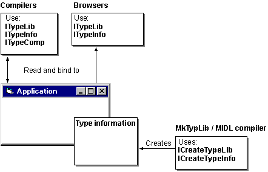

# Creating Type Information Browsers

Type information browsers let users scan type libraries to determine what types of objects are available. The following figure shows the interfaces you can use when creating compilers or browsers that access type libraries.

The Browse and BrowseH samples show how a browser might access a type library. The Browse sample is a Windows-based browser that presents a dialog box from which type information items can be selected to display.

 

 

