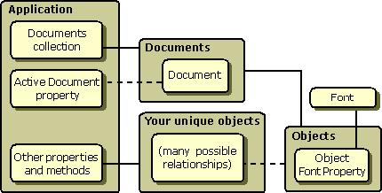

# Using Standard Objects

The following table lists the Automation standard objects. Although none of these objects are required, user-interactive applications with subordinate objects should include an Application object.

| Object name               | Description                                                                                                                             |
|---------------------------|-----------------------------------------------------------------------------------------------------------------------------------------|
| Application     | Top-level object. Provides a standard way for ActiveX clients to retrieve and navigate an application's subordinate objects.  |
| Document        | Provides a way to open, print, change, and save an application document.                                                      |
| Documents       | Provides a way to iterate over and select open documents in MDI applications.                                                 |
| Font            | Describes fonts that are used to display or print text.                                                                       |
| Picture         | Provides a language-neutral abstraction for bitmaps, icons, and metafiles.                                                    |
| Property Frame  | The user interface mechanism that displays one or more property pages for a control.                                          |

 

The following illustration shows how the standard objects fit into the organization of objects provided by an application.

The following sections describe the standard properties and methods for all objects, all collection objects, and each of the standard objects. These sections list the standard methods and properties for each object, as well as the standard arguments for those properties and methods.

## In this section

| Topic                                                                                                           | Description                                                                                                                                              |
|-----------------------------------------------------------------------------------------------------------------|----------------------------------------------------------------------------------------------------------------------------------------------------------|
| [Object Properties](object-properties.md)                                                            | Describes the properties that must be provided by all objects and collections.                                                                 |
| [Collection Object Properties](collection-object-properties.md)                                      | A collection provides a set of objects over which iteration can be performed.                                                                  |
| [Using the Application Object in a Type Library](using-the-application-object-in-a-type-library.md)  | Describes how to use the Application object in a type library.                                                                                 |
| [Document Object Properties](document-object-properties.md)                                          | If the application is document based, it should provide a Document object named Document.                                                      |
| [Documents Collection Object](documents-collection-object.md)                                        | If your application supports a multiple-document interface (MDI), you should provide a Documents collection object.                            |
| [The Font Object](the-font-object.md)                                                                | The standard font object supports a number of read-write properties as well as a set of methods through its [**IFont**](https://msdn.microsoft.com/library/windows/desktop/ms680673) interface.  |
| [The Picture Object](the-picture-object.md)                                                          | Picture objects provide a language-neutral abstraction for bitmaps, icons, and metafiles.                                                      |
| [The Property Frame Object](the-property-frame-object.md)                                            | Property frame objects are the user interface mechanism that displays one or more property pages for a control.                                |

 

> [!Note]  
> You can define additional application-specific properties and methods for each object. You can also provide additional optional arguments for any of the listed properties or methods; however, the optional arguments should follow the standard arguments in a positional argument list.

 

 

 

