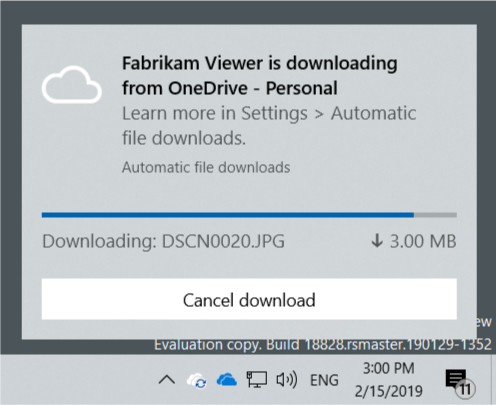

# Build a Cloud Sync Engine that Supports Placeholder Files

A sync engine is a service that syncs files, typically between a remote host and a local client. Sync engines on Windows often present those files to the user through the Windows file system and File Explorer. Before Windows 10, version 1709, sync engine support in Windows was limited to scenario-agnostic ad-hoc surfaces, such as File Explorer’s navigation pane, the Windows system tray, and (for more technical applications) file system filter drivers.

Windows 10 version 1709 (also called the Fall Creators Update) introduced the *cloud files API*. This API is a new platform that formalizes support for sync engines. The cloud files API provides support for sync engines in a way that offers many new benefits to developers and end users.

The cloud files API contains the following native Win32 APIs and Windows Runtime (WinRT) APIs:

* [Cloud Filter API](cloud-filter-reference.md): This native Win32 API provides functionality at the boundary between the user mode and the file system. This API handles the creation and management of placeholder files and directories.
* [Windows.Storage.Provider namespace](/uwp/api/windows.storage.provider): This WinRT API enables applications to configure the cloud storage provider and register the sync root with the operating system.

> [!NOTE]
> The cloud files API does not currently support implementing cloud sync engines in UWP apps. Cloud sync engines must be implemented in desktop apps.

## Supported features

The cloud files API provides the following features for building cloud sync engines.

### Placeholder files

* Sync engines can create placeholder files that consume only 1 KB of storage for the filesystem header, and that automatically hydrate into full files under normal use conditions. Placeholder files present as typical files to apps and to end users in the Windows Shell.
* Placeholder files are vertically integrated from the Windows kernel up to the Windows Shell, and app compatibility with placeholder files is generally a non-issue. Whether you use file system APIs, the Command Prompt, or a desktop or a UWP app to access a placeholder file, the file will hydrate without additional code changes and that app can use the file normally.
* Files can exist in three states:
  * **Placeholder file**: An empty representation of the file and only available if the sync service is available.
  * **Full file**: The file has been hydrated implicitly and could be dehydrated by the system if space is needed.
  * **Pinned full file**: The file has been hydrated explicitly by the user through File Explorer and is guaranteed to be available offline.

The following image demonstrates how the placeholder, full, and pinned full file states are shown in File Explorer.

  

### Standardized sync root registration

* Registering a sync root is straightforward and standardized. This includes creation of a branded node in the navigation pane of File Explorer, as shown in the following screenshot. Roots can be created either as individual top-level entries, or as children of a parent grouping.

  

### Shell integration

* State icons:
  * The cloud files API provides standardized, automatic hydration state icons shown in File Explorer and on the Windows desktop.
  * In addition to the standard Windows state icons used for hydration state, you can provide custom state icons for additional service-specific properties.
  * Replaces legacy icon overlay Shell extensions.
* Progress indication:
  * Opening a placeholder file that takes more than a few seconds to hydrate will show hydration progress. Progress is shown in a few locations depending on context:
    * In a copy engine dialog window.
    * Inline progress is shown next to the file in File Explorer.
    * If the file is not opened at the user’s specific instruction, a toast notification is shown to inform the user and provide a way to control unintended hydration activity.
* Thumbnails and metadata:
  * Placeholder files can have rich service-provided thumbnails and extended file metadata to provide the user with a seamless File Explorer experience.
* File Explorer navigation pane:
  * Registering a sync root with the cloud files API causes that sync root (with an icon and custom name) to appear in File Explorer’s navigation pane.
* File Explorer context menus:
  * Registering a sync root with the cloud files API automatically provides several verbs (menu entries) in File Explorer’s context menu that let the user control the hydration state of their file.
  * Additional verbs can be added to this section of the context menu using Desktop Bridge-compatible APIs.
* User control of file hydration:
  * Users are always in control of file hydration, even when the files are not hydrated explicitly by the user. An interactive toast is shown for background hydration to alert the user and provide options. The following image demonstrates a toast notification for a hydrating file.
    
  * If a user blocks an app from hydrating files through an interactive toast, they can unblock the app in the **Automatic file downloads** page in **Settings**.
    
* Hooking copy engine operations (supported in Windows 10 Insider Preview Build 19624 and later versions):
  * Cloud storage providers can register a shell copy hook for monitoring file operations within their sync root.
  * The provider registers their copy hook by setting the **CopyHook** registry value under their sync root registry key to a the CLSID of their COM local server object. This local server object implements the [IStorageProviderCopyHook](../shell/nn-shobjidl-istorageprovidercopyhook.md) interface.

### Desktop Bridge

* Sync engines using the cloud files APIs are designed to use the [Desktop Bridge](/windows/uwp/porting/desktop-to-uwp-root) as an implementation requirement.

## Cloud Mirror sample

The [Cloud Mirror sample](https://github.com/Microsoft/Windows-classic-samples/tree/master/Samples/CloudMirror) illustrates how to build a solution that uses the cloud files API. It is not intended to be used as production code. It lacks robust error handling and it is written to be as easily understood as possible. It's called Cloud Mirror because it simply mirrors a local folder on your local disk. You specify a server folder that is meant to represent your cloud file server and a client folder that is meant to specify the sync root path. A top-level node appears in the navigation pane in File Explorer called **TestStorageProviderDisplayName**, and this node maps to the specified client folder.

When it comes to syncing, these are the things that a fully-developed cloud files sync provider must implement:

* When the sync root file is just a placeholder, the service is responsible for copying down the contents of the file for hydration. This is implemented in the sample.
* When the sync root file is a full file and the contents of the file in the cloud service change, the service is responsible of notifying the local sync client of the change and the local sync client must handle merges according to their own specifications. This is not implemented in the sample.
* When the sync root file is a full file and the contents of the file in the sync root path (the local client) change, the local sync client must notify the cloud service and handle merges according to their own specifications. The local file change notification is implemented in the sample, but it does not do anything.

### Use the sample

1. Create two folders on your local hard drive. One of them will act as the server and the other as the client.
2. Add some files to the server folder. Make sure the client folder is empty.
3. Open the Cloud Mirror sample in Visual Studio. Set the **CloudMirrorPackage** project as your startup project and then build and run the sample. When prompted by the sample, enter the two paths to your server and client folders. After this you will see a console window with diagnostic information.
4. Open File Explorer and confirm that you see the **TestStorageProviderDisplayName** node and the placeholders for all the files that you copied into the server folder. To simulate an application that tries to open files without using the picker, copy several images to the server folder. Double-click one of them in your sync root folder and confirm that it hydrates. Then, open the Photos app. The app will pre-load adjacent files in the background to make it more likely the user does not experience delays when looking through the other pictures. You can observe the background dehydration happen via toasts or in File Explorer.
5. Right-click a file in File Explorer to bring up a context menu, and confirm that you see the **TestCommand** menu item. Clicking this menu item will display a message box.
6. To stop the sample, set focus to the console output and press **Ctrl-C**. This will cleanup the sync root registration so that the provider is uninstalled. If the sample crashes, it’s possible that the sync root will remain registered. This will cause File Explorer to relaunch every time you click on anything, and you would get prompted for the fake client and server locations. If this occurs, uninstall the **CloudMirrorPackage** sample application from your computer.

### Sample architecture

The sample is deliberately simple. It uses static classes to make it unnecessary to pass instance pointers. Here are the main classes in the sample:

* **FakeCloudProvider**: This top-level class controls the following worker classes:
  * **CloudProviderRegistrar**: Registers the sync root information with the Windows Shell.
  * **Placeholders**: Generates the placeholder files in the sync root path.
  * **ShellServices**: Constructs the Windows Shell providers for the context menu, thumbnails, and other services.
  * **CloudProviderSyncRootWatcher**: Instantiates a DirectoryWatcher to monitor changes to the sync root path and act on changes.
  * **FileCopierWithProgress**: Copies files from the server folder to the client folder slowly in chunks to simulate downloading them from a real cloud server. Provides progress indication so that toasts and File Explorer UI shows the user something informative.

In addition to the classes above, the sample also provides several helper classes to prompt the user for folders and some utilities. The **TestExplorerCommandHandler**, **CustomStateProvider**, **ThumbnailProvider**, and **UriSource** are all examples of Shell service providers.

## Cloud files API architecture

At the core of the storage stack in the cloud files API is a file system minifilter driver called cldflt.sys. This driver acts as a proxy between the user’s applications and your sync engine. Your sync engine knows how to download and upload the data on demand while it is responsibility of cldflt.sys to work with the Shell to present files as if the cloud data were locally available.

Cldflt.sys currently only supports NTFS volumes because it depends on some features unique to NTFS.

There are many file system minifilter drivers in a system and they can be active on a given volume at the same time. The drivers that are of most interest to the cloud files API are the anti-virus file system filters.

File system minifilter drivers are managed and supported by a special kernel-mode component called the filter manager. Among many other duties, the filter manager facilitates unfiltered communication between filters and user mode components via a construct known as filter message port.

## Hydration Policies

Windows supports a variety of [primary hydration policies](/windows/desktop/api/cfapi/ne-cfapi-cf_hydration_policy_primary) and [secondary hydration policy](/windows/desktop/api/cfapi/ne-cfapi-cf_hydration_policy_modifier) modifiers. Primary hydration policies have this order:

  **Always full > Full > Progressive > Partial**

Both applications and sync engines can define their preferred primary hydration policy. If not specified, the default hydration policy is progressive for both applications and sync engines.

The hydration policy of a cloud file is determined at the file open time by this formula:

  ```File hydration policy = max(app hydration policy, provider hydration policy)```

For example, let’s say the user is trying to open a PDF file stored on Fabrikam Cloud Drive using Contoso PDF Viewer, which doesn’t specify a preferred hydration policy. The application hydration policy is therefore progressive hydration, in this case by default. However, because Fabrikam Cloud Drive is a full hydration sync engine, the final hydration policy on the file becomes full hydration, which will result in the file being fully hydrated on first access. The same outcome happens in cases where the sync engine supports progressive hydration, but the app’s preference is full hydration.

Note that the file hydration policy cannot be changed after the file is opened.

## Compatibility with applications that use reparse points

The cloud files API implements the placeholder system using [reparse points](/windows/desktop/FileIO/reparse-points). A common misconception about reparse points is that they are the same as symbolic links. This misconception is occasionally reflected in application implementations, and as a result, many existing applications hit errors when encountering any reparse point.

To mitigate this compatibility issue, the cloud files API always hides its reparse points from all applications except for sync engines and processes whose main image resides under **%systemroot%**. Applications that understand reparse points correctly can force the platform to expose cloud files API reparse points using [RtlSetProcessPlaceholderCompatibilityMode](/windows-hardware/drivers/ddi/content/ntifs/nf-ntifs-rtlsetprocessplaceholdercompatibilitymode) or [RtlSetThreadProcessPlaceholderCompatibilityMode](/windows-hardware/drivers/ddi/content/ntifs/nf-ntifs-rtlsetthreadplaceholdercompatibilitymode).