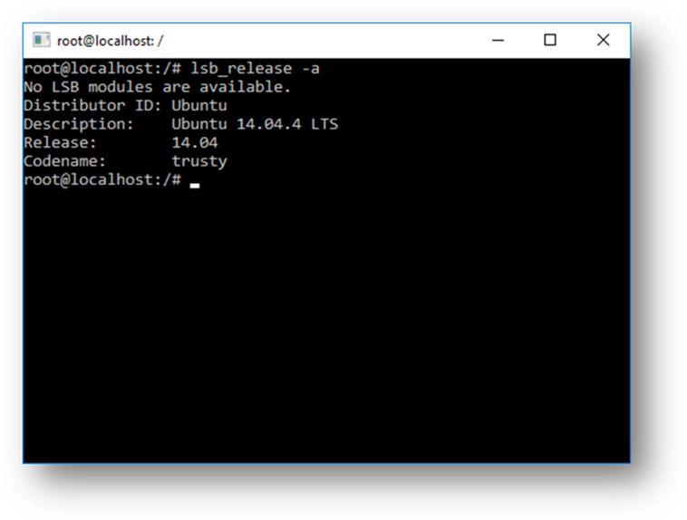
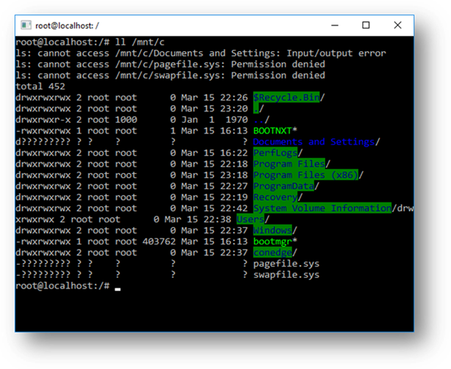

# WSL FAQ

\[Some information relates to pre-released product which may be substantially modified before it's commercially released. Microsoft makes no warranties, express or implied, with respect to the information provided here.\]

This article provides answers to frequently asked questions about the Windows Subsystem for Linux (WSL).

## What is Windows Subsystem for Linux (WSL)?

The Windows Subsystem for Linux (WSL) is a new Windows feature that enables native user-mode Linux shells, apps, and tools to run unmodified on top of Windows, alongside your traditional Windows desktop apps and modern store apps.

For more information, see [Windows Subsystem for Linux (WSL)](windows-subsystem-for-linux-wsl.md).

## Who is WSL for?

WSL is primarily a tool for software developers to run Linux shells, tools and applications on Windows.

## What is “Ubuntu on Windows”?

Through our partnership with Canonical, we download an unmodified Ubuntu image, provided by Canonical, and unpack it onto your local machine.

When you run Bash, we open a console (if not already opened) and start Bash which you can use to run Linux apps, execute Bash scripts, etc.

## What can I do with WSL?

WSL provides an application called Bash.exe that, when started, opens a Windows console running the Bash shell. Using Bash, you can run command-line Linux tools and apps. For example, type **lsb\_release -a** and hit enter; you’ll see details of the Linux distro currently running:

You can also access your local machine’s filesystem from within the Linux Bash shell – you’ll find your local drives mounted under the **/mnt** folder. For example, your C: drive is mounted under **/mnt/c:**

## How does WSL work?

For information on the underlying technology of WSL, see [WSL architectural overview](wsl-architectural-overview.md).

## Why would I use WSL rather than Linux in a VM?

WSL requires far fewer resources (CPU, memory and storage) than a full virtualized machine environment. WSL also allows you to run Linux tools and apps alongside your Windows command-line, desktop and store apps, enabling you to use the tools you need on the files on your local machine.

## Why would I use, for example, Ruby on Linux instead of on Windows?

Some cross-platform tools were built primarily with Linux and its ecosystem in mind. As such, some tools assume that the environment in which they run behaves just like Linux.

For example, some tools assume that they are able to access very long file paths or that asynchronous IO is performed a specific way. This often causes problems on Windows which behaves differently from Linux and which, in some cases, has different limits and expectations.

While frameworks like Ruby or node are often modified to run great on Windows, not all of the Ruby Gem or node/NPM library ecosystems are updated to remove their platform-specific dependencies. This can often result in systems built using such tools to suffer from build and sometimes runtime errors or unwanted behaviors.

These type of issues are what drove so many people to ask for Microsoft to, in some way, incorporate better support for Linux tools on Windows and which is why we build the Windows Subsystem for Linux and partnered with Canonical to bring a first-class Linux tools experience to Windows.

## Can run ALL Linux apps in WSL?

Not quite! In this first release of WSL, we’re focusing on delivering solid support for command-line Linux shells, tools and apps.

Even though you will be able to run many popular server applications (e.g. Redis), we do not recommend WSL for server scenarios at this time. Also, we do not support GUI desktops or applications (e.g. Gnome, KDE, etc.) at this time.

## Can I run other Linux distro’s than Ubuntu?

Not at this time: We’re currently focused on delivering a great Ubuntu experience. We are keen to explore supporting other Linux distro’s in the future.

 

 

