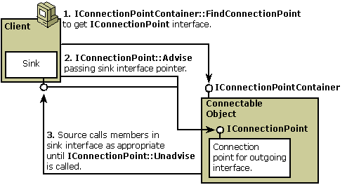

# Architecture of Connectable Objects

The connectable object is only one piece of the overall architecture of connectable objects. This technology includes the following elements:

-   **Connectable object.** Implements the [**IConnectionPointContainer**](/windows/win32/OCIdl/nn-ocidl-iconnectionpointcontainer?branch=master) interface; creates at least one connection point object; defines an outgoing interface for the client.
-   **Client.** Queries the object for [**IConnectionPointContainer**](/windows/win32/OCIdl/nn-ocidl-iconnectionpointcontainer?branch=master) to determine whether the object is connectable; creates a sink object to implement the outgoing interface defined by the connectable object.
-   **Sink object.** Implements the outgoing interface; used to establish a connection to the connectable object.
-   **Connection point object.** Implements the [**IConnectionPoint**](/windows/win32/OCIdl/nn-ocidl-iconnectionpoint?branch=master) interface and manages connection with the client's sink.

The relationships between client, connectable object, a connection point, and a sink are illustrated in the following diagram:

Before the connection point object calls methods in the sink interface in step 3 in the preceding diagram, it must [**QueryInterface**](/windows/win32/Unknwn/nf-unknwn-iunknown-queryinterface(q,)?branch=master) for the specific interface required, even if the pointer was already passed in the step 2 call to the [**Advise**](/windows/win32/OCIdl/nf-ocidl-iconnectionpoint-advise?branch=master) method.

Two enumerator objects are also involved in this architecture though not shown in the illustration. One is created by a method in [**IConnectionPointContainer**](/windows/win32/OCIdl/nn-ocidl-iconnectionpointcontainer?branch=master) to enumerate the connection points within the connectable object. The other is created by a method in [**IConnectionPoint**](/windows/win32/OCIdl/nn-ocidl-iconnectionpoint?branch=master) to enumerate the connections currently established to that connection point. One connection point can support multiple connected sink interfaces, and it should iterate through the list of connections each time it makes a method call on that interface. This process is known as multicasting.

When working with connectable objects, it is important to understand that the connectable object, each connection point, each sink, and all enumerators are separate objects with separate [**IUnknown**](/windows/win32/Unknwn/nn-unknwn-iunknown?branch=master) implementations, separate reference counts, and separate lifetimes. A client using these objects is always responsible for releasing all reference counts it owns.

> [!Note]  
> A connectable object can support more than one client and can support multiple sinks within a client. Likewise, a sink can be connected to more than one connectable object.

 

The steps for establishing a connection between a client and a connectable object are as follows:

1.  The client queries for [**IConnectionPointContainer**](/windows/win32/OCIdl/nn-ocidl-iconnectionpointcontainer?branch=master) on the object to determine whether the object is connectable. If this call is successful, the client holds a pointer to the **IConnectionPointContainer** interface on the connectable object and the connectable object reference counter has been incremented. Otherwise, the object is not connectable and does not support outgoing interfaces.
2.  If the object is connectable, the client next tries to obtain a pointer to the [**IConnectionPoint**](/windows/win32/OCIdl/nn-ocidl-iconnectionpoint?branch=master) interface on a connection point within the connectable object. There are two methods for obtaining this pointer, both in [**IConnectionPointContainer::FindConnectionPoint**](/windows/win32/OCIdl/nf-ocidl-iconnectionpointcontainer-findconnectionpoint?branch=master) and in [**IConnectionPointContainer::EnumConnectionPoints**](/windows/win32/OCIdl/nf-ocidl-iconnectionpointcontainer-enumconnectionpoints?branch=master). There are a few additional steps needed if **EnumConnectionPoints** is used. (See [Using IConnectionPointContainer](using-iconnectionpointcontainer.md) for more information.) If successful, the connectable object and the client both support the same outgoing interface. The connectable object defines it and calls it, and the client implements it. The client can then communicate through the connection point within the connectable object.
3.  The client then calls [**Advise**](/windows/win32/OCIdl/nf-ocidl-iconnectionpoint-advise?branch=master) on the connection point to establish a connection between its sink interface and the object's connection point. After this call, the object's connection point holds a pointer to the outgoing interface on the sink.
4.  The code inside [**Advise**](/windows/win32/OCIdl/nf-ocidl-iconnectionpoint-advise?branch=master) calls [**QueryInterface**](/windows/win32/Unknwn/nf-unknwn-iunknown-queryinterface(q,)?branch=master) on the interface pointer that is passed in, asking for the specific interface identifier to which it connects.
5.  The object calls methods on the sink's interface as needed, using the pointer held by its connection point.
6.  The client calls [**Unadvise**](/windows/win32/OCIdl/nf-ocidl-iconnectionpoint-unadvise?branch=master) to terminate the connection. Then the client calls **IConnectionPoint::Release** to free its hold on the connection point and, therefore, the main connectable object also. The client must also call **IConnectionPointContainer::Release** to free its hold on the main connectable object.

## Related topics

<dl> <dt>

[Connectable Object Interfaces](connectable-object-interfaces.md)
</dt> </dl>

 

 

