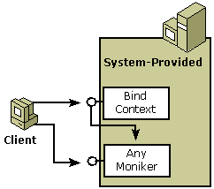
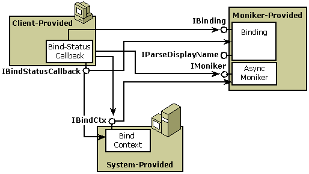

# Asynchronous and Synchronous Monikers

A client of a standard, synchronous OLE moniker typically creates and holds a reference to the moniker, as well as the bind-context to be used during binding. The components involved in using traditional monikers are shown in the following diagram.

Clients typically create standard monikers by calling functions such as [**CreateFileMoniker**](/windows/desktop/api/Objbase/nf-objbase-createfilemoniker), [**CreateItemMoniker**](/windows/desktop/api/Objbase/nf-objbase-createitemmoniker), or [**CreatePointerMoniker**](/windows/desktop/api/Objbase/nf-objbase-createpointermoniker) or, because they are can be saved to persistent storage, through [**OleSaveToStream**](/windows/desktop/api/ole/nf-ole-olesavetostream) and [**OleLoadFromStream**](/windows/desktop/api/ole/nf-ole-oleloadfromstream). Monikers may also be obtained from a container object by calling the [**IBindHost::CreateMoniker**](https://msdn.microsoft.com/library/ms775075(v=VS.85).aspx) method. Clients create bind contexts by calling the [**CreateBindCtx**](/windows/desktop/api/Objbase/nf-objbase-createbindctx) function and then pass the bind context to the moniker with calls to [**IMoniker::BindToStorage**](/windows/desktop/api/ObjIdl/nf-objidl-imoniker-bindtostorage) or [**IMoniker::BindToObject**](/windows/desktop/api/ObjIdl/nf-objidl-imoniker-bindtoobject).

As shown in the following diagram, a client of an asynchronous moniker also creates and holds a reference to the moniker and bind context to be used during binding.

To get asynchronous behavior, the client implements the [**IBindStatusCallback**](https://msdn.microsoft.com/library/ms775060(v=VS.85).aspx) interface on a bind-status-callback object and calls either the [**RegisterBindStatusCallback**](https://msdn.microsoft.com/library/ms775115(v=VS.85).aspx) function or the [**CreateAsyncBindCtx**](/windows/desktop/api/Urlmon/nf-urlmon-createasyncbindctx) function to register this interface with the bind context. The moniker passes a pointer to its [**IBinding**](https://msdn.microsoft.com/library/ms775071(v=VS.85).aspx) interface in a call to the [**IBindStatusCallback::OnStartBinding**](https://msdn.microsoft.com/library/ms775065(v=VS.85).aspx) method. The client tells the asynchronous moniker how it wants to bind on return from the moniker's call to [**IBindStatusCallback::GetBindInfo**](https://msdn.microsoft.com/library/ms775058(v=VS.85).aspx) method.

## Related topics

<dl> <dt>

[Asynchronous Monikers](asynchronous-monikers.md)
</dt> </dl>

 

 

