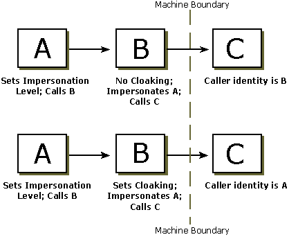

# Delegation and Impersonation

In client/server scenarios, it is common for one server to call another server to accomplish some task on a client's behalf. The situation where a server is given the authority to act on a client's behalf is called *delegation*.

From a security standpoint, two issues arise regarding delegation:

-   What should the server be allowed to do when acting on the client's behalf?
-   What identity is presented by the server when it calls other servers on behalf of a client?

To deal with these issues, COM provides the following functionality. The client can set an *impersonation level* that determines to what extent the server will be able to act as the client. If the client grants enough authority to the server, the server can *impersonate* (pretend to be) the client. When impersonating the client, the server is given access to only those objects or resources that the client has permission to use. The server, acting as a client, can also enable *cloaking* to mask its own identity and project the client's identity in calls to other COM components.

Consider the scenario illustrated by the preceding figure, where A and B are processes on a different machine from C. Process A calls B, and B calls C. Client A sets the impersonation level. B sets the cloaking capability. If A sets an impersonation level that permits impersonation, B can impersonate A when calling C on A's behalf. The identity that is presented to process C will be either A's identity or B's identity, depending on whether cloaking was enabled by B. If cloaking is enabled, the identity presented to process C will be that of A. If cloaking is not enabled, B's identity will be presented to C.

For more information, see the following topics:

-   [Impersonation](impersonation.md)
-   [Impersonation Levels](impersonation-levels.md)
-   [Cloaking](cloaking.md)

 

 

