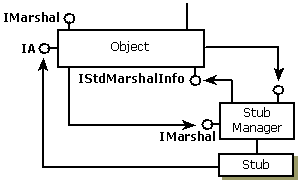
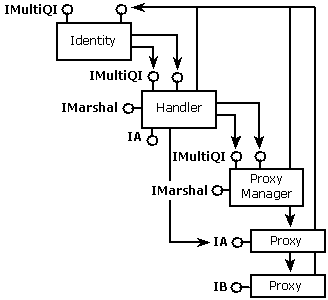

# Implementing and Activating a Handler with Extra Data Supplied by Server

If the server wants to include some extra data in the packet for the handler to use, the server must implement both the [**IMarshal**](/windows/win32/api/objidlbase/nn-objidlbase-imarshal) and the [**IStdMarshalInfo**](/windows/win32/api/objidlbase/nn-objidlbase-istdmarshalinfo) interfaces. The server must aggregate the standard marshaler and must delegate the first part of the marshaling to the aggregated standard marshaler, including [**IMarshal::GetUnmarshalClass**](/windows/desktop/api/ObjIdl/nf-objidl-imarshal-getunmarshalclass), and must add its own data size to the size returned by the standard marshaler's [**IMarshal::GetMarshalSizeMax**](/windows/desktop/api/ObjIdl/nf-objidl-imarshal-getmarshalsizemax). The standard marshaler calls [**IStdMarshalInfo::GetClassForHandler**](/windows/win32/api/objidlbase/nf-objidlbase-istdmarshalinfo-getclassforhandler) to get the CLSID of the handler to be created. After the standard marshaler has done its marshaling, the server then writes its own extra data into the stream. The resulting structures, with extra data in the stream, are shown in the following illustration:

## Server-Side Structures with Extra Data in Stream

This allows the call from COM to [**CoUnmarshalInterface**](/windows/desktop/api/combaseapi/nf-combaseapi-counmarshalinterface) on the client side the ability to skip over any unread data and leave the stream in the appropriate position following all the marshaled interface data if the handler cannot be created.

## Client-Side Structures with Extra Data in Stream

As in the case where there is no extra server data in the stream, the client-side COM call to [**CoUnmarshalInterface**](/windows/desktop/api/combaseapi/nf-combaseapi-counmarshalinterface) will create the identity and handler. The handler must implement [**IMarshal**](/windows/win32/api/objidlbase/nn-objidlbase-imarshal) and must delegate the **IMarshal** calls to the aggregated standard marshaler first and then marshal or unmarshal any extra data that the server provided. The handler's [**UnmarshalInterface**](/windows/win32/api/objidlbase/nf-objidlbase-imarshal-unmarshalinterface) will be called for every unmarshal, regardless of whether it has unmarshaled the interface before or not. In this case, the server does not call [**CoGetStdMarshalEx**](/windows/desktop/api/combaseapi/nf-combaseapi-cogetstdmarshalex) but the handler must. The resulting client-side structure is shown in the following illustration.

## Related topics

<dl> <dt>

[The Lightweight Client-Side Handler](the-lightweight-client-side-handler.md)
</dt> </dl>

 

 