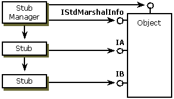
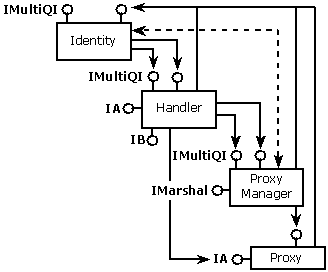

# Implementing and Activating a Handler with No Extra Server Data

To create an instance of your handler, if it is one that gets no extra server data, the server must implement [**IStdMarshalInfo**](/windows/win32/api/objidlbase/nn-objidlbase-istdmarshalinfo) but not [**IMarshal**](/windows/win32/api/objidlbase/nn-objidlbase-imarshal). **IStdMarshalInfo** has one method, [**GetClassForHandler**](/windows/win32/api/objidlbase/nf-objidlbase-istdmarshalinfo-getclassforhandler), which retrieves the CLSID of the object handler to be used in the destination process. COM calls this when it calls [**CoMarshalInterface**](/windows/desktop/api/combaseapi/nf-combaseapi-comarshalinterface) for you and activates the handler on the client side.

Next, both the server and handler implementations must call the [**CoGetStdMarshalEx**](/windows/desktop/api/combaseapi/nf-combaseapi-cogetstdmarshalex) function. This function creates a standard marshaler on each side (called a proxy manager on the client side and a stub manager on the server side).

The server calls [**CoGetStdMarshalEx**](/windows/desktop/api/combaseapi/nf-combaseapi-cogetstdmarshalex), passing in the flag SMEXF\_SERVER. This creates a server-side standard marshaler (stub manager). The server-side structure is shown in the following illustration:

## Server-Side Structure

The handler calls [**CoGetStdMarshalEx**](/windows/desktop/api/combaseapi/nf-combaseapi-cogetstdmarshalex), passing in the flag SMEXF\_HANDLER. This creates a client-side standard marshaler (proxy manager) and aggregates it with the handler on the client side. The lifetime of both are managed by the controlling identity object (implementing [**IUnknown**](/windows/desktop/api/Unknwn/nn-unknwn-iunknown)) that the system implements when the handler calls **CoGetStdMarshalEx**. The client-side structure is shown in the following illustration.

## Client-Side Structure

As shown in the preceding illustration, the handler is actually sandwiched between the proxy manager and the identity/controlling unknown. This gives the system control over the lifetime of the object while giving the handler control over the exposed interfaces. The dashed line between the Identity and Proxy Manager indicates that the two share tight integration through internal private interfaces.

When COM calls [**CoUnmarshalInterface**](/windows/desktop/api/combaseapi/nf-combaseapi-counmarshalinterface) for the client, it creates the handler instance, aggregating it with the Identity. The handler will create the standard marshaler (through the call to [**CoGetStdMarshalEx**](/windows/desktop/api/combaseapi/nf-combaseapi-cogetstdmarshalex), passing in the controlling unknown it received when it was created). The handler does not implement [**IMarshal**](/windows/win32/api/objidlbase/nn-objidlbase-imarshal) but just returns **IMarshal** from the standard marshaler. Even if the handler does implement **IMarshal**, it will not get called during an unmarshal.

If two threads simultaneously unmarshal the same object for the first time, it is possible for two handlers to get created temporarily. One will subsequently be released.

## Related topics

<dl> <dt>

[The Lightweight Client-Side Handler](the-lightweight-client-side-handler.md)
</dt> </dl>

 

 