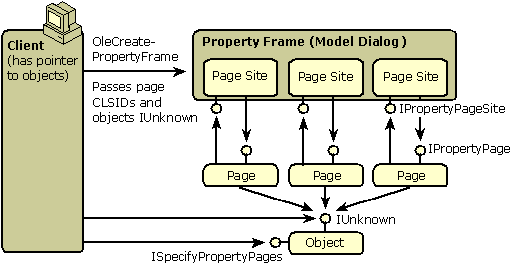

# Property Sheets and Property Pages

An object's properties are exposed to clients the same as methods through either COM interfaces or the object's **IDispatch** implementation, allowing properties to be changed by programs calling these methods. The OLE technology of property pages provides the means to build a user interface for an object's properties according to Windows user interface standards. Thus, the properties are exposed to end users. An object's property sheet is a tabbed-dialog where each tab corresponds to a specific property page. The OLE model for working with property pages consists of these features:

-   Each property page is managed by an in-process object that implements either [**IPropertyPage**](/windows/desktop/api/OCIdl/nn-ocidl-ipropertypage) or [**IPropertyPage2**](/windows/desktop/api/OCIdl/nn-ocidl-ipropertypage2). Each page is identified with its own unique CLSID.
-   An object specifies its support for property pages by implementing [**ISpecifyPropertyPages**](/windows/desktop/api/OCIdl/nn-ocidl-ispecifypropertypages). Through this interface the caller can obtain a list of CLSIDs identifying the specific property pages that the object supports. If the object specifies a property page CLSID, the object must be able to receive property changes from the property page.
-   Any piece of code (client or object) that wants to display an object's property sheet passes the object's [**IUnknown**](/windows/desktop/api/Unknwn/nn-unknwn-iunknown) pointer (or an array if multiple objects are to be affected) along with an array of page CLSIDs to [**OleCreatePropertyFrame**](/windows/desktop/api/OleCtl/nf-olectl-olecreatepropertyframe) or [**OleCreatePropertyFrameIndirect**](/windows/desktop/api/OleCtl/nf-olectl-olecreatepropertyframeindirect), which creates the tabbed-dialog box.
-   The property frame dialog instantiates a single instance of each property page, using [**CoCreateInstance**](/windows/desktop/api/combaseapi/nf-combaseapi-cocreateinstance) on each CLSID. The property frame obtains at least an [**IPropertyPage**](/windows/desktop/api/OCIdl/nn-ocidl-ipropertypage) pointer for each page. In addition, the frame creates a property page site object in itself for each page. Each site implements [**IPropertyPageSite**](/windows/desktop/api/OCIdl/nn-ocidl-ipropertypagesite) and this pointer is passed to each page. The page then communicates with the site through this interface pointer.
-   Each page is also made aware of the object or objects for which it has been invoked; that is, the property frame passes the [**IUnknown**](/windows/desktop/api/Unknwn/nn-unknwn-iunknown)pointers of the objects to each page. When instructed to apply changes to the objects, each page queries for the appropriate interface pointer and passes new property values to the objects in whatever way is desired. There are no stipulations on how such communication has to happen.
-   An object can also support per property browsing through the [**IPerPropertyBrowsing**](/windows/desktop/api/OCIdl/nn-ocidl-iperpropertybrowsing) interface permitting the object to specify which property should receive initial focus when the property page is displayed and to specify strings and values that can be displayed by the client in its own user interface.

These features are illustrated in the following diagram:



These interfaces are defined as follows:

``` syntax
interface ISpecifyPropertyPages : IUnknown 
  { 
    HRESULT GetPages([out] CAUUID *pPages); 
  }; 
 
 
interface IPropertyPage : IUnknown 
  { 
    HRESULT SetPageSite([in] IPropertyPageSite *pPageSite); 
    HRESULT Activate([in] HWND hWndParent, [in] LPCRECT prc 
        , [in] BOOL bModal); 
    HRESULT Deactivate(void); 
    HRESULT GetPageInfo([out] PROPPAGEINFO *pPageInfo); 
    HRESULT SetObjects([in] ULONG cObjects 
        , [in, max_is(cObjects)] IUnknown **ppunk); 
    HRESULT Show([in] UINT nCmdShow); 
    HRESULT Move([in] LPCRECT prc); 
    HRESULT IsPageDirty(void); 
    HRESULT Apply(void); 
    HRESULT Help([in] LPCOLESTR pszHelpDir); 
    HRESULT TranslateAccelerator([in] LPMSG pMsg); 
  } 
 
interface IPropertyPageSite : IUnknown 
  { 
    HRESULT OnStatusChange([in] DWORD dwFlags); 
    HRESULT GetLocaleID([out] LCID *pLocaleID); 
    HRESULT GetPageContainer([out] IUnknown **ppUnk); 
    HRESULT TranslateAccelerator([in] LPMSG pMsg); 
  } 
 
```

The [**ISpecifyPropertyPages::GetPages**](/windows/desktop/api/OCIdl/nf-ocidl-ispecifypropertypages-getpages) method returns a counted array of UUID (GUID) values each of which describe the CLSID of a property page that the object would like displayed. Whoever invokes the property sheet with [**OleCreatePropertyFrame**](/windows/desktop/api/OleCtl/nf-olectl-olecreatepropertyframe) or [**OleCreatePropertyFrameIndirect**](/windows/desktop/api/OleCtl/nf-olectl-olecreatepropertyframeindirect) passes this array to the function. Note that if the caller wishes to display property pages for multiple objects, it must only pass the intersection of the CLSID lists of all the objects to these functions. In other words, the caller must only invoke property pages that are common to all objects.

In addition, the caller passes the [**IUnknown**](/windows/desktop/api/Unknwn/nn-unknwn-iunknown) pointers to the affected objects to the API functions as well. Both API functions create a property frame dialog and instantiate a page site with [**IPropertyPageSite**](/windows/desktop/api/OCIdl/nn-ocidl-ipropertypagesite) for each page it will load. Through this interface a property page can:

-   Retrieve the current language used in the property sheet through [**GetLocaleID**](/windows/desktop/api/OCIdl/nf-ocidl-ipropertypagesite-getlocaleid).
-   Ask the frame to process keystrokes through [**TranslateAccelerator**](/windows/desktop/api/OCIdl/nf-ocidl-ipropertypagesite-translateaccelerator).
-   Notify the frame of changes in the page through [**OnStatusChange**](/windows/desktop/api/OCIdl/nf-ocidl-ipropertypagesite-onstatuschange).
-   Obtain an interface pointer for the frame itself through [**GetPageContainer**](/windows/desktop/api/OCIdl/nf-ocidl-ipropertypagesite-getpagecontainer), although there are no interfaces defined for the frame at this time for this function always returns E\_NOTIMPL.

The property frame instantiates each property page object and obtain each page's [**IPropertyPage**](/windows/desktop/api/OCIdl/nn-ocidl-ipropertypage) interface. Through this interface the frame informs the page of its page site ([**SetPageSite**](/windows/desktop/api/OCIdl/nf-ocidl-ipropertypage-setpagesite)), retrieves page dimensions and strings ([**GetPageInfo**](/windows/desktop/api/OCIdl/nf-ocidl-ipropertypage-getpageinfo)), passes the interface pointers to the affected objects ([**SetObjects**](/windows/desktop/api/OCIdl/nf-ocidl-ipropertypage-setobjects)), tells the page when to create and destroy its controls ([**Activate**](/windows/desktop/api/OCIdl/nf-ocidl-ipropertypage-activate) and [**Deactivate**](/windows/desktop/api/OCIdl/nf-ocidl-ipropertypage-deactivate)), instructs the page to show or reposition itself ([**Show**](/windows/desktop/api/OCIdl/nf-ocidl-ipropertypage-show) and [**Move**](/windows/desktop/api/OCIdl/nf-ocidl-ipropertypage-move)), instructs the page to apply its current values to the affected objects ([**Apply**](/windows/desktop/api/OCIdl/nf-ocidl-ipropertypage-apply)), checks on the page's dirty status ([**IsPageDirty**](/windows/desktop/api/OCIdl/nf-ocidl-ipropertypage-ispagedirty)), invokes help ([**Help**](/windows/desktop/api/OCIdl/nf-ocidl-ipropertypage-help)), and passes keystrokes to the page ([**TranslateAccelerator**](/windows/desktop/api/OCIdl/nf-ocidl-ipropertypage-translateaccelerator)).

An object can also support per-property browsing, which provides:

1.  A way (through [**IPerPropertyBrowsing**](/windows/desktop/api/OCIdl/nn-ocidl-iperpropertybrowsing) and [**IPropertyPage2**](/windows/desktop/api/OCIdl/nn-ocidl-ipropertypage2)) to specify which property on which property page should be given the initial focus when a property sheet is first displayed
2.  A way (through [**IPerPropertyBrowsing**](/windows/desktop/api/OCIdl/nn-ocidl-iperpropertybrowsing)) for the object to specify predefined values and corresponding descriptive strings that could be displayed in a client's own user interface for properties.

An object can choose to support (2) without supporting (1), such as when the object has no property sheet.

The [**IPropertyPage2**](/windows/desktop/api/OCIdl/nn-ocidl-ipropertypage2) and [**IPerPropertyBrowsing**](/windows/desktop/api/OCIdl/nn-ocidl-iperpropertybrowsing) interfaces are defined as follows:

``` syntax
interface IPerPropertyBrowsing : IUnknown 
  { 
    HRESULT GetDisplayString([in] DISPID dispID, [out] BSTR *pbstr); 
    HRESULT MapPropertyToPage([in] DISPID dispID, [out] CLSID *pclsid); 
    HRESULT GetPredefinedStrings([in] DISPID dispID, [out] CALPOLESTR *pcaStringsOut, [out] CADWORD *pcaCookiesOut); 
    HRESULT GetPredefinedValue([in] DISPID dispID, [in] DWORD dwCookie, [out] VARIANT *pvarOut); 
  } 
 
interface IPropertyPage2 : IPropertyPage 
  { 
    HRESULT EditProperty([in] DISPID dispID); 
  } 
 
```

To specify its support for such capabilities, the object implements [**IPerPropertyBrowsing**](/windows/desktop/api/OCIdl/nn-ocidl-iperpropertybrowsing). Through this interface, the caller can request the information necessary to achieve the browsing, such as predefined strings ([**GetPredefinedStrings**](/windows/desktop/api/OCIdl/nf-ocidl-iperpropertybrowsing-getpredefinedstrings)) and values ([**GetPredefinedValue**](/windows/desktop/api/OCIdl/nf-ocidl-iperpropertybrowsing-getpredefinedvalue)) as well as a display string for a given property ([**GetDisplayString**](/windows/desktop/api/OCIdl/nf-ocidl-iperpropertybrowsing-getdisplaystring)).

In addition, the client can obtain the CLSID of the property page that allows the user to edit a given property identified with a DISPID ([**MapPropertyToPage**](/windows/desktop/api/OCIdl/nf-ocidl-iperpropertybrowsing-mappropertytopage)). The client then instructs the property frame to activate that page initially by passing the CLSID and the DISPID to [**OleCreatePropertyFrameIndirect**](/windows/desktop/api/OleCtl/nf-olectl-olecreatepropertyframeindirect). The frame activates that page first and passes the DISPID to the page through [**IPropertyPage2::EditProperty**](/windows/desktop/api/OCIdl/nf-ocidl-ipropertypage2-editproperty). The page then sets the focus to that property's editing field. In this way, a client can jump from a property name in its own user interface to the property page that can manipulate that property.

## Related topics

<dl> <dt>

[Property Pages and Property Sheets](property-pages-and-property-sheets.md)
</dt> </dl>

 

 


