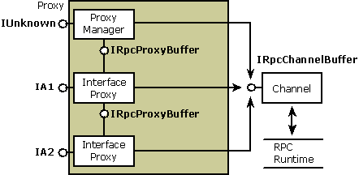

# Proxy

A proxy resides in the address space of the calling process and acts as a surrogate for the remote object. From the perspective of the calling object, the proxy is the object. Typically, the proxy's role is to package the interface parameters for calls to methods in its object interfaces. The proxy packages the parameters into a message buffer and passes the buffer onto the channel, which handles the transport between processes. The proxy is implemented as an aggregate, or composite, object. It contains a system-provided, manager piece called the proxy manager and one or more interface-specific components called interface proxies. The number of interface proxies equals the number of object interfaces that have been exposed to that particular client. To the client complying with the component object model, the proxy appears to be the real object.

> [!Note]  
> With custom marshaling, the proxy can be implemented similarly or it can communicate directly with the object without using a stub.

 

Each interface proxy is a component object that implements the marshaling code for one of the object's interfaces. The proxy represents the object for which it provides marshaling code. Each proxy also implements the [**IRpcProxyBuffer**](/windows/win32/api/objidlbase/nn-objidlbase-irpcproxybuffer) interface. Although the object interface represented by the proxy is public, the **IRpcProxyBuffer** implementation is private and is used internally within the proxy. The proxy manager keeps track of the interface proxies and also contains the public implementation of the controlling [**IUnknown**](/windows/desktop/api/Unknwn/nn-unknwn-iunknown) interface for the aggregate. Each interface proxy can exist in a separate DLL that is loaded when the interface it supports is materialized to the client.

## Structure of the Proxy

The following diagram shows the structure of a proxy that supports the standard marshaling of parameters belonging to two interfaces: IA1 and IA2. Each interface proxy implements [**IRpcProxyBuffer**](/windows/win32/api/objidlbase/nn-objidlbase-irpcproxybuffer) for internal communication between the aggregate pieces. When the proxy is ready to pass its marshaled parameters across the process boundary, it calls methods in the [**IRpcChannelBuffer**](/windows/win32/api/objidlbase/nn-objidlbase-irpcchannelbuffer) interface, which is implemented by the channel. The channel in turn forwards the call to the RPC run-time library so that it can reach its destination in the object.

## Related topics

<dl> <dt>

[Channel](channel.md)
</dt> <dt>

[Inter-Object Communication](inter-object-communication.md)
</dt> <dt>

[Marshaling Details](marshaling-details.md)
</dt> <dt>

[Microsoft RPC](microsoft-rpc.md)
</dt> <dt>

[Stub](stub.md)
</dt> </dl>

 

 