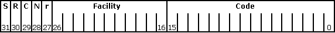

# Structure of COM Error Codes

The following illustration shows the format of an [**HRESULT**](/openspecs/windows_protocols/ms-erref/0642cb2f-2075-4469-918c-4441e69c548a) (or SCODE); the numbers indicate bit positions:

The high-order bit in the **HRESULT** or SCODE indicates whether the return value represents success or failure. If set to 0, SEVERITY\_SUCCESS, the value indicates success. If set to 1, SEVERITY\_ERROR, it indicates failure.

The R, C, N, and r bits are reserved.

The facility field indicates the system service responsible for the error. Microsoft allocates new facility codes as they become necessary. Most SCODEs and **HRESULT** values set the facility field to FACILITY\_ITF, indicating an interface method error.

Common facility fields are described in the following table.

| Facility Field                | Value        | Description                                                                                                                                                                                                                                                                                                              |
|-------------------------------|--------------|--------------------------------------------------------------------------------------------------------------------------------------------------------------------------------------------------------------------------------------------------------------------------------------------------------------------------|
| FACILITY\_DISPATCH  | 2  | For late-binding **IDispatch** interface errors.                                                                                                                                                                                                                                                               |
| FACILITY\_ITF       | 4  | For most status codes returned from interface methods. The actual meaning of the error is defined by the interface. That is, two **HRESULT**s with exactly the same 32-bit value returned from two different interfaces might have different meanings.                                                         |
| FACILITY\_NULL      | 0  | For broadly applicable common status codes such as S\_OK.                                                                                                                                                                                                                                                      |
| FACILITY\_RPC       | 1  | For status codes returned from remote procedure calls.                                                                                                                                                                                                                                                         |
| FACILITY\_STORAGE   | 3  | For status codes returned from [**IStorage**](/windows/desktop/api/objidl/nn-objidl-istorage) or [**IStream**](/windows/desktop/api/objidl/nn-objidl-istream) method calls relating to structured storage. Status codes whose code (lower 16 bits) value is in the range of MS-DOS error codes (that is, less than 256) have the same meaning as the corresponding MS-DOS error.   |
| FACILITY\_WIN32     | 7  | Used to provide a means of handling error codes from functions in the Windows API as an **HRESULT**. Error codes in 16-bit OLE that duplicated system error codes have also been changed to FACILITY\_WIN32.                                                                                                   |
| FACILITY\_WINDOWS   | 8  | Used for additional error codes from Microsoft-defined interfaces.                                                                                                                                                                                                                                             |

 

The code field is a unique number that is assigned to represent the error or warning.

By convention, **HRESULT** values generally have names in the following format: *Facility*\_*Severity*\_*Reason*.

*Facility* is either the facility name or some other distinguishing identifier; *Severity* is a single letter, S or E, that indicates whether the function call succeeded (S) or produced an error (E); and *Reason* is an identifier that describes the meaning of the code. For example, the status code STG\_E\_FILENOTFOUND indicates a storage-related error has occurred; specifically, a requested file does not exist. Status codes from FACILITY\_NULL omit the *Facility*\_ prefix.

Error codes are defined within the context of an interface implementation. Once defined, success codes cannot be changed or new success codes added. However, new failure codes can be written. Microsoft reserves the right to define new failure codes (but not success codes) for the interfaces described in FACILITY\_ITF or in new facilities.

## Related topics

<dl> <dt>

[Error Handling in COM](error-handling-in-com.md)
</dt> <dt>

[Windows Protocols: HRESULT](/openspecs/windows_protocols/ms-erref/0642cb2f-2075-4469-918c-4441e69c548a)
</dt> </dl>

 

