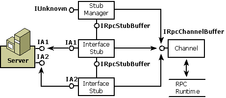

# Stub

The stub, like the proxy, is made up of one or more interface pieces and a manager. Each interface stub provides code to unmarshal the parameters and code that calls one of the object's supported interfaces. Each stub also provides an interface for internal communication. The stub manager keeps track of the available interface stubs.

There are, however, the following differences between the stub and the proxy:

-   The most important difference is that the stub represents the client in the object's address space.
-   The stub is not implemented as an aggregate object because there is no requirement that the client be viewed as a single unit; each piece in the stub is a separate component.
-   The interface stubs are private rather than public.
-   The interface stubs implement [**IRpcStubBuffer**](/windows/win32/api/objidlbase/nn-objidlbase-irpcstubbuffer), not [**IRpcProxyBuffer**](/windows/win32/api/objidlbase/nn-objidlbase-irpcproxybuffer).
-   Instead of packaging parameters to be marshaled, the stub unpackages them after they have been marshaled and then packages the reply.

## Structure of the Stub

The following diagram shows the structure of the stub. Each interface stub is connected to an interface on the object. The channel dispatches incoming messages to the appropriate interface stub. All the components talk to the channel through [**IRpcChannelBuffer**](/windows/win32/api/objidlbase/nn-objidlbase-irpcchannelbuffer), the interface that provides access to the RPC run-time library.

## Related topics

<dl> <dt>

[Channel](channel.md)
</dt> <dt>

[Inter-Object Communication](inter-object-communication.md)
</dt> <dt>

[Marshaling Details](marshaling-details.md)
</dt> <dt>

[Microsoft RPC](microsoft-rpc.md)
</dt> <dt>

[Proxy](proxy.md)
</dt> </dl>

 

 