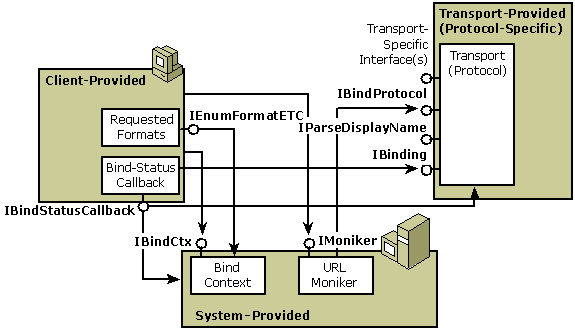

# URL Monikers

The OLE moniker architecture provides a convenient programming model for working with URLs. The moniker architecture supports extensible and complete name parsing through the [**MkParseDisplayName**](/windows/desktop/api/Objbase/nf-objbase-mkparsedisplayname) function and the [**IParseDisplayName**](/windows/desktop/api/OleIdl/nn-oleidl-iparsedisplayname) and [**IMoniker**](/windows/desktop/api/ObjIdl/nn-objidl-imoniker) interfaces, as well as printable names through the [**IMoniker::GetDisplayName**](/windows/desktop/api/ObjIdl/nf-objidl-imoniker-getdisplayname) method. The **IMoniker** interface is the way you actually use URLs you encounter, and building components that fit into the moniker architecture is the way to actually extend URL namespaces in practice.

A system-provided moniker class, the URL moniker, provides a framework for building and using certain URLs. Because URLs frequently see resources across high-latency networks, the URL moniker supports asynchronous as well as synchronous binding. The URL moniker does not currently support [asynchronous storage](/windows/desktop/Stg/asynchronous-storage).

The following diagram shows the components involved in using URL monikers. All these components should be familiar. (See [Asynchronous Monikers](asynchronous-monikers.md).)

Like all moniker clients, a user of URL Monikers typically creates and holds a reference to the moniker as well as to the bind context to be used during binding ([**IMoniker::BindToStorage**](/windows/desktop/api/ObjIdl/nf-objidl-imoniker-bindtostorage) or [**IMoniker::BindToObject**](/windows/desktop/api/ObjIdl/nf-objidl-imoniker-bindtoobject)). To support asynchronous binding, the client can implement a bind-status-callback object, which implements the [**IBindStatusCallback**](/previous-versions/windows/internet-explorer/ie-developer/platform-apis/ms775060(v=vs.85)) interface, and register it with the bind context using the [**RegisterBindStatusCallback**](/previous-versions/windows/internet-explorer/ie-developer/platform-apis/ms775115(v=vs.85)) function. This object will receive the transport's [**IBinding**](/previous-versions/windows/internet-explorer/ie-developer/platform-apis/ms775071(v=vs.85)) interface during calls to [**IBindStatusCallback::OnStartBinding**](/previous-versions/windows/internet-explorer/ie-developer/platform-apis/ms775065(v=vs.85)).

The URL Moniker identifies the protocol being used by parsing the URL prefix and then retrieves the [**IBinding**](/previous-versions/windows/internet-explorer/ie-developer/platform-apis/ms775071(v=vs.85)) interface from the transport layer. The client uses **IBinding** to support pausing, cancellation, and prioritization of the binding operation. The callback object also receives progress notification through [**IBindStatusCallback::OnProgress**](/previous-versions/windows/internet-explorer/ie-developer/platform-apis/ms775064(v=vs.85)), data availability notification through [**IBindStatusCallback::OnDataAvailable**](/previous-versions/windows/internet-explorer/ie-developer/platform-apis/ms775061(v=vs.85)), and various, other transport-layer notifications about the status of the binding. The URL moniker or specific transport layers may also request extended information from the client through **IBindStatusCallback::QueryInterface**, allowing the client to provide protocol-specific information that will affect the bind operation.

For more information, see the following topics:

-   [Callback Synchronization](callback-synchronization.md)
-   [Media-Type Negotiation](media-type-negotiation.md)
-   [URL Moniker Functions](url-moniker-api-functions.md)

## Related topics

<dl> <dt>

[Asynchronous Monikers](asynchronous-monikers.md)
</dt> <dt>

[About URL Monikers](/previous-versions/windows/internet-explorer/ie-developer/platform-apis/ms775149(v=vs.85))
</dt> </dl>

 

 