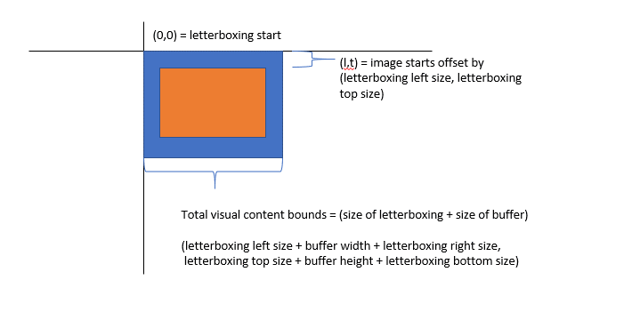
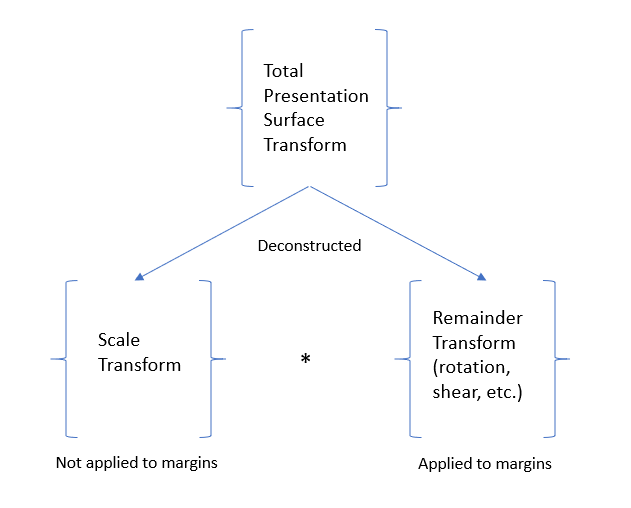
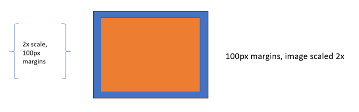
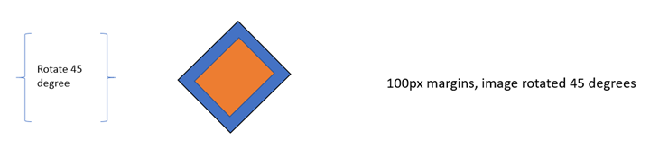
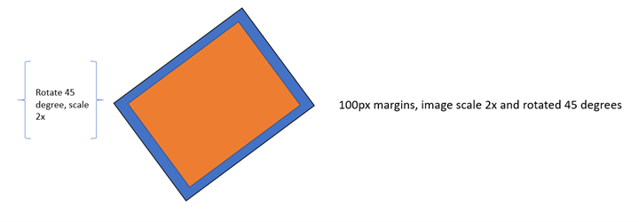
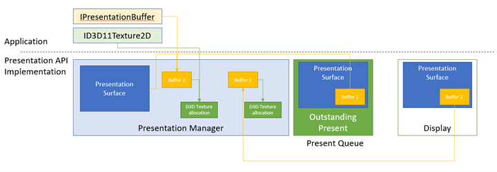
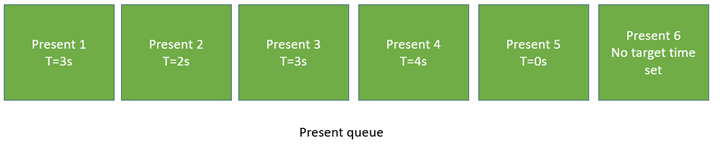

# Composition swapchain code examples

> [!NOTE]
> **Some information relates to pre-released product, which may be substantially modified before it's commercially released. Microsoft makes no warranties, express or implied, with respect to the information provided here.**

These code examples use the [Windows Implementation Libraries (WIL)](https://github.com/Microsoft/wil). A convenient way to install WIL is to go to Visual Studio, click **Project** \> **Manage NuGet Packages...** \> **Browse**, type or paste **Microsoft.Windows.ImplementationLibrary** in the search box, select the item in search results, and then click **Install** to install the package for that project.

## Example 1&mdash;Creating a presentation manager on systems that support the composition swapchain API

As mentioned, the composition swapchain API requires supported drivers to function. The following example illustrates how your application can create a presentation manager if the system supports the API. This is demonstrated as a `TryCreate`-style function that returns the presentation manager only if the API is supported. This function also demonstrates how to properly create a Direct3D device to back a presentation manager.

### C++ example

```cpp
bool TryCreatePresentationManager(
    _In_ bool requestDirectPresentation,
    _Out_ ID3D11Device** ppD3DDevice,
    _Outptr_opt_result_maybenull_ IPresentationManager **ppPresentationManager)
{
    // Null the presentation manager and Direct3D device initially
    *ppD3DDevice = nullptr;
    *ppPresentationManager = nullptr;

    // Direct3D device creation flags. The composition swapchain API requires that applications disable internal
    // driver threading optimizations, as these optimizations are incompatible with the
    // composition swapchain API. If this flag is not present, then the API will fail the call to create the
    // presentation factory.
    UINT deviceCreationFlags =
        D3D11_CREATE_DEVICE_BGRA_SUPPORT |
        D3D11_CREATE_DEVICE_SINGLETHREADED |
        D3D11_CREATE_DEVICE_PREVENT_INTERNAL_THREADING_OPTIMIZATIONS;

    // Create the Direct3D device.
    com_ptr_failfast<ID3D11DeviceContext> d3dDeviceContext;
    FAIL_FAST_IF_FAILED(D3D11CreateDevice(
        nullptr,                   // No adapter
        D3D_DRIVER_TYPE_HARDWARE,  // Hardware device
        nullptr,                   // No module
        deviceCreationFlags,       // Device creation flags
        nullptr, 0,                // Highest available feature level
        D3D11_SDK_VERSION,         // API version
        ppD3DDevice,               // Resulting interface pointer
        nullptr,                   // Actual feature level
        &d3dDeviceContext));       // Device context

    // Call the composition swapchain API export to create the presentation factory.
    com_ptr_failfast<IPresentationFactory> presentationFactory;
    FAIL_FAST_IF_FAILED(CreatePresentationFactory(
        (*ppD3DDevice),
        IID_PPV_ARGS(&presentationFactory)));

    // Determine whether the system is capable of supporting the composition swapchain API based
    // on the capability that's reported by the presentation factory. If your application
    // wants direct presentation (that is, presentation without the need for DWM to
    // compose, using MPO or iflip), then we query for direct presentation support.
    bool isSupportedOnSystem;
    if (requestDirectPresentation)
    {
        isSupportedOnSystem = presentationFactory->IsPresentationSupportedWithIndependentFlip();
    }
    else
    {
        isSupportedOnSystem = presentationFactory->IsPresentationSupported();
    }

    // Create the presentation manager if it is supported on the current system.
    if (isSupportedOnSystem)
    {
        FAIL_FAST_IF_FAILED(presentationFactory->CreatePresentationManager(ppPresentationManager));
    }

    return isSupportedOnSystem;
}
```

## Example 2&mdash;Creating a presentation manager and presentation surface

The following example illustrates how your application would create a presentation manager and a presentation surface to bind to a visual in a visual tree. Subsequent examples will show how to bind the presentation surface into both [**DirectComposition**](/windows/win32/directcomp/directcomposition-portal) and [**Windows.UI.Composition**](/uwp/api/windows.ui.composition) visual trees.

### C++ example (DCompositionGetTargetStatistics)

```cpp
bool MakePresentationManagerAndPresentationSurface(
    _Out_ ID3D11Device** ppD3dDevice,
    _Out_ IPresentationManager** ppPresentationManager,
    _Out_ IPresentationSurface** ppPresentationSurface,
    _Out_ unique_handle& compositionSurfaceHandle)
{
    // Null the output pointers initially.
    *ppD3dDevice = nullptr;
    *ppPresentationManager = nullptr;
    *ppPresentationSurface = nullptr;
    compositionSurfaceHandle.reset();

    com_ptr_failfast<IPresentationManager> presentationManager;
    com_ptr_failfast<IPresentationSurface> presentationSurface;
    com_ptr_failfast<ID3D11Device> d3d11Device;

    // Call the function we defined previously to create a Direct3D device and presentation manager, if
    // the system supports it.
    if (TryCreatePresentationManager(
        true, // Request presentation with independent flip.
        &d3d11Device,
        &presentationManager) == false)
    {
        // Return 'false' out of the call if the composition swapchain API is unsupported. Assume the caller
        // will handle this somehow, such as by falling back to DXGI.
        return false;
    }

    // Use DirectComposition to create a composition surface handle.
    FAIL_FAST_IF_FAILED(DCompositionCreateSurfaceHandle(
        COMPOSITIONOBJECT_ALL_ACCESS,
        nullptr,
        compositionSurfaceHandle.addressof()));

    // Create presentation surface bound to the composition surface handle.
    FAIL_FAST_IF_FAILED(presentationManager->CreatePresentationSurface(
        compositionSurfaceHandle.get(),
        presentationSurface.addressof()));

    // Return the Direct3D device, presentation manager, and presentation surface to the caller for future
    // use.
    *ppD3dDevice = d3d11Device.detach();
    *ppPresentationManager = presentationManager.detach();
    *ppPresentationSurface = presentationSurface.detach();

    // Return 'true' out of the call if the composition swapchain API is supported and we were able to
    // create a presentation manager.
    return true;
}
```

## Example 3&mdash;Binding a presentation surface to a Windows.UI.Composition surface brush

The following example illustrates how your application would bind a composition surface handle bound to a presentation surface, as created in the above example, to a [**Windows.UI.Composition**](/uwp/api/windows.ui.composition) (*WinComp*) surface brush, which can then be bound to a sprite visual in your application's visual tree.

### C++ example

```cpp
void BindPresentationSurfaceHandleToWinCompTree(
    _In_ ICompositor * pCompositor,
    _In_ ISpriteVisual * pVisualToBindTo, // The sprite visual we want to bind to.
    _In_ unique_handle& compositionSurfaceHandle)
{
    // QI an interop compositor from the passed compositor.
    com_ptr_failfast<ICompositorInterop> compositorInterop;
    FAIL_FAST_IF_FAILED(pCompositor->QueryInterface(IID_PPV_ARGS(&compositorInterop)));

    // Create a composition surface for the presentation surface's composition surface handle.
    com_ptr_failfast<ICompositionSurface> compositionSurface;
    FAIL_FAST_IF_FAILED(compositorInterop->CreateCompositionSurfaceForHandle(
        compositionSurfaceHandle.get(),
        &compositionSurface));

    // Create a composition surface brush, and bind the surface to it.
    com_ptr_failfast<ICompositionSurfaceBrush> surfaceBrush;
    FAIL_FAST_IF_FAILED(pCompositor->CreateSurfaceBrush(&surfaceBrush));
    FAIL_FAST_IF_FAILED(surfaceBrush->put_Surface(compositionSurface.get()));

    // Bind the brush to the visual.
    auto brush = surfaceBrush.query<ICompositionBrush>();
    FAIL_FAST_IF_FAILED(pVisualToBindTo->put_Brush(brush.get()));
}
```

## Example 4&mdash;Binding a presentation surface to a DirectComposition visual

The following example illustrates how your application would bind a presentation surface to a DirectComposition (*DComp*) visual in a visual tree.

### C++ example

```cpp
void BindPresentationSurfaceHandleToDCompTree(
    _In_ IDCompositionDevice* pDCompDevice,
    _In_ IDCompositionVisual* pVisualToBindTo,
    _In_ unique_handle& compositionSurfaceHandle) // The composition surface handle that was
                                                  // passed to CreatePresentationSurface.
{
    // Create a DComp surface to wrap the presentation surface.
    com_ptr_failfast<IUnknown> dcompSurface;
    FAIL_FAST_IF_FAILED(pDCompDevice->CreateSurfaceFromHandle(
        compositionSurfaceHandle.get(),
        &dcompSurface));

    // Bind the presentation surface to the visual.
    FAIL_FAST_IF_FAILED(pVisualToBindTo->SetContent(dcompSurface.get()));
}
```

## Example 5&mdash;Setting alpha mode and color space on a presentation surface

The following example illustrates how your application would set alpha mode and color space on a presentation surface. The alpha mode describes whether or not, and how, the alpha channel in the texture should be interpreted. The color space describes the color space to which the texture pixels refer.

All property updates like these will take effect as part of the application's next present, and take effect atomically alongside any buffer updates that are part of that present. A present may also, if your application wishes, not update any buffers at all, and instead, consist only of property updates. Any presentation surfaces whose buffers are not updated on a particular present remain bound to whatever buffer they were bound to before that present.

### C++ example

```cpp
void SetAlphaModeAndColorSpace(
    _In_ IPresentationSurface* pPresentationSurface)
{
    // Set alpha mode.
    FAIL_FAST_IF_FAILED(pPresentationSurface->SetAlphaMode(DXGI_ALPHA_MODE_IGNORE));

    // Set color space to full RGB.
    FAIL_FAST_IF_FAILED(pPresentationSurface->SetColorSpace(DXGI_COLOR_SPACE_RGB_FULL_G22_NONE_P709));
}
```

## Example 6&mdash;Setting letterboxing margins on a presentation surface

The following example illustrates how your application would specify letterboxing margins on a presentation surface. Letterboxing is used to fill a specified area outside of the surface content itself, to account for differing aspect ratios between content and the display device it's being shown on. A good example of this are the black *bars* that are often visible above and below content when watching on a PC a movie formatted for widescreen theaters. The composition swapchain API allows you to specify the margins within which to render letterboxing in such cases.

Currently, letterboxing areas are always filled with opaque black.

As visual tree content, the presentation surface exists in the coordinate space of its host visual. With letterboxing present, the origin of the visual's coordinate space corresponds to the top-left of the letterboxing. That is to say, the buffer itself exists offset into the visual's coordinate space. The bounds are computed as the size of the buffer plus the size of the letterboxing.

The following illustrates where the buffer and letterboxing exist in visual coordinate space, and how bounds are computed.



Finally, if the transform applied to a presentation surface comes with an offset, then the area not covered by the buffer or the letterboxing is considered outside of the bounds of the content, and is treated as transparent&mdash;similar to how any other visual tree content is treated outside of content bounds.

### Letterboxing and transform interaction

In order to provide consistent letterboxing margin sizes regardless of the scale your application applies to a buffer in order to fill some content area, DWM will attempt to render the margins at a consistent size regardless of scale, but taking into account the result of the transform that has been applied to the presentation surface.

Put another way, letterboxing margins are technically applied before the transform of the presentation surface is applied, but compensate for any scale that might be part of that transform. That is to say, the presentation surface's transform is deconstructed into two components&mdash;the part of the transform that scales, and the remainder of the transform.



For example, with 100px letterboxing margins, and no transform applied to the presentation surface, the resulting buffer will be rendered without scale, and letterboxing margins will be 100px wide.


Another example, with 100px letterboxing margins, and a 2x scale transform applied on the presentation surface, the resulting buffer will be rendered with a 2x scale, and letterboxing margins seen on screen will still be 100px in all sizes.



Another example, with a 45 degree rotation transform, the resulting letterboxing margins will appear 100px, and the letterboxing margins will be rotated with the buffer.



Another example, with a scale 2x and rotation 45 degree transform, the image will be rotated and scaled, and letterboxing margins will also be 100px wide and be rotated with the buffer.



If a scale transform can't be extracted unambiguously from the transform that your application applies to the presentation surface, such as if the resulting X or Y scale is 0, the letterboxing margins will be rendered with the entire transform applied, and we won't attempt to compensate for the scale.


### C++ example

```cpp
 void SetContentLayoutAndFill(
    _In_ IPresentationSurface* pPresentationSurface)
{
    // Set layout properties. Each layout property is described below.

    // The source RECT describes the area from the bound buffer that will be sampled from. The
    // RECT is in source texture coordinates. Below we indicate that we'll sample from a
    // 100x100 area on the source texture.
    RECT sourceRect;
    sourceRect.left = 0;
    sourceRect.top = 0;
    sourceRect.right = 100;
    sourceRect.bottom = 100;
    FAIL_FAST_IF_FAILED(pPresentationSurface->SetSourceRect(&sourceRect));

    // The presentation transform defines how the source rect will be transformed when
    // rendering the buffer. In this case, we indicate we want to scale it 2x in both
    // width and height, and we also want to offset it 50 pixels to the right.
    PresentationTransform transform = { 0 };
    transform.M11 = 2.0f; // X scale 2x
    transform.M22 = 2.0f; // Y scale 2x
    transform.M31 = 50.0f; // X offset 50px
    FAIL_FAST_IF_FAILED(pPresentationSurface->SetTransform(&transform));

    // The letterboxing parameters describe how to letterbox the content. Letterboxing
    // is commonly used to fill area not covered by video/surface content when scaling to
    // an aspect ration that doesn't match the aspect ratio of the surface itself. For
    // example, when viewing content formatted for the theater on a 1080p home screen, one
    // can typically see black "bars" on the top and bottom of the video, covering the space
    // on screen that wasn't covered by the video due to the differing aspect ratios of the
    // content and the display device. The composition swapchain API allows the user to specify
    // letterboxing margins, which describe the number of pixels to surround the surface
    // content with on screen. In this case, surround the top and bottom of our content with
    // 100 pixel tall letterboxing.
    FAIL_FAST_IF_FAILED(pPresentationSurface->SetLetterboxingMargins(
        0.0f,
        100.0f,
        0.0f,
        100.0f));
}
```

## Example 7&mdash;Setting content restrictions on a presentation surface

The following example illustrates how your application would prevent other applications from reading back the contents of the presentation surface (from technologies such as PrintScreen, DDA, Capture API, and others) for the purposes of protected content. It also demonstrates how to limit display of a presentation surface to only a single DXGI output.

If content readback is disabled, then when your application attempts to read back, the captured image will contain opaque black in place of the presentation surface. If a presentation surface is display-limited to an [**IDXGIOutput**](/windows/win32/api/dxgi/nn-dxgi-idxgioutput), then it will appear as opaque black on all other outputs.

### C++ example

```cpp
void SetContentRestrictions(
    _In_ IPresentationSurface* pPresentationSurface,
    _In_ IDXGIOutput* pOutputToRestrictTo)
{
    // Disable readback of the surface via printscreen, bitblt, etc.
    FAIL_FAST_IF_FAILED(pPresentationSurface->SetDisableReadback(true));

    // Restrict display of surface to only the passed output.
    FAIL_FAST_IF_FAILED(pPresentationSurface->RestrictToOutput(pOutputToRestrictTo));
}
```

## Example 8&mdash;Adding presentation buffers to a presentation manager

The following example illustrates how your application would allocate a set of Direct3D textures, and add them to the presentation manager to use as presentation buffers, which can be presented to presentation surfaces.

As mentioned, there are no restrictions around the number of presentation managers that a texture can be registered with. However, in most normal use cases, a texture will be registered only to a single presentation manager.

Also note that since the API accepts shared buffer handles as currency when registering textures as presentation buffers in the presentation manager, and since DXGI can create multiple shared buffers for a single texture2D, it's technically possible for your application to create multiple shared buffer handles for a single texture, and register them both with the presentation manager, essentially having the effect of adding the same buffer more than once. This is not advised, as it will break the synchronization mechanisms the presentation manager provides, as two presentation buffers tracked uniquely will actually correspond to the same texture. Since this is an advanced API, and since it is actually quite difficult in implementation to detect this case when it happens, the API doesn't attempt to validate this scenario.

### C++ example

```cpp
void AddBuffersToPresentationManager(
    _In_ ID3D11Device* pD3D11Device, // The backing Direct3D device
    _In_ IPresentationManager* pPresentationManager, // Previously-made presentation manager
    _In_ UINT bufferWidth, // The width of the buffers to add
    _In_ UINT bufferHeight, // The height of the buffers to add
    _In_ UINT numberOfBuffersToAdd, // The number of buffers to add to the presentation manager
    _Out_ vector<com_ptr_failfast<ID3D11Texture2D>>& textures, // Array of textures returned
    _Out_ vector<com_ptr_failfast<IPresentationBuffer>>& presentationBuffers) // Array of presentation buffers returned
{
    // Clear the returned vectors initially.
    textures.clear();
    presentationBuffers.clear();

    // Add the desired buffers to the presentation manager.
    for (UINT i = 0; i < numberOfBuffersToAdd; i++)
    {
        com_ptr_failfast<ID3D11Texture2D> texture;
        com_ptr_failfast<IPresentationBuffer> presentationBuffer;

        // Call our helper to make a new buffer of the desired type.
        AddNewPresentationBuffer(
            pD3D11Device,
            pPresentationManager,
            bufferWidth,
            bufferHeight,
            &texture,
            &presentationBuffer);

        // Track our buffers in our own set of vectors.
        textures.push_back(texture);
        presentationBuffers.push_back(presentationBuffer);
    }
}

void AddNewPresentationBuffer(
    _In_ ID3D11Device* pD3D11Device,
    _In_ IPresentationManager* pPresentationManager,
    _In_ UINT bufferWidth,
    _In_ UINT bufferHeight,
    _Out_ ID3D11Texture2D** ppTexture2D,
    _Out_ IPresentationBuffer** ppPresentationBuffer)
{
    com_ptr_failfast<ID3D11Texture2D> texture2D;
    unique_handle sharedResourceHandle;

    // Create a shared Direct3D texture and handle with the passed attributes.
    MakeD3D11Texture(
        pD3D11Device,
        bufferWidth,
        bufferHeight,
        &texture2D,
        out_param(sharedResourceHandle));

    // Add the texture2D to the presentation manager, and get back a presentation buffer.
    com_ptr_failfast<IPresentationBuffer> presentationBuffer;
    FAIL_FAST_IF_FAILED(pPresentationManager->AddBufferFromSharedHandle(
        sharedResourceHandle.get(),
        &presentationBuffer));

    // Return back the texture and buffer presentation buffer.
    *ppTexture2D = texture2D.detach();
    *ppPresentationBuffer = presentationBuffer.detach();
}

void MakeD3D11Texture(
    _In_ ID3D11Device* pD3D11Device,
    _In_ UINT textureWidth,
    _In_ UINT textureHeight,
    _Out_ ID3D11Texture2D** ppTexture2D,
    _Out_ HANDLE* sharedResourceHandle)
{
    D3D11_TEXTURE2D_DESC textureDesc = {};

    // Width and height can be anything within max texture size of the adapter backing the Direct3D
    // device.
    textureDesc.Width = textureWidth;
    textureDesc.Height = textureHeight;

    // MipLevels and ArraySize must be 1.
    textureDesc.MipLevels = 1;
    textureDesc.ArraySize = 1;

    // Format can be one of the following:
    //   DXGI_FORMAT_B8G8R8A8_UNORM
    //   DXGI_FORMAT_R8G8B8A8_UNORM
    //   DXGI_FORMAT_R16G16B16A16_FLOAT
    //   DXGI_FORMAT_R10G10B10A2_UNORM
    //   DXGI_FORMAT_NV12
    //   DXGI_FORMAT_YUY2
    //   DXGI_FORMAT_420_OPAQUE
    // For this 
    textureDesc.Format = DXGI_FORMAT_B8G8R8A8_UNORM;

    // SampleDesc count and quality must be 1 and 0 respectively.
    textureDesc.SampleDesc.Count = 1;
    textureDesc.SampleDesc.Quality = 0;

    // Usage must be D3D11_USAGE_DEFAULT.
    textureDesc.Usage = D3D11_USAGE_DEFAULT;

    // BindFlags must include D3D11_BIND_SHADER_RESOURCE for RGB textures, and D3D11_BIND_DECODER
    // for YUV textures. For RGB textures, it is likely your application will want to specify
    // D3D11_BIND_RENDER_TARGET in order to render to it.
    textureDesc.BindFlags =
        D3D11_BIND_SHADER_RESOURCE |
        D3D11_BIND_RENDER_TARGET;

    // MiscFlags should include D3D11_RESOURCE_MISC_SHARED and D3D11_RESOURCE_MISC_SHARED_NTHANDLE,
    // and might also include D3D11_RESOURCE_MISC_SHARED_DISPLAYABLE if your application wishes to
    // qualify for MPO and iflip. If D3D11_RESOURCE_MISC_SHARED_DISPLAYABLE is not provided, then the
    // content will not qualify for MPO or iflip, but can still be composed by DWM
    textureDesc.MiscFlags =
        D3D11_RESOURCE_MISC_SHARED |
        D3D11_RESOURCE_MISC_SHARED_NTHANDLE |
        D3D11_RESOURCE_MISC_SHARED_DISPLAYABLE;

    // CPUAccessFlags must be 0.
    textureDesc.CPUAccessFlags = 0;

    // Use Direct3D to create a texture 2D matching the desired attributes.
    com_ptr_failfast<ID3D11Texture2D> texture2D;
    FAIL_FAST_IF_FAILED(pD3D11Device->CreateTexture2D(&textureDesc, nullptr, &texture2D));

    // Create a shared handle for the texture2D.
    unique_handle sharedBufferHandle;
    auto dxgiResource = texture2D.query<IDXGIResource1>();
    FAIL_FAST_IF_FAILED(dxgiResource->CreateSharedHandle(
        nullptr,
        GENERIC_ALL,
        nullptr,
        &sharedBufferHandle));

    // Return the handle to the caller.
    *ppTexture2D = texture2D.detach();
    *sharedResourceHandle = sharedBufferHandle.release();
}
```

## Example 9&mdash;Removing presentation buffers from a presentation manager, and object lifetime

Removing a presentation buffer from the presentation manager is as simple as releasing the IPresentationBuffer object to a 0 refcount. However, when this happens, it doesn't necessarily mean that the presentation buffer can be released. There may be cases when a buffer may still be in use, such as if that presentation buffer is visible on screen, or has outstanding presents that reference it.

In short, the presentation manager will keep track of how every buffer is being used by your application directly, and indirectly. It will keep track of what buffers are displayed, what presents are outstanding and reference buffers, and it will internally track all this state to make sure that a buffer isn't truly released/unregistered until it truly is no longer in use.

A good way to think about buffer lifetime is that if your application releases an IPresentationBuffer, it is telling the API that it will no longer use that buffer in any future calls. The composition swapchain API will be tracking this, as well as any other ways the buffer is being used, and it will fully release the buffer only when it is completely safe to do so.

In short&mdash;your application should release an [**IPresentationBuffer**](/windows/win32/api/presentation/nn-presentation-ipresentationbuffer) when it's done with it, and know that the composition swapchain API will fully release the buffer when all other uses have completed as well.

Here's an illustration of the concepts above.



In this example, we have a presentation manager with two presentation buffers. Buffer 1 has three references keeping it alive.

* Your application holds an **IPresentationBuffer** referencing it.
* Internal to the API, it is being stored as the presentation surface's current bound buffer, as it was the last buffer your application bound, which it then presented.
* There's also a present outstanding in the present queue intending to display buffer 1 on the presentation surface.

Buffer 1 is additionally holding a reference on its corresponding Direct3D texture allocation. Your application also has an [**ID3D11Texture2D**](/windows/win32/api/d3d11/nn-d3d11-id3d11texture2d) referencing that allocation.

Buffer 2 has no more outstanding references from the application side, nor does the texture allocation it references, but buffer 2 is being kept alive because it is what is being displayed currently by the presentation surface on screen. When Present 1 is processed, and buffer 1 is displayed on screen instead, buffer 2 will have no more references, and it will be released, in turn releasing its reference on its Direct3D texture2D allocation.

### C++ example

```cpp
void ReleasePresentationManagerBuffersExample(
    _In_ ID3D11Device* pD3D11Device,
    _In_ IPresentationManager* pPresentationManager)
{
    com_ptr_failfast<ID3D11Texture2D> texture2D;
    com_ptr_failfast<IPresentationBuffer> newBuffer;

    // Create a new texture/presentation buffer.
    AddNewPresentationBuffer(
        pD3D11Device,
        pPresentationManager,
        200, // Buffer width
        200, // Buffer height
        &texture2D,
        &newBuffer);

    // Release the IPresentationBuffer. This indicates that we have no more intention to use it
    // from the application side. However, if we have any presents outstanding that reference
    // the buffer, it will be kept alive internally and released when all outstanding presents
    // have been retired.
    newBuffer.reset();

    // When the presentation buffer is truly released internally, it will in turn release its
    // reference on the texture2D which it corresponds to. Your application must also release
    // its own references to the texture2D for it to be released.
    texture2D.reset();
}
```

## Example 10&mdash;Resizing buffers in a presentation manager

The following example illustrates how your application would perform a *resize* of the presentation buffers. For example, if a movie streaming service is streaming 480p but decides to switch formats to 1080p due to the availability of high network bandwidth, then it would want to reallocate its buffers from 480p to 1080p so that it could begin presenting 1080p content.

In DXGI, this is referred to as a *resize* operation. DXGI reallocates all buffers atomically, which is costly, and can produce glitching on screen. The example here describes how to achieve atomic resize on par with DXGI in the composition swapchain API. A later example will show how to do a resize in a *staggered* fashion, spacing out the reallocation across multiple presents, achieving better performance than an atomic swapchain resize.

### C++ example

```cpp
void ResizePresentationManagerBuffersExample(
    _In_ ID3D11Device* pD3D11Device,
    _In_ IPresentationManager* pPresentationManager) // Previously-made presentation manager.
{
    // Vectors representing the IPresentationBuffer and ID3D11Texture2D collections.
    vector<com_ptr_failfast<ID3D11Texture2D>> textures;
    vector<com_ptr_failfast<IPresentationBuffer>> presentationBuffers;

    // Add 6 50x50 buffers to the presentation manager. See previous example for definition of
    // this function.
    AddBuffersToPresentationManager(
        pD3D11Device,
        pPresentationManager,
        50, // Buffer width
        50, // Buffer height
        6, // Number of buffers
        textures,
        presentationBuffers);

    // Release all the buffers we just added. The presentation buffers internally will be released
    // when any other references are also removed (outstanding presents, display references, etc.).
    textures.clear();
    presentationBuffers.clear();

    // Add 6 new 100x100 buffers to the presentation manager to replace the
    // old ones we just removed.
    AddBuffersToPresentationManager(
        pD3D11Device,
        pPresentationManager,
        100, // Buffer width
        100, // Buffer height
        6, // Number of buffers
        textures,
        presentationBuffers);
}
```

## Example 11&mdash;Synchronizing presentation using buffer available events, and handling presentation manager lost events

If your application is going to issue a present involving a presentation buffer that has been used in an earlier present, then you must ensure that the previous present is complete for rendering to and presenting the presentation buffer again. The composition swapchain API provides a couple of different mechanisms to facilitate this synchronization. The easiest is a presentation buffer's *available event*, which is an NT event object that is signaled when a buffer is available to use (that is, all previous presents have entered either the *retiring* or *retired* state) and unsignaled otherwise. This example illustrates how to use buffer available events to pick out available buffers to present. It also illustrates how to listen for *device lost* errors which are morally equivalent to DXGI device loss, and require a recreation of the presentation manager.

### Presentation manager lost errors

A presentation manager can become lost if it encounters an error internally that it can't recover from. Your application must destroy a lost presentation manager, and create a new one to use instead. When a presentation manager becomes lost, it will stop accepting further presents. Any attempt to call **Present** on a lost presentation manager will return **PRESENTATION_ERROR_LOST**. All other methods, however, will function normally. This is to ensure that your application needs only to check for **PRESENTATION_ERROR_LOST** on present calls, and doesn't need to anticipate/handle lost errors on every API call. If your application wishes to check for, or be notified of, lost errors outside of a present call, then it can use the lost event returned by [**IPresentationManager::GetLostEvent**](/windows/win32/api/presentation/nf-presentation-ipresentationmanager-getlostevent).

### Present queue and timing

Presents issued by the presentation manager can specify a specific time to target. This target time is the ideal time that the system will attempt to show the present. Since screens update at a finite cadence, the present is unlikely to show up precisely at the specified time, but it will be shown as close to the time as it can.

This target time is a system-relative time, or the time the system has been running since it turned on, in hundreds-of-nanosecond units. An easy way to compute the current time is to query current [**QueryPerformanceCounter**](/windows/win32/api/profileapi/nf-profileapi-queryperformancecounter) (QPC) value, divide it by the system's QPC frequency, and multiply it by 10,000,000. Rounding and precision limits aside, this will compute the current time in applicable units. The system could also get the current time by calling [**MfGetSystemTime**](/windows/win32/api/mfidl/nf-mfidl-mfgetsystemtime), or [**QueryInterruptTimePrecise**](/windows/win32/api/realtimeapiset/nf-realtimeapiset-queryinterrupttimeprecise).

Once the current time is known, your application will typically emit presents at increasing offsets from the current time.

Regardless of target time, presents are always processed in queue order. Even if a present targets an earlier time than the previous present, it will not be processed until after that previous present is processed. This essentially means that any present that doesn't target a later time than the one before it will override that previous present. It also means that if your application wants to issue a present *as early as possible*, then it can simply not set a target time (in which case the target time would remain what it was for the last present), or set a target time of 0. Both would have the same effect. If your application doesn't want to wait for previous presents to complete for a new present to take place, then it will need to cancel previous presents. A future example describes how to do this.



**T=3s**: Present 1, 2, 3 all ready, and 3, being the last present, wins out.
**T=4s**: Present 4, 5, 6 all ready, and 6, being the last present, wins out.

The diagram above illustrates an example of outstanding presents in the present queue. Present 1 targets a time of 3s. So no presents will take place until 3s. However, present 2 actually targets an earlier time, 2s, and present 3 targets 3s as well. As such, at time 3s, presents 1, 2, and 3 will all complete, and present 3 will be the present to actually take effect. Following that, the next present, 4, will be satisfied at 4s, but immediately be overridden by Present 5, which targets 0s, and Present 6, which has no target time set. Both 5 and 6 effective take effect *as early as possible*.

### C++ example

```cpp
bool SimpleEventSynchronizationExample(
    _In_ ID3D11Device* pD3D11Device,
    _In_ IPresentationManager* pPresentationManager,
    _In_ IPresentationSurface* pPresentationSurface,
    _In_ vector<com_ptr_failfast<ID3D11Texture2D>>& textures,
    _In_ vector<com_ptr_failfast<IPresentationBuffer>>& presentationBuffers)
{
    // Track a time we'll be presenting to below. Default to the current time, then increment by
    // 1/10th of a second every present.
    SystemInterruptTime presentTime;
    QueryInterruptTimePrecise(&presentTime.value);

    // Build an array of events that we can wait on to perform various actions in our work loop.
    vector<unique_event> waitEvents;

    // The lost event will be the first event in our list. This is an event that signifies that
    // something went wrong in the system (due to extreme conditions such as memory pressure, or
    // driver issues) that indicate that the presentation manager has been lost, and should no
    // longer be used, and instead should be recreated.
    unique_event lostEvent;
    pPresentationManager->GetLostEvent(&lostEvent);
    waitEvents.emplace_back(std::move(lostEvent));

    // Add each buffer's available event to the list of events we will be waiting on.
    for (UINT bufferIndex = 0; bufferIndex < presentationBuffers.size(); bufferIndex++)
    {
        unique_event availableEvent;
        presentationBuffers[bufferIndex]->GetAvailableEvent(&availableEvent);
        waitEvents.emplace_back(std::move(availableEvent));
    }

    // Iterate for 120 presents.
    constexpr UINT numberOfPresents = 120;
    for (UINT onPresent = 0; onPresent < numberOfPresents; onPresent++)
    {
        // Advance our present time 1/10th of a second in the future. Note the API accepts
        // time in 100ns units, or 1/1e7 of a second, meaning that 1 million units correspond to
        // 1/10th of a second.
        presentTime.value += 1'000'000;

        // Wait for the lost event or an available buffer. Since WaitForMultipleObjects prioritizes
        // lower-indexed events, it is recommended to put any higher importance events (like the
        // lost event) first, and then follow up with buffer available events.
        DWORD waitResult = WaitForMultipleObjects(
            static_cast<UINT>(waitEvents.size()),
            reinterpret_cast<HANDLE*>(waitEvents.data()),
            FALSE,
            INFINITE);

        // Failfast if the wait hit an error.
        FAIL_FAST_IF((waitResult - WAIT_OBJECT_0) >= waitEvents.size());

        // Our lost event was the first event in the array. If this is signaled, the caller
        // should recreate the presentation manager. This is very similar to how Direct3D devices
        // can be lost. Assume our caller knows to handle this return value appropriately.
        if (waitResult == WAIT_OBJECT_0)
        {
            return false;
        }

        // Otherwise, compute the buffer corresponding to the available event that was signaled.
        UINT bufferIndex = waitResult - (WAIT_OBJECT_0 + 1);

        // Draw red to that buffer
        DrawColorToSurface(
            pD3D11Device,
            textures[bufferIndex],
            1.0f, // red
            0.0f, // green
            0.0f); // blue

        // Bind the presentation buffer to the presentation surface. Changes in this binding will take
        // effect on the next present, and the binding persists across presents. That is, any number
        // of subsequent presents will imply this binding until it is changed. It is completely fine
        // to only update buffers for a subset of the presentation surfaces owned by a presentation
        // manager on a given present - the implication is that it simply didn't update.
        //
        // Similarly, note that if your application were to call SetBuffer on the same presentation
        // surface multiple times without calling present, this is fine. The policy is last writer
        // wins.
        //
        // Your application may present without first binding a presentation surface to a buffer.
        // The result will be that presentation surface will simply have no content on screen,
        // similar to how DComp and WinComp surfaces appear in a tree before they are rendered to.
        // In that case system content will show through where the buffer would have been.
        //
        // Your application may also set a 'null' buffer binding after previously having bound a
        // buffer and present - the end result is the same as if your application had presented
        // without ever having set the content.
        pPresentationSurface->SetBuffer(presentationBuffers[bufferIndex].get());

        // Present at the targeted time. Note that a present can target only a single time. If an
        // application wants to updates two buffers at two different times, then it must present
        // two times.
        //
        // Presents are always processed in queue order. A present will not take effect before any
        // previous present in the queue, even if it targets an earlier time. In such a case, when
        // the previous present is processed, the next present will also be processed immediately,
        // and override that previous present.
        //
        // For this reason, if your application wishes to present "now" or "early as possible", then
        // it can simply present, without setting a target time. The implied target time will be 0,
        // and the new present will override the previous present.
        //
        // If your application wants to present truly "now", and not wait for previous presents in the
        // queue to be processed, then it will need to cancel previous presents. A future example
        // demonstrates how to do this.
        //
        // Your application will receive PRESENTATION_ERROR_LOST if it attempts to Present a lost
        // presentation manager. This is the only call that will return such an error. A lost
        // presentation manager functions normally in every other case, so applications need only
        // to handle this error at the time they call Present.
        pPresentationManager->SetTargetTime(presentTime);
        HRESULT hrPresent = pPresentationManager->Present();
        if (hrPresent == PRESENTATION_ERROR_LOST)
        {
            // Our presentation manager has been lost. Return 'false' to the caller to indicate that
            // the presentation manager should be recreated.
            return false;
        }
        else
        {
            FAIL_FAST_IF_FAILED(hrPresent);
        }
    }

    return true;
}

void DrawColorToSurface(
    _In_ ID3D11Device* pD3D11Device,
    _In_ const com_ptr_failfast<ID3D11Texture2D>& texture2D,
    _In_ float redValue,
    _In_ float greenValue,
    _In_ float blueValue)
{
    com_ptr_failfast<ID3D11DeviceContext> D3DDeviceContext;
    com_ptr_failfast<ID3D11RenderTargetView> renderTargetView;

    // Get the immediate context from the D3D11 device.
    pD3D11Device->GetImmediateContext(&D3DDeviceContext);

    // Create a render target view of the passed texture.
    auto resource = texture2D.query<ID3D11Resource>();
    FAIL_FAST_IF_FAILED(pD3D11Device->CreateRenderTargetView(
        resource.get(),
        nullptr,
        renderTargetView.addressof()));

    // Clear the texture with the specified color.
    float clearColor[4] = { redValue, greenValue, blueValue, 1.0f }; // red, green, blue, alpha
    D3DDeviceContext->ClearRenderTargetView(renderTargetView.get(), clearColor);
}
```

## Example 12&mdash;Advanced synchronization&mdash;throttling workflow to the size of the outstanding present queue using present synchronization fences, and handling presentation manager lost events

The following example illustrates how your application can submit a large number of presents for the future, and then sleep until the number of presents that are still outstanding drops to a specific quantity. Frameworks such as Windows Media Foundation throttle this way to minimize the number of CPU wakes that occur, while still ensuring that the present queue doesn't deplete (which would prevent smooth playback, and cause a glitch). This has the effect of minimizing CPU power usage during the presentation workflow. Your application will queue the maximum number of presents (based on the number of presentation buffers they've allocated), and then sleep until right before the present queue is depleted to refill the queue.

### C++ example

```cpp
bool FenceSynchronizationExample(
    _In_ ID3D11Device* pD3D11Device,
    _In_ IPresentationManager* pPresentationManager,
    _In_ IPresentationSurface* pPresentationSurface,
    _In_ vector<com_ptr_failfast<ID3D11Texture2D>>& textures,
    _In_ vector<com_ptr_failfast<IPresentationBuffer>>& presentationBuffers)
{
    // Track a time we'll be presenting to below. Default to the current time, then increment by
    // 1/10th of a second every present.
    SystemInterruptTime presentTime;
    QueryInterruptTimePrecise(&presentTime.value);

    // Get present retiring fence.
    com_ptr_failfast<ID3D11Fence> presentRetiringFence;
    FAIL_FAST_IF_FAILED(pPresentationManager->GetPresentRetiringFence(
        IID_PPV_ARGS(&presentRetiringFence)));

    // Get the lost event to query before presentation.
    unique_event lostEvent;
    pPresentationManager->GetLostEvent(&lostEvent);

    // Create an event to synchronize to our queue depth with. We'll use Direct3D to signal this event
    // when our synchronization fence indicates reaching a specific present.
    unique_event presentQueueSyncEvent;
    presentQueueSyncEvent.create(EventOptions::ManualReset);

    // Cycle the present queue 10 times.
    constexpr UINT numberOfPresentRefillCycles = 10;
    for (UINT onRefillCycle = 0; onRefillCycle < numberOfPresentRefillCycles; onRefillCycle++)
    {
        // Fill up presents for all presentation buffers. We compare the presentation manager's
        // next present ID to the present confirmed fence's value to figure out how
        // far ahead we are. We stop when we've issued presents for all buffers.
        while ((pPresentationManager->GetNextPresentId() -
                presentRetiringFence->GetCompletedValue()) < presentationBuffers.size())
        {
            // Present buffers in cyclical pattern. We can figure out the current buffer to
            // present by taking the modulo of the next present ID by the number of buffers. Note that the
            // first present of a presentation manager always has a present ID of 1 and increments by 1 on
            // each subsequent present. A present ID of 0 is conceptually meant to indicate that "no
            // presents have taken place yet".
            UINT bufferIndex = static_cast<UINT>(
                pPresentationManager->GetNextPresentId() % presentationBuffers.size());

            // Assert that the passed buffer is tracked as available for presentation. Because we throttle
            // based on the total number of buffers, this should always be true.
            NT_ASSERT(presentationBuffers[bufferIndex]->IsAvailable());

            // Advance our present time 1/10th of a second in the future.
            presentTime.value += 1'000'000;

            // Draw red to the texture.
            DrawColorToSurface(
                pD3D11Device,
                textures[bufferIndex],
                1.0f, // red
                0.0f, // green
                0.0f); // blue

            // Bind the presentation buffer to the presentation surface.
            pPresentationSurface->SetBuffer(presentationBuffers[bufferIndex].get());

            // Present at the targeted time.
            pPresentationManager->SetTargetTime(presentTime);
            HRESULT hrPresent = pPresentationManager->Present();
            if (hrPresent == PRESENTATION_ERROR_LOST)
            {
                // Our presentation manager has been lost. Return 'false' to the caller to indicate that
                // the presentation manager should be recreated.
                return false;
            }
            else
            {
                FAIL_FAST_IF_FAILED(hrPresent);
            }
        };

        // Now that the buffer is full, go to sleep until the present queue has been drained to
        // the desired queue depth. To figure out the appropriate present to wake on, we subtract
        // the desired wake queue depth from the presentation manager's last present ID. We
        // use Direct3D's SetEventOnCompletion to signal our wait event when that particular present
        // is retiring, and then wait on that event. Note that the semantic of SetEventOnCompletion
        // is such that even if we happen to call it after the fence has already reached the
        // requested value, the event will be set immediately.
        constexpr UINT wakeOnQueueDepth = 2;
        presentQueueSyncEvent.ResetEvent();
        FAIL_FAST_IF_FAILED(presentRetiringFence->SetEventOnCompletion(
            pPresentationManager->GetNextPresentId() - 1 - wakeOnQueueDepth,
            presentQueueSyncEvent.get()));

        HANDLE waitHandles[] = { lostEvent.get(), presentQueueSyncEvent.get() };
        DWORD waitResult = WaitForMultipleObjects(
            ARRAYSIZE(waitHandles),
            waitHandles,
            FALSE,
            INFINITE);

        // Failfast if we hit an error during our wait.
        FAIL_FAST_IF((waitResult - WAIT_OBJECT_0) >= ARRAYSIZE(waitHandles));

        if (waitResult == WAIT_OBJECT_0)
        {
            // The lost event was signaled - return 'false' to the caller to indicate that
            // the presentation manager was lost.
            return false;
        }

        // Iterate into another refill cycle.
    }

    return true;
}
```

## Example 13&mdash;VSync interrupts and hardware flip queue support

A new form of flip queue management called *hardware flip queue* has been introduced alongside this API, essentially allowing GPU hardware to manage presents completely independently of the CPU. The main benefit of this is power efficiency. When the CPU doesn't need to be involved in the presentation process, less power is drawn.

The downside to having the GPU handle presents independently is that CPU state can no longer immediately reflect when presents are shown. composition swapchain API concepts such as buffer available events, synchronization fences, and present statistics won't be updated immediately. Instead, the GPU will refresh only periodically the CPU state as to what presents have been shown. This means that feedback to applications regarding present status will come with a latency.

Your application will typically care when some presents are shown, but not care so much about other presents. For example, if your application issues 10 presents, it may decide that it wants to know when the 8th is shown, so it can begin refilling the present queue again. In this case, the only present it really wants feedback from is the 8th. It doesn't plan on doing anything when 1-7 or 9 are shown.

Whether presents update CPU state is dependent on whether the GPU hardware is configured to generate a VSync interrupt when that present is shown. This VSync interrupt awakens the CPU if it's not already active, and the CPU then runs special kernel-level code to update itself on the presents that have occurred on the GPU since the last time it checked, in turn updating feedback mechanisms such as buffer available events, the present retiring fence, and present statistics.

To allow your application to explicitly indicate which presents should issue a VSync interrupt, the presentation manager exposes a [**IPresentationManager::ForceVSyncInterrupt**](/windows/win32/api/presentation/nf-presentation-ipresentationmanager-forcevsyncinterrupt) method, which specifies whether or not subsequent presents should issue a VSync interrupt. This setting applies to all future presents until it is changed, much like [**IPresentationManager::SetTargetTime**](/windows/win32/api/presentation/nf-presentation-ipresentationmanager-settargettime) and [**IPresentationManager::SetPreferredPresentDuration**](/windows/win32/api/presentation/nf-presentation-ipresentationmanager-setpreferredpresentduration).

If this setting is enabled on a particular present, then the hardware will immediately notify the CPU when that present is shown, using more power, but ensuring that the CPU is immediately notified when a present takes place in order to allow applications to respond as quickly as possible. If this setting is disabled on a particular present, then the system will be allowed to defer updating the CPU when the present is shown&mdash;saving power, but deferring feedback.

Your application will typically not force the VSync interrupt for any presents except a present it wants to synchronize with. In the example above, since your application wanted to wake up when the 8th present was shown to refill its present queue, it would request that present 8 signals a VSync interrupt, but presents 1-7 and present 9 don't. 

By default, if your application doesn't configure this setting, then the presentation manager will always signal the VSync interrupt when every present is shown. Applications that are not concerned about power usage, or not aware of hardware flip queue support, can simply not call **ForceVSyncInterrupt**, and they'll be guaranteed to synchronize properly as a result. Applications that are aware of hardware flip queue support can explicitly control this setting for improved power efficiency.

The following is a diagram describing the behavior of the API with respect to VSync interrupt settings.


### C++ example

```cpp
bool ForceVSyncInterruptPresentsExample(
    _In_ ID3D11Device* pD3D11Device,
    _In_ IPresentationManager* pPresentationManager,
    _In_ IPresentationSurface* pPresentationSurface,
    _In_ vector<com_ptr_failfast<ID3D11Texture2D>>& textures,
    _In_ vector<com_ptr_failfast<IPresentationBuffer>>& presentationBuffers)
{
    // Track a time we'll be presenting to below. Default to the current time, then increment by
    // 1/10th of a second every present.
    SystemInterruptTime presentTime;
    QueryInterruptTimePrecise(&presentTime.value);

    // Get present retiring fence.
    com_ptr_failfast<ID3D11Fence> presentRetiringFence;
    FAIL_FAST_IF_FAILED(pPresentationManager->GetPresentRetiringFence(
        IID_PPV_ARGS(&presentRetiringFence)));

    // Get the lost event to query before presentation.
    unique_event lostEvent;
    pPresentationManager->GetLostEvent(&lostEvent);

    // Create an event to synchronize to our queue depth with. We will use Direct3D to signal this event
    // when our synchronization fence indicates reaching a specific present.
    unique_event presentQueueSyncEvent;
    presentQueueSyncEvent.create(EventOptions::ManualReset);

    // Issue 10 presents, and wake when the present queue is 2 entries deep (which happens when
    // present 7 is retiring).
    constexpr UINT wakeOnQueueDepth = 2;
    constexpr UINT numberOfPresents = 10;
    const UINT presentIdToWakeOn = numberOfPresents - 1 - wakeOnQueueDepth;
    while (pPresentationManager->GetNextPresentId() <= numberOfPresents)
    {
        UINT bufferIndex = static_cast<UINT>(
            pPresentationManager->GetNextPresentId() % presentationBuffers.size());

        // Advance our present time 1/10th of a second in the future.
        presentTime.value += 1'000'000;

        // Draw red to the texture.
        DrawColorToSurface(
            pD3D11Device,
            textures[bufferIndex],
            1.0f, // red
            0.0f, // green
            0.0f); // blue

        // Bind the presentation buffer to the presentation surface.
        pPresentationSurface->SetBuffer(presentationBuffers[bufferIndex].get());

        // Present at the targeted time.
        pPresentationManager->SetTargetTime(presentTime);

        // If this present is not going to retire the present that we want to wake on when it is shown, then
        // we don't need immediate updates to buffer available events, present retiring fence, or present
        // statistics. As such, we can mark it as not requiring a VSync interrupt, to allow for greater
        // power efficiency on machines with hardware flip queue support.
        bool forceVSyncInterrupt = (pPresentationManager->GetNextPresentId() == (presentIdToWakeOn + 1));
        pPresentationManager->ForceVSyncInterrupt(forceVSyncInterrupt);

        HRESULT hrPresent = pPresentationManager->Present();
        if (hrPresent == PRESENTATION_ERROR_LOST)
        {
            // Our presentation manager has been lost. Return 'false' to the caller to indicate that
            // the presentation manager should be recreated.
            return false;
        }
        else
        {
            FAIL_FAST_IF_FAILED(hrPresent);
        }
    }

    // Now that the buffer is full, go to sleep until presentIdToWakeOn has begun retiring. We
    // configured the subsequent present to force a VSync interrupt when it is shown, which will ensure
    // this wait is completed immediately.
    presentQueueSyncEvent.ResetEvent();
    FAIL_FAST_IF_FAILED(presentRetiringFence->SetEventOnCompletion(
        presentIdToWakeOn,
        presentQueueSyncEvent.get()));

    HANDLE waitHandles[] = { lostEvent.get(), presentQueueSyncEvent.get() };
    DWORD waitResult = WaitForMultipleObjects(
        ARRAYSIZE(waitHandles),
        waitHandles,
        FALSE,
        INFINITE);

    // Failfast if we hit an error during our wait.
    FAIL_FAST_IF((waitResult - WAIT_OBJECT_0) >= ARRAYSIZE(waitHandles));

    if (waitResult == WAIT_OBJECT_0)
    {
        // The lost event was signaled - return 'false' to the caller to indicate that
        // the presentation manager was lost.
        return false;
    }

    return true;
}
```

## Example 14&mdash;Canceling presents scheduled for the future

Media applications that deeply queue presents for the future might decide to cancel presents they've previously issued. This may happen, for example, if your application is playing back a video, has issued a large number of frames for the future, and the user decides to pause video playback. In this case, your application will want to stick to the current frame, and cancel any future frames that haven't yet become queued. This may also happen if a media application decides to move playback to a different point in the video. In this case, your application will want to cancel all presents that have not yet become queued for the old position in the video, and replace them with presents for the new position. In this case, after canceling previous presents, your application can issue new presents in the future corresponding to the new point in the video.

### C++ example

```cpp
void PresentCancelExample(
    _In_ IPresentationManager* pPresentationManager,
    _In_ UINT64 firstPresentIDToCancelFrom)

{
    // Assume we've issued a number of presents in the future. Something happened in the app, and
    // we want to cancel the issued presents that occur after a specified time or present ID. This
    // may happen, for example, when the user pauses playback from inside a media application. The
    // application will want to cancel all presents posted targeting beyond the pause time. The
    // cancel will apply to all previously posted presents whose present IDs are at least
    // 'firstPresentIDToCancelFrom'. Note that Present IDs are always unique, and never recycled,
    // so even if a present is canceled, no subsequent present will ever reuse its present ID.
    //
    // Also note that if some presents we attempt to cancel can't be canceled because they've
    // already started queueing, then no error will be returned, they simply won't be canceled as
    // requested. Cancelation takes a "best effort" approach.
    FAIL_FAST_IF_FAILED(pPresentationManager->CancelPresentsFrom(firstPresentIDToCancelFrom));

    // In the case where the media application scrubbed to a different position in the video, it may now
    // choose to issue new presents to replace the ones canceled. This is not illustrated here, but
    // previous examples that demonstrate presentation show how this may be achieved.
}
```

## Example 15&mdash;Staggered buffer resize operation for improved performance

This example illustrates how your application can stagger buffer resizes for improved performance over DXGI. Recall our previous resize example, wherein a movie streaming service client wishes to change playback resolution from 720p to 1080p. In DXGI, the application would perform a resize operation on the DXGI swapchain, which would atomically throw away all previous buffers, and reallocate all new 1080p buffers at once, and add them to the swapchain. This type of atomic resize of buffers is expensive, and has the potential to take a long time and cause glitches. The new API provides finer control over individual presentation buffers. As such, buffers can be reallocated and replaced one-by-one across multiple presents to split the workload over time. This has less of an impact on any one present and is much less likely to cause glitching. Essentially, for a presentation manager with n presentation buffers, for n' presents, your application can remove an old presentation buffer at the old size, allocate a new presentation buffer at the new size, and present it. After n' presents, all buffers will be at the new size.

### C++ example

```cpp
bool StaggeredResizeExample(
    _In_ ID3D11Device* pD3D11Device,
    _In_ IPresentationManager* pPresentationManager,
    _In_ IPresentationSurface* pPresentationSurface,
    _In_ vector<com_ptr_failfast<ID3D11Texture2D>> textures,
    _In_ vector<com_ptr_failfast<IPresentationBuffer>> presentationBuffers)
{
    // Track a time we'll be presenting to below. Default to the current time, then increment by
    // 1/10th of a second every present.
    SystemInterruptTime presentTime;
    QueryInterruptTimePrecise(&presentTime.value);

    // Assume textures/presentationBuffers vector contains 10 100x100 buffers, and we want to resize
    // our swapchain to 200x200. Instead of reallocating 10 200x200 buffers all at once,
    // like DXGI does today, we can stagger the reallocation across multiple presents. For
    // each present, we can allocate one buffer at the new size, and replace one old buffer
    // at the old size with the new one at the new size. After 10 presents, we will have
    // reallocated all our buffers, and we will have done so in a manner that's much less
    // likely to produce delays or glitches.
    constexpr UINT numberOfBuffers = 10;
    for (UINT bufferIndex = 0; bufferIndex < numberOfBuffers; bufferIndex++)
    {
        // Advance our present time 1/10th of a second in the future.
        presentTime.value += 1'000'000;

        // Release the old texture/presentation buffer at the presented index.
        auto& replacedTexture = textures[bufferIndex];
        auto& replacedPresentationBuffer = presentationBuffers[bufferIndex];
        replacedTexture.reset();
        replacedPresentationBuffer.reset();

        // Create a new texture/presentation buffer in its place.
        AddNewPresentationBuffer(
            pD3D11Device,
            pPresentationManager,
            200, // Buffer width
            200, // Buffer height
            &replacedTexture,
            &replacedPresentationBuffer);

        // Draw red to the new texture.
        DrawColorToSurface(
            pD3D11Device,
            replacedTexture,
            1.0f, // red
            0.0f, // green
            0.0f); // blue

        // Bind the presentation buffer to the presentation surface.
        pPresentationSurface->SetBuffer(replacedPresentationBuffer.get());

        // Present at the targeted time.
        pPresentationManager->SetTargetTime(presentTime);
        HRESULT hrPresent = pPresentationManager->Present();
        if (hrPresent == PRESENTATION_ERROR_LOST)
        {
            // Our presentation manager has been lost. Return 'false' to the caller to indicate that
            // the presentation manager should be recreated.
            return false;
        }
        else
        {
            FAIL_FAST_IF_FAILED(hrPresent);
        }
    }

    return true;
}
```

## Example 16&mdash;Reading and processing present statistics

The API reports present statistics for each present that's submitted. At a high level, present statistics are a feedback mechanism that describes how a particular present was processed or shown by the system. There are different types of statistics which your application can register to receive, and the statistics infrastructure in the API itself is meant to be expandable, so more types of statistics can be added in the future. This API describes how to read back statistics, and describes the types of statistics defined today, and what information they convey at a high level.

### C++ example

```cpp
// This is an identifier we'll assign to our presentation surface that will be used to reference that
// presentation surface in statistics. This is to avoid referring to a presentation surface by pointer
// in a statistics structure, which has unclear refcounting and lifetime semantics.
static constexpr UINT_PTR myPresentedContentTag = 12345;

bool StatisticsExample(
    _In_ ID3D11Device* pD3D11Device,
    _In_ IPresentationManager* pPresentationManager,
    _In_ IPresentationSurface* pPresentationSurface,
    _In_ vector<com_ptr_failfast<ID3D11Texture2D>>& textures,
    _In_ vector<com_ptr_failfast<IPresentationBuffer>>& presentationBuffers)
{
    // Track a time we'll be presenting to below. Default to the current time, then increment by
    // 1/10th of a second every present.
    SystemInterruptTime presentTime;
    QueryInterruptTimePrecise(&presentTime.value);

    // Register to receive 3 types of statistics.
    FAIL_FAST_IF_FAILED(pPresentationManager->EnablePresentStatisticsKind(
        PresentStatisticsKind_CompositionFrame,
        true));
    FAIL_FAST_IF_FAILED(pPresentationManager->EnablePresentStatisticsKind(
        PresentStatisticsKind_PresentStatus,
        true));
    FAIL_FAST_IF_FAILED(pPresentationManager->EnablePresentStatisticsKind(
        PresentStatisticsKind_IndependentFlipFrame,
        true));

    // Stats come back referencing specific presentation surfaces. We assign 'tags' to presentation
    // surfaces in the API that statistics will use to reference the presentation surface in a
    // statistic.
    pPresentationSurface->SetTag(myPresentedContentTag);

    // Build an array of events that we can wait on.
    vector<unique_event> waitEvents;

    // The lost event will be the first event in our list. This is an event that signifies that
    // something went wrong in the system (due to extreme conditions like memory pressure, or
    // driver issues) that indicate that the presentation manager has been lost, and should no
    // longer be used, and instead should be recreated.
    unique_event lostEvent;
    FAIL_FAST_IF_FAILED(pPresentationManager->GetLostEvent(&lostEvent));
    waitEvents.emplace_back(std::move(lostEvent));

    // The statistics event will be the second event in our list. This event will be signaled
    // by the presentation manager when there are statistics to read back.
    unique_event statisticsEvent;
    FAIL_FAST_IF_FAILED(pPresentationManager->GetPresentStatisticsAvailableEvent(&statisticsEvent));
    waitEvents.emplace_back(std::move(statisticsEvent));

    // Add each buffer's available event to the list of events we will be waiting on.
    for (UINT bufferIndex = 0; bufferIndex < presentationBuffers.size(); bufferIndex++)
    {
        unique_event availableEvent;
        presentationBuffers[bufferIndex]->GetAvailableEvent(&availableEvent);
        waitEvents.emplace_back(std::move(availableEvent));
    }

    // Iterate our workflow 120 times.
    constexpr UINT iterationCount = 120;
    for (UINT i = 0; i < iterationCount; i++)
    {
        // Wait for an event to be signaled.
        DWORD waitResult = WaitForMultipleObjects(
            static_cast<UINT>(waitEvents.size()),
            reinterpret_cast<HANDLE*>(waitEvents.data()),
            FALSE,
            INFINITE);

        // Failfast if the wait hit an error.
        FAIL_FAST_IF((waitResult - WAIT_OBJECT_0) >= waitEvents.size());

        // Our lost event was the first event in the array. If this is signaled, then the caller
        // should recreate the presentation manager. This is very similar to how Direct3D devices
        // can be lost. Assume our caller knows to handle this return value appropriately.
        if (waitResult == WAIT_OBJECT_0)
        {
            return false;
        }

        // The second event in the array is the statistics event. If this event is signaled,
        // read and process our statistics.
        if (waitResult == (WAIT_OBJECT_0 + 1))
        {
            StatisticsExample_ProcessStatistics(pPresentationManager);
        }
        // Otherwise, the event corresponds to a buffer available event that is signaled.
        // Compute the buffer for the available event that was signaled and present a
        // frame.
        else
        {
            DWORD bufferIndex = waitResult - (WAIT_OBJECT_0 + 2);

            // Draw red to the texture.
            DrawColorToSurface(
                pD3D11Device,
                textures[bufferIndex],
                1.0f, // red
                0.0f, // green
                0.0f); // blue

            // Bind the texture to the presentation surface.
            pPresentationSurface->SetBuffer(presentationBuffers[bufferIndex].get());

            // Advance our present time 1/10th of a second in the future.
            presentTime.value += 1'000'000;

            // Present at the targeted time.
            pPresentationManager->SetTargetTime(presentTime);
            HRESULT hrPresent = pPresentationManager->Present();
            if (hrPresent == PRESENTATION_ERROR_LOST)
            {
                // Our presentation manager has been lost. Return 'false' to the caller to indicate that
                // the presentation manager should be recreated.
                return false;
            }
            else
            {
                FAIL_FAST_IF_FAILED(hrPresent);
            }
        }
    }

    return true;
}

void StatisticsExample_ProcessStatistics(
    _In_ IPresentationManager* pPresentationManager)
{
    // Dequeue a single present statistics item. This will return the item
    // and pop it off the queue of statistics.
    com_ptr_failfast<IPresentStatistics> presentStatisticsItem;
    pPresentationManager->GetNextPresentStatistics(&presentStatisticsItem);

    // Read back the present ID this corresponds to.
    UINT64 presentId = presentStatisticsItem->GetPresentId();
    UNREFERENCED_PARAMETER(presentId);

    // Switch on the type of statistic this item corresponds to.
    switch (presentStatisticsItem->GetKind())
    {
        case PresentStatisticsKind_PresentStatus:
        {
            // Present status statistics describe whether a given present was queued for display,
            // skipped due to some future present being a better candidate to display on a given
            // frame, or canceled via the API.
            auto presentStatusStatistics = presentStatisticsItem.query<IPresentStatusStatistics>();

            // Read back the status
            PresentStatus status = presentStatusStatistics->GetPresentStatus();
            UNREFERENCED_PARAMETER(status);

            // Possible values for status:
            //   PresentStatus_Queued
            //   PresentStatus_Skipped
            //   PresentStatus_Canceled;

            // Depending on the status returned, your application can adjust their workflow
            // accordingly. For example, if your application sees that a large percentage of their
            // presents are skipped, it means they are presenting more frames than the system can
            // display. In such a case, your application might decided to lower the rate at which
            // you present frames.
        }
        break;

        case PresentStatisticsKind_CompositionFrame:
        {
            // Composition frame statistics describe how a given present was used in a DWM frame.
            // It includes information such as which monitors displayed the present, whether the
            // present was composed or directly scanned out via an MPO plane, and rendering
            // properties such as what transforms were applied to the rendering. Composition
            // frame statistics are not issued for iflip presents - only for presents issued by the
            // compositor. iflip presents have their own type of statistic (described next).
            auto compositionFrameStatistics =
                presentStatisticsItem.query<ICompositionFramePresentStatistics>();

            // Stats should come back for the present statistics item that we tagged earlier.
            NT_ASSERT(compositionFrameStatistics->GetContentTag() == myPresentedContentTag);

            // The composition frame ID indicates the DWM frame ID that the present was used
            // in.
            CompositionFrameId frameId = compositionFrameStatistics->GetCompositionFrameId();

            // Get the display instance array to indicate which displays showed the present. Each
            // instance of the presentation surface will have an entry in this array. For example,
            // if your application adds the same presentation surface to four different visuals in the
            // visual tree, then each instance in the tree will have an entry in the display instance
            // array. Similarly, if the presentation surface shows up on multiple monitors, then each
            // monitor instance will be accounted for in the display instance array that is
            // returned.
            //
            // Note that the pointer returned from GetDisplayInstanceArray is valid for the
            // lifetime of the ICompositionFramePresentStatistics. Your application must not attempt
            // to read this pointer after the ICompositionFramePresentStatistics has been released
            // to a refcount of 0.
            UINT displayInstanceArrayCount;
            const CompositionFrameDisplayInstance* pDisplayInstances;
            compositionFrameStatistics->GetDisplayInstanceArray(
                &displayInstanceArrayCount,
                &pDisplayInstances);

            for (UINT i = 0; i < displayInstanceArrayCount; i++)
            {
                const auto& displayInstance = pDisplayInstances[i];

                // The following are fields that are available in a display instance.

                // The LUID, VidPnSource, and unique ID of the output and its owning
                // adapter. The unique ID will be bumped when a LUID/VidPnSource is
                // recycled. Applications should use the unique ID to determine when
                // this happens so that they don't try and correlate stats from one
                // monitor with another.
                displayInstance.outputAdapterLUID;
                displayInstance.outputVidPnSourceId;
                displayInstance.outputUniqueId;

                // The instanceKind field indicates how the present was used. It
                // indicates that the present was composed (rendered to DWM's backbuffer),
                // scanned out (via MPO/DFlip) or composed to an intermediate buffer by DWM
                // for effects.
                displayInstance.instanceKind;

                // The finalTransform field indicates the transform at which the present was
                // shown in world space. It will include all ancestor visual transforms and
                // can be used to know how it was rendered in the global visual tree.
                displayInstance.finalTransform;

                // The requiredCrossAdapterCopy field indicates whether or not we needed to
                // copy your application's buffer to a different adapter in order to display
                // it. Applications should use this to determine whether or not they should
                // reallocate their buffers onto a different adapter for better performance.
                displayInstance.requiredCrossAdapterCopy;

                // The colorSpace field indicates the colorSpace of the output that the
                // present was rendered to.
                displayInstance.colorSpace;

                // For example, if your application sees that the finalTransform is scaling your
                // content by 2x, you might elect to pre-render that scale into your presentation
                // surface, and then add a 1/2 scale. At which point, the finalTransform should
                // be 1x, and some MPO hardware will be more likely to MPO a presentation surface
                // with a 1x scale applied, since some hardware has a maximum they are able to
                // scale in an MPO plane. Similarly, if your application's content is being scaled
                // down on screen, you may wish to simply render its content at a
                // smaller scale to conserve resources, and apply an enlargement transform.
            }

            // Additionally, we can use the CompositionFrameId reported by the statistic
            // to query timing-related information about that specific frame via the new
            // composition timing API, such as when that frame showed up on screen.
            // Note this is achieved using a separate API from the composition swapchain API, but
            // using the composition frame ID reported in the composition swapchain API to
            // properly specify which frame your application wants timing information from.
            COMPOSITION_FRAME_TARGET_STATS frameTargetStats;
            COMPOSITION_TARGET_STATS targetStats[4];
            frameTargetStats.targetCount = ARRAYSIZE(targetStats);
            frameTargetStats.targetStats = targetStats;

            // Specify the frameId that we got from stats in order to pass to the call
            // below and retrieve timing information about that frame.
            frameTargetStats.frameId = frameId;
            FAIL_FAST_IF_FAILED(DCompositionGetTargetStatistics(1, &frameTargetStats));

            // If the frameTargetStats comes back with a 0 frameId, it means the frame isn't
            // part of statistics. This might mean that it has expired out of
            // DCompositionGetTargetStatistics history, but that call keeps a history buffer
            // roughly equivalent to ~5 seconds worth of frame history, so if your application
            // is processing statistics from the presentation manager relatively regularly,
            // by all accounts it shouldn't worry about DCompositionGetTargetStatistics
            // history expiring. The more likely scenario when this occurs is that it's too
            // early, and that this frame isn't part of statistics YET. In that case, your application
            // should defer processing for this frame, and try again later. For the purposes
            // if sample brevity, we don't bother trying again here. A good method to use would
            // be to add this present info to a list of presents that we haven't gotten target
            // statistics for yet, and try again for all presents in that list any time we get
            // a new PresentStatisticsKind_CompositionFrame for a future frame.
            if (frameTargetStats.frameId == frameId)
            {
                // The targetCount will represent the count of outputs the given frame
                // applied to.
                frameTargetStats.targetCount;

                // The targetTime corresponds to the wall clock QPC time DWM was
                // targeting for the frame.
                frameTargetStats.targetTime;

                for (UINT i = 0; i < frameTargetStats.targetCount; i++)
                {
                    const auto& targetStat = frameTargetStats.targetStats[i];

                    // The present time corresponds to the targeted present time of the composition
                    // frame.
                    targetStat.presentTime;

                    // The target ID corresponds to the LUID/VidPnSourceId/Unique ID for the given
                    // target.
                    targetStat.targetId;

                    // The completedStats convey information about the time a compositor frame was
                    // completed, which marks the time any of its associated composition swapchain API
                    // presents entered the displayed state. In particular, your application might wish
                    // to use the 'time' to know if a present showed at a time it expected.
                    targetStat.completedStats.presentCount;
                    targetStat.completedStats.refreshCount;
                    targetStat.completedStats.time;

                    // There is various other timing statistics information conveyed by
                    // DCompositionGetTargetStatistics.
                }
            }
        }
        break;

        case PresentStatisticsKind_IndependentFlipFrame:
        {
            // Independent flip frame statistics describe a present that was shown via
            // independent flip.
            auto independentFlipFrameStatistics =
                presentStatisticsItem.query<IIndependentFlipFramePresentStatistics>();

            // Stats should come back for the present statistics item that we tagged earlier.
            NT_ASSERT(independentFlipFrameStatistics->GetContentTag() == myPresentedContentTag);

            // The driver-approved present duration describes the custom present duration that was
            // approved by the driver and applied during the present. This is how, for example, media
            // will know whether or not they got 24hz mode for their content if they requested it.
            independentFlipFrameStatistics->GetPresentDuration();

            // The displayed time is the time the present was confirmed to have been shown
            // on screen.
            independentFlipFrameStatistics->GetDisplayedTime();

            // The adapter LUID/VidpnSource ID describe the output on which the present took
            // place. Unlike the composition statistic above, we don't report a unique ID here
            // because a monitor recycle would kick the presentation out of iflip.
            independentFlipFrameStatistics->GetOutputAdapterLUID();
            independentFlipFrameStatistics->GetOutputVidPnSourceId();
        }
        break;
    }
}
```

## Example 17&mdash;using an abstraction layer to present using either the new composition swapchain API or DXGI from your application

Given the higher system/driver requirements of the new composition swapchain API, your application might wish to use DXGI in cases when the new API is not supported. Luckily it's fairly easy to introduce an abstraction layer that utilizes whatever API is available to do presentation. The following example illustrates how to achieve this.

### C++ example

```cpp
// A base class presentation provider. We'll provide implementations using both DXGI and the new
// composition swapchain API, which the example will use based on what's supported.
class PresentationProvider
{
public:
    virtual void GetBackBuffer(
        _Out_ ID3D11Texture2D** ppBackBuffer) = 0;

    virtual void Present(
        _In_ SystemInterruptTime presentationTime) = 0;

    virtual bool ReadStatistics(
        _Out_ UINT* pPresentCount,
        _Out_ UINT64* pSyncQPCTime) = 0;

    virtual ID3D11Device* GetD3D11DeviceNoRef()
    {
        return m_d3dDevice.get();
    }

protected:
    com_ptr_failfast<ID3D11Device> m_d3dDevice;
};

// An implementation of PresentationProvider using a DXGI swapchain to provide presentation
// functionality.
class DXGIProvider :
    public PresentationProvider
{
public:
    DXGIProvider(
        _In_ UINT width,
        _In_ UINT height,
        _In_ UINT bufferCount)
    {
        com_ptr_failfast<IDXGIAdapter> dxgiAdapter;
        com_ptr_failfast<IDXGIFactory7> dxgiFactory;
        com_ptr_failfast<IDXGISwapChain1> dxgiSwapchain;
        com_ptr_failfast<ID3D11DeviceContext> d3dDeviceContext;

        // Direct3D device creation flags.
        UINT deviceCreationFlags =
            D3D11_CREATE_DEVICE_BGRA_SUPPORT |
            D3D11_CREATE_DEVICE_SINGLETHREADED;

        // Create the Direct3D device.
        FAIL_FAST_IF_FAILED(D3D11CreateDevice(
            nullptr,                   // No adapter
            D3D_DRIVER_TYPE_HARDWARE,  // Hardware device
            nullptr,                   // No module
            deviceCreationFlags,       // Device creation flags
            nullptr, 0,                // Highest available feature level
            D3D11_SDK_VERSION,         // API version
            &m_d3dDevice,              // Resulting interface pointer
            nullptr,                   // Actual feature level
            &d3dDeviceContext));       // Device context

        // Make our way from the Direct3D device to the DXGI factory.
        auto dxgiDevice = m_d3dDevice.query<IDXGIDevice>();
        FAIL_FAST_IF_FAILED(dxgiDevice->GetParent(IID_PPV_ARGS(&dxgiAdapter)));
        FAIL_FAST_IF_FAILED(dxgiAdapter->GetParent(IID_PPV_ARGS(&dxgiFactory)));

        // Create a swapchain matching the desired parameters.
        DXGI_SWAP_CHAIN_DESC1 desc = {};
        desc.Width = width;
        desc.Height = height;
        desc.Format = DXGI_FORMAT_B8G8R8A8_UNORM;
        desc.BufferUsage = DXGI_USAGE_RENDER_TARGET_OUTPUT;
        desc.SampleDesc.Count = 1;
        desc.SampleDesc.Quality = 0;
        desc.BufferCount = bufferCount;
        desc.Scaling = DXGI_SCALING_STRETCH;
        desc.SwapEffect = DXGI_SWAP_EFFECT_FLIP_SEQUENTIAL;
        desc.AlphaMode = DXGI_ALPHA_MODE_PREMULTIPLIED;
        FAIL_FAST_IF_FAILED(dxgiFactory->CreateSwapChainForComposition(
            m_d3dDevice.get(),
            &desc,
            nullptr,
            &dxgiSwapchain));

        // Store the swapchain.
        dxgiSwapchain.query_to(&m_swapchain);
    }

    void GetBackBuffer(
        _Out_ ID3D11Texture2D** ppBackBuffer) override
    {
        // Get the backbuffer directly from the swapchain.
        FAIL_FAST_IF_FAILED(m_swapchain->GetBuffer(
            m_swapchain->GetCurrentBackBufferIndex(),
            IID_PPV_ARGS(ppBackBuffer)));
    }

    void Present(
        _In_ SystemInterruptTime presentationTime) override
    {
        // Convert the passed presentation time to a present interval. The implementation is
        // not provided here, as there's a great deal of complexity around computing this
        // most accurately, but it essentially boils down to taking the time from now and
        // figuring out the number of vblanks that corresponds to that time duration.
        UINT vblankIntervals = ComputePresentIntervalFromTime(presentationTime);

        // Issue a present to the swapchain. If we wanted to allow for a time to be specified,
        // code here could convert the time to a present duration, which could be passed here.
        FAIL_FAST_IF_FAILED(m_swapchain->Present(vblankIntervals, 0));
    }

    bool ReadStatistics(
        _Out_ UINT* pPresentCount,
        _Out_ UINT64* pSyncQPCTime) override
    {
        // Zero our output parameters initially.
        *pPresentCount = 0;
        *pSyncQPCTime = 0;

        // Grab frame statistics from the swapchain.
        DXGI_FRAME_STATISTICS frameStatistics;
        FAIL_FAST_IF_FAILED(m_swapchain->GetFrameStatistics(&frameStatistics));

        // If the statistics have changed since our last read, then return the new information
        // to the caller.
        bool hasNewStats = false;
        if (frameStatistics.PresentCount > m_lastPresentCount)
        {
            m_lastPresentCount = frameStatistics.PresentCount;
            hasNewStats = true;
            *pPresentCount = frameStatistics.PresentCount;
            *pSyncQPCTime = frameStatistics.SyncQPCTime.QuadPart;
        }

        return hasNewStats;
    }

private:
    com_ptr_failfast<IDXGISwapChain4> m_swapchain;
    UINT m_lastPresentCount = 0;
};

// An implementation of PresentationProvider using the composition swapchain API to provide
// presentation functionality.
class PresentationAPIProvider :
    public PresentationProvider
{
public:
    PresentationAPIProvider(
        _In_ UINT width,
        _In_ UINT height,
        _In_ UINT bufferCount)
    {
        // Create the presentation manager and presentation surface using the function defined in a
        // previous example.
        MakePresentationManagerAndPresentationSurface(
            &m_d3dDevice,
            &m_presentationManager,
            &m_presentationSurface,
            m_presentationSurfaceHandle);

        // Register for present statistics.
        FAIL_FAST_IF_FAILED(m_presentationManager->EnablePresentStatisticsKind(
            PresentStatisticsKind_CompositionFrame,
            true));

        // Get the statistics event from the presentation manager.
        FAIL_FAST_IF_FAILED(m_presentationManager->GetPresentStatisticsAvailableEvent(
            &m_statisticsAvailableEvent));

        // Create and register the specified number of presentation buffers.
        for (UINT i = 0; i < bufferCount; i++)
        {
            com_ptr_failfast<ID3D11Texture2D> texture;
            com_ptr_failfast<IPresentationBuffer> presentationBuffer;
            AddNewPresentationBuffer(
                m_d3dDevice.get(),
                m_presentationManager.get(),
                width,
                height,
                &texture,
                &presentationBuffer);

            // Add the new presentation buffer and texture to our array.
            m_textures.push_back(texture);
            m_presentationBuffers.push_back(presentationBuffer);

            // Store the available event for the presentation buffer.
            unique_event availableEvent;
            FAIL_FAST_IF_FAILED(presentationBuffer->GetAvailableEvent(&availableEvent));
            m_bufferAvailableEvents.emplace_back(std::move(availableEvent));
        }
    }

    void GetBackBuffer(
        _Out_ ID3D11Texture2D** ppBackBuffer) override
    {
        // Query an available backbuffer using our available events.
        DWORD waitIndex = WaitForMultipleObjects(
            static_cast<UINT>(m_bufferAvailableEvents.size()),
            reinterpret_cast<HANDLE*>(m_bufferAvailableEvents.data()),
            FALSE,
            INFINITE);
        UINT bufferIndex = waitIndex - WAIT_OBJECT_0;

        // Set the backbuffer to be the next presentation buffer.
        FAIL_FAST_IF_FAILED(m_presentationSurface->SetBuffer(m_presentationBuffers[bufferIndex].get()));

        // Return the backbuffer to the caller.
        m_textures[bufferIndex].query_to(ppBackBuffer);
    }

    void Present(
        _In_ SystemInterruptTime presentationTime) override
    {
        // Present at the targeted time.
        m_presentationManager->SetTargetTime(presentationTime);
        HRESULT hrPresent = m_presentationManager->Present();
        if (hrPresent == PRESENTATION_ERROR_LOST)
        {
            // Our presentation manager has been lost. See previous examples regarding how to handle this.
            return;
        }
        else
        {
            FAIL_FAST_IF_FAILED(hrPresent);
        }
    }

    bool ReadStatistics(
        _Out_ UINT* pPresentCount,
        _Out_ UINT64* pSyncQPCTime) override
    {
        // Zero our out parameters initially.
        *pPresentCount = 0;
        *pSyncQPCTime = 0;

        bool hasNewStats = false;

        // Peek at the statistics available event state to see if we've got new statistics.
        while (WaitForSingleObject(m_statisticsAvailableEvent.get(), 0) == WAIT_OBJECT_0)
        {
            // Pop a statistics item to process.
            com_ptr_failfast<IPresentStatistics> statisticsItem;
            FAIL_FAST_IF_FAILED(m_presentationManager->GetNextPresentStatistics(
                &statisticsItem));

            // If this is a composition frame stat, process it.
            if (statisticsItem->GetKind() == PresentStatisticsKind_CompositionFrame)
            {
                // We've got new stats to report.
                hasNewStats = true;

                // Convert to composition frame statistic item.
                auto frameStatisticsItem = statisticsItem.query<ICompositionFramePresentStatistics>();

                // Query DirectComposition's target statistics API to determine the completed time.
                COMPOSITION_FRAME_TARGET_STATS frameTargetStats;
                COMPOSITION_TARGET_STATS targetStats[4];
                frameTargetStats.targetCount = ARRAYSIZE(targetStats);
                frameTargetStats.targetStats = targetStats;
                // Specify the frameId we got from stats in order to pass to the call
                // below and retrieve timing information about that frame.
                frameTargetStats.frameId = frameStatisticsItem->GetCompositionFrameId();
                FAIL_FAST_IF_FAILED(DCompositionGetTargetStatistics(1, &frameTargetStats));

                // Return the statistics information for the first target.
                *pPresentCount = static_cast<UINT>(frameStatisticsItem->GetPresentId());
                *pSyncQPCTime = frameTargetStats.targetStats[0].completedStats.time;

                // Note that there's a much richer variety of statistics information in the new
                // API that can be used to infer much more than is possible with DXGI frame
                // statistics.
            }
        }

        return hasNewStats;
    }

    static bool IsSupportedOnSystem()
    {
        // Direct3D device creation flags. The composition swapchain API requires that applications disable internal
        // driver threading optimizations, as these optimizations break synchronization of the API.
        // If this flag isn't present, then the API will fail the call to create the presentation factory.
        UINT deviceCreationFlags =
            D3D11_CREATE_DEVICE_BGRA_SUPPORT |
            D3D11_CREATE_DEVICE_SINGLETHREADED |
            D3D11_CREATE_DEVICE_PREVENT_INTERNAL_THREADING_OPTIMIZATIONS;

        // Create the Direct3D device.
        com_ptr_failfast<ID3D11Device> d3dDevice;
        com_ptr_failfast<ID3D11DeviceContext> d3dDeviceContext;
        FAIL_FAST_IF_FAILED(D3D11CreateDevice(
            nullptr,                   // No adapter
            D3D_DRIVER_TYPE_HARDWARE,  // Hardware device
            nullptr,                   // No module
            deviceCreationFlags,       // Device creation flags
            nullptr, 0,                // Highest available feature level
            D3D11_SDK_VERSION,         // API version
            &d3dDevice,                // Resulting interface pointer
            nullptr,                   // Actual feature level
            &d3dDeviceContext));       // Device context

        // Call the composition swapchain API export to create the presentation factory.
        com_ptr_failfast<IPresentationFactory> presentationFactory;
        FAIL_FAST_IF_FAILED(CreatePresentationFactory(
            d3dDevice.get(),
            IID_PPV_ARGS(&presentationFactory)));

        // Now determine whether the system is capable of supporting the composition swapchain API based
        // on the capability that's reported by the presentation factory.
        return presentationFactory->IsPresentationSupported();
    }

private:
    com_ptr_failfast<IPresentationManager> m_presentationManager;
    com_ptr_failfast<IPresentationSurface> m_presentationSurface;
    vector<com_ptr_failfast<ID3D11Texture2D>> m_textures;
    vector<com_ptr_failfast<IPresentationBuffer>> m_presentationBuffers;
    vector<unique_event> m_bufferAvailableEvents;
    unique_handle m_presentationSurfaceHandle;
    unique_event m_statisticsAvailableEvent;
};

void DXGIOrPresentationAPIExample()
{
    // Get the current system time. We'll base our 'PresentAt' time on this result.
    SystemInterruptTime currentTime;
    QueryInterruptTimePrecise(&currentTime.value);

    // Track a time we'll be presenting at below. Default to the current time, then increment by
    // 1/10th of a second every present.
    auto presentTime = currentTime;

    // Allocate a presentation provider using the composition swapchain API if it is supported;
    // otherwise fall back to DXGI.
    unique_ptr<PresentationProvider> presentationProvider;
    if (PresentationAPIProvider::IsSupportedOnSystem())
    {
        presentationProvider = std::make_unique<PresentationAPIProvider>(
            500, // Buffer width
            500, // Buffer height
            6);  // Number of buffers
    }
    else
    {
        // System doesn't support the composition swapchain API. Fall back to DXGI.
        presentationProvider = std::make_unique<DXGIProvider>(
            500, // Buffer width
            500, // Buffer height
            6);  // Number of buffers
    }

    // Present 50 times.
    constexpr UINT numPresents = 50;
    for (UINT i = 0; i < 50; i++)
    {
        // Advance our present time 1/10th of a second in the future.
        presentTime.value += 1'000'000;

        // Call the presentation provider to get a backbuffer to render to.
        com_ptr_failfast<ID3D11Texture2D> backBuffer;
        presentationProvider->GetBackBuffer(&backBuffer);

        // Render to the backbuffer.
        DrawColorToSurface(
            presentationProvider->GetD3D11DeviceNoRef(),
            backBuffer,
            1.0f, // red
            0.0f, // green
            0.0f); // blue

        // Present the backbuffer.
        presentationProvider->Present(presentTime);

        // Process statistics.
        bool hasNewStats;
        UINT64 presentTime;
        UINT presentCount;
        hasNewStats = presentationProvider->ReadStatistics(
            &presentCount,
            &presentTime);
        if (hasNewStats)
        {
            // Process these statistics however your application wishes.
        }
    }
}
```

## Related topics

* [Composition swapchain](comp-swapchain-portal.md)
