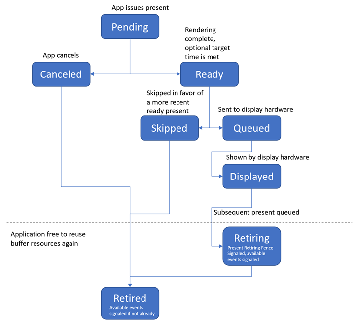
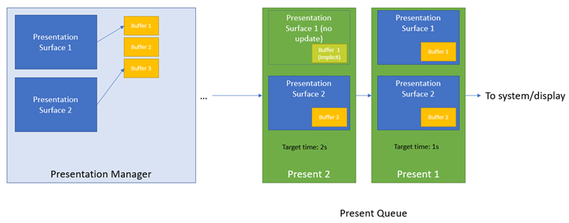

# Composition swapchain programming guide

> [!NOTE]
> **Some information relates to pre-released product, which may be substantially modified before it's commercially released. Microsoft makes no warranties, express or implied, with respect to the information provided here.**

The composition swapchain API is a spiritual successor to the DXGI swapchain, which allows applications to render and present content to the screen. There are several benefits to using this API over the DXGI swapchain. More fine-grained control is given to your application regarding the state of the swapchain, and more freedom is provided when it comes to how the swapchain is used. Additionally, the API provides a better story for precise present timing.

## What is presentation?

*Presentation* is the concept of displaying the results of drawing operations on screen. A *present* is a single instance of presentation&mdash;a request to show the results of a drawing operation onto a single buffer, on screen. A present can contain additional attributes that describe how to show on screen. In this API, a present can also have a *target time*, which is a system-relative timestamp (an interrupt-time) that describes the ideal time that the present should be shown. Your application can use this to more accurately control the rate at which content appears on screen, and to synchronize presents with other events in the system, such as an audio track.

At the heart of presentation is synchronization. That is, drawing operations are generally carried out by a GPU, as opposed to the CPU and, as such, they execute on an asynchronous timeline from that of the CPU that issued the operations initially. Presentation is an operation submitted to the GPU that ensures that the drawing operations that were issued previously will have finished before the buffer is shown on screen.

Your application will generally issue many presents over time, and have multiple textures to select from when issuing presents. Your application must use the synchronization mechanisms that this API provides to ensure that once you draw to and present a buffer, you don't draw to that buffer again until that present has been shown and subsequently replaced with a new buffer from a subsequent present. Otherwise, the buffer contents that your application meant to present initially can be overwritten as that present is shown on screen.

## Presentation modes&mdash;composition, multiplane overlay, and iflip

Buffers presented by your application can be displayed by the system in a few different ways.

The simplest way, which is the default, is that the present will be sent to DWM, and the DWM will render a frame based on the buffer that was presented. That is, there is a copy (or more accurately, a 3D render) of the presentation buffer into the backbuffer that the DWM sends to the display. This method of displaying a present is called Composition.

A more performant mode of displaying a present would be to scan out the presentation buffer directly to hardware, and eliminate the copy that takes place. This method of displaying a present is called *direct scanout*. When handling presents, DWM can decide to program the hardware to directly scan out of a presentation buffer, by either assigning the buffer to a *multiplane overlay* plane (or MPO plane, for short), or directly flip the buffer to the hardware (known as *direct flip*).

An even more performant way to display a present would be to have presents be displayed directly by the graphics kernel, and bypass the DWM entirely. This method of presentation is known as *independent flip* (iflip). Both multiplane overlay and iflip are described in [For best performance, use DXGI flip model](https://devblogs.microsoft.com/directx/dxgi-flip-model/).

Composition is the most easily supported, but also the least efficient. The surface needs to be specially allocated to be eligible for direct scanout or iflip, and this type of special allocation has stricter system-requirements than composition swapchain. It is only available on WDDM 3.0 and greater hardware. As a result, your application can query API support for Composition-only presentation, as well as presentation that qualifies for direct scanout or iflip.

## Presentation factory, checking capability, and presentation manager

The first object that your application will use out of the composition swapchain API is the *presentation factory*. The presentation factory is created by your application, and bound to a Direct3D device that your application passes to the call to create, and as such, has an affinity to the video adapter associated with that device.

The presentation factory exposes methods to check whether or not the current system and graphics device are capable of using the composition swapchain API. You can use capability methods such as [**IPresentationFactory::IsPresentationSupported**](/windows/win32/api/presentation/nf-presentation-ipresentationfactory-ispresentationsupported) to check system support. If capability methods indicate system support for the API, then you can use the presentation factory to create a *presentation manager*. This presentation manager is the object you use to perform presentation functions, and is bound to the same Direct3D device and video adapter as that presentation factory that was used to create it.

Currently, the system requirements for using the composition swapchain API at all are GPU drivers supporting WDDM (Windows Device Driver Model) 2.0. To utilize the composition swapchain API in the most performant way (direct scanout and independent flip, or *iflip*), systems will need GPU drivers supporting WDDM 3.0.

If the system is not capable of using the composition swapchain API, then your application will need to have a separate codepath to handle presentation using older methods, such as a DXGI swapchain.

## Register presentation buffers to present

The presentation manager tracks buffers that it can present. In order to present a Direct3D texture, your application must first create that texture with Direct3D, then register it with the presentation manager. When a texture has been registered with the presentation manager, it is called a *presentation buffer*, and can from that point onward be presented to the screen by that presentation manager. Your application can add and remove presentation buffers as you wish, though there is a maximum number of presentation buffers that can be added to a single presentation manager (currently 31). These presentation buffers can also be of varying sizes and formats which will take effect as an individual presentation buffer is presented.

A texture can be registered with any number of presentation managers; however, that would not be considered normal use in most cases, and will bring up complicated synchronization scenarios that your application would be responsible for managing.

## Defining the content to be presented

In general, buffers we present need to be associated with content in a *visual tree*. Therefore, we need to define a sort of *binding* so that when your application issues presents, it's clear where in the visual tree the buffers being presented are meant to go. We call this binding *Presentation Content*.

Presented content could take many forms. Your application might wish to present a single buffer to be displayed, or it may wish to present stereo content with buffers for both the left and right eye, and so on. The initial version of this API provides support for presenting a single buffer to screen.

We define a *presentation surface* to be a form of presentation content to which a single buffer is presented at a time. A presentation surface can be set as content in a visual tree, and can show a single presentation buffer on screen at a time. Presentation Manager presents will update the buffer being shown by one or more presentation surfaces atomically.

The presentation manager can be used to create one or more presentation surfaces for a given *composition surface handle*. Each composition surface handle can be bound to one or more visuals in a visual tree (by strategies outlined in [**Windows.UI.Composition**](/uwp/api/windows.ui.composition) and [**DirectComposition**](/windows/win32/directcomp/directcomposition-portal) API documentation) to define the relationship between the associated presentation surface and where it appears in its visual tree. Your application can update one or more presentation surfaces, which are submitted to the system and take place on the next present operation.

Note that the presentation manager can present any presentation buffer to any number of any presentation surfaces it wishes. There are no restrictions. However, it is up to your application to keep track of which buffers you've issued, and where, in order to ensure that you don't attempt to issue new drawing to that buffer while it is still being displayed by a presentation surface.

## Applying properties to presentation surface

In addition to specifying which buffers to display in a presentation surface, a present can also specify various other properties to that presentation surface. These include properties that define how the source texture will be sampled, including the alpha mode and color space, how the source texture will be transformed and laid out, and any displayed or readback restrictions for protected content. All of these are exposed as property setter methods on a presentation surface that can be changed by your application and, just like buffer updates, will take effect when your application's present takes place.

## Presenting to the presenting surface

After your application creates presentation surfaces, registers presentation buffers, and specifies updates to issue during a present, you can apply those properties by presenting. Your application issues a present through the presentation manager. When that present is processed by the system, all updates are applied atomically. In addition, your application can also specify other properties of the present, such as the ideal time it should take place (the *present target time* time) and other rarer properties, such as the intended content rate, which can be used to enable custom refresh modes on the system. Since presents can be scheduled at a given time, your application can issue multiple presents ahead of time. These presents will be processed one by one as their scheduled time is reached. 

## Synchronizing presentation

Your application must be sure that as it renders to buffers, and issues presents, it selects a buffer to render to which is not currently being referenced by any other outstanding previous present, as doing so could overwrite the buffer contents those presents intended. Further, if your application issues rendering to a buffer currently being displayed by a presentation surface in scanout hardware, then its rendering may be stalled indefinitely, because Direct3D disallows *front buffer rendering*.

The composition swapchain API provides a few different mechanisms to allow your application to practice proper synchronization of buffers it has presented.

A buffer is said to be *available* if there are no outstanding presents that reference it, and it is currently not being displayed by the system. Otherwise, it is unavailable. The API provides an event for each presentation buffer that indicates whether or not the buffer is available. This is the simplest method of synchronization for your application to use. Before drawing to a buffer and presenting it, your application can ensure that its *available* event is signaled. The *available* event for a particular buffer becomes unsignaled the moment it has been bound to a presentation surface in the API, and stays unsignaled all the way up until the present becomes retired.

Secondly, the presentation manager tracks a single *present retiring fence* to communicate to your application which presents have been completed. The value of the fence corresponds to the present identifier of the last present that began the *retiring* phase of its lifecycle, as discussed in the *lifecycle* section below. Once a present enters this phase, it's safe to assume that any buffers that have been replaced by subsequent presents can be reused.

This method of synchronization is more advanced, but allows for greater control over throttling the workflow, and is more informative about the state of the system in regards to the depth of the current present queue. For an overview of the lifecycle of a present, see the section below.

## Lifecycle of a Present

Presentation manager presents are queued to the system as part of its *present queue*. The system processes presents in queued order. Additionally, each present has a unique (to the presentation manager) associated *present identifier*, which is an incrementing value assigned to a present, starting at 1 for the first present, and incrementing by 1 for each subsequent present. This present identifier is used in various parts of the API, such as synchronization primitives and presentation statistics, to refer to that particular present.

Each present that your application issues follows a specific lifecycle, as described here.

Once your application sets up the changes to be made as part of a present, it will use the presentation manager to actually issue the present. At this point, the present is said to be *pending*.

Once pending, a present will sit in the presentation manager's present queue, where it will stay until one of two things happen.

* The present becomes *canceled*. The presentation manager allows your application to cancel previously issued presents. If this happens, then the present is said to be *canceled*, and then it immediately becomes *retired*. On this transition, associated buffer *available* events for the canceled present will be updated, however the present retired fence will not signaled, because the previously displayed present (prior to the presents that were canceled) will remain displayed. For this reason, your application can't use the present retiring fence to determine which presents were canceled. You must instead learn this from the present status statistic that comes back for each canceled present. We suggest that your application uses buffer *available* events to find an available buffer to present after a cancel. Once that present is displayed, the previous present will begin the retiring process, and update the present retiring fence.
* If not canceled, the present eventually becomes *ready* to be processed. In order to be ready, two major conditions must be met.
  * All drawing work issued to the Direct3D context before the present was called must be completed. This ensures that the buffer is not shown before your application's drawing is complete.
  * If a present target time was specified, then the current system-relative time that we expect to be able to show the present meets the requested target time that your application applied to the present.

When the system decides to find a present to show on screen, it will pick the last present that has become *ready* to present to display. If there are multiple *ready* presents, all but the latest (that is, the present with the greatest present identifier) will be *skipped*, and immediately enter the *retired* state, at which point its buffer *available* events will be signaled, but the present retiring fence will not be signaled, as the skipped present doesn't transition away from the *displayed* state.

When the *ready* present is chosen to be displayed, the system begins doing the work to show it on screen. This may mean rendering the buffer as part of a DWM frame, and then requesting the hardware show that frame on screen, or it may mean sending the buffer directly to scanout hardware in the case of iflip. After this takes place, the present is said to be *queued*. At a high level, this means it's on its way to being displayed.

When the hardware gets around to displaying the present, that present is said to be *displayed*. There it will stay, visible on screen, until a subsequent present comes in and replaces it.

When a subsequent present becomes queued, then we know that the hardware is eventually going to stop showing the current present. At this point, the present is said to be *retiring*.

When that subsequent present becomes displayed, then the current present is said to be *retired*.

The presentation manager exposes a *present retiring fence*, which is signaled to the present identifier of each present when it enters the *retiring* state. This signal indicates to your application that it has become safe to issue rendering work to the buffers associated with that present without corrupting a previous present. If your application issues rendering work during the present's *retiring* state, then the rendering work will be queued until the present enters the *retired* state, at which point it will be executed. If the rendering work is issued after the present becomes *retired*, then it will be execute immediately.

The following is a diagram of this state change.

## Diagram of buffers, surfaces, and presents

The following is a diagram relating the presentation manager, presentation buffers, presentation surfaces, presents, and updates.

This diagram shows a presentation manager, with two presentation surfaces and three presentation buffers, which has had two issued presents issued so far&mdash;the first present displayed buffer 1 in surface 1, and buffer 2 in surface 2. The second present updated surface 2 to show presentation buffer 3, and did not change surface 1's binding. After present 2 is displayed, surface 1 will show buffer 1, and surface 2 will show buffer 3, which can be seen in the current state of the objects in the presentation manager. Each present in the queue will take effect when it is processed in the system.

> [!NOTE]
> Because Present 2 didn't change the buffer for surface 1, surface 1 was left bound to buffer 1 from the previous present. In this sense, there is an "implicit" reference on buffer 1 in present 2, since surface 1 will remain bound to buffer 1 after present 2 is displayed.

## Adding presentation surfaces to visual tree

Presentation Surfaces are content that exists as part of a composition visual tree. Each presentation surface is bound to a *composition surface handle*. In Windows.UI.Composition, a surface brush can be created for a pre-existing composition surface handle, and bound to a sprite visual. In DirectComposition, a composition surface can be created from a pre-existing composition surface handle and bound as content to a visual. See respective documentation for each API for more information.

APIs like Windows Media Foundation, built to use this API, expose composition surface handles which will be pre-bound to a presentation surface. An application can also create its own composition surface handle to subsequently bind to a presentation surface and add to a visual tree by calling [DCompositionCreateSurfaceHandle](/windows/win32/api/dcomp/nf-dcomp-dcompositioncreatesurfacehandle).

## Reading presentation statistics

The composition swapchain API exposes *presentation statistics*, which describes various information about how a particular present was processed. The information generally might describe how a presentation surface was used in a DWM frame, the point in time at which it showed up, whether it was shown at all, and so on.

There are different types of presentation statistics, and they are designed to be expandable in future versions of the API. An application uses the presentation manager to register to receive types of statistics it is interested in. Those statistics are then pushed to the presentation manager's *statistics queue*. The presentation manager exposes a *statistics available event* to applications, which is an event handle that indicates when the statistics queue has statistics items available to be read. When it does, your application can dequeue the first statistics item off the queue, read it, and process it. The presentation manager will reset the statistics available event when your application has read all the statistics currently in the queue. An application will typically read and process statistics in a loop until the statistics available event has been reset. It will be common for your application to process this statistics queue in the same work loop you use to issue presents. The suggested usage pattern is to prioritize processing statistics over issuing new presents, to ensure that the queue doesn't overflow.

The queue has a maximum number of statistics that it will track, which will be on the order of 512-1024 statistics. The maximum queue depth should be enough to store ~5 seconds worth of statistics in normal cases. If the statistics queue becomes full, and more statistics are reported, the policy is that the oldest statistics will be retired to make room.

## Related topics

* [Composition swapchain](comp-swapchain-portal.md)
* [For best performance, use DXGI flip model](https://devblogs.microsoft.com/directx/dxgi-flip-model/)
