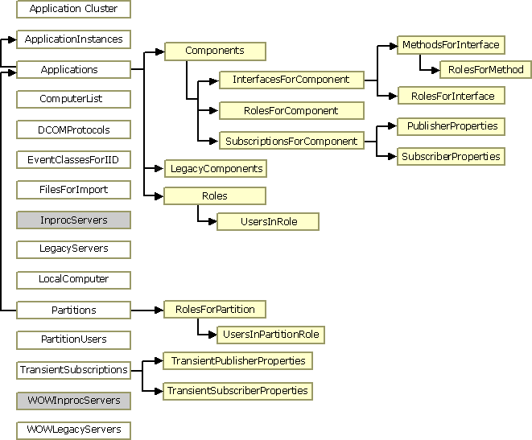

# COM+ Administration Collections

The COM+ administration collections serve to hold and organize configuration data stored in the COM+ catalog. The collections correspond to folders in the console tree of the Component Services administration tool. You can access these collections by using the COM+ administration objects and interfaces.

You initiate programmatic administration by using objects created from the [**COMAdminCatalog**](comadmincatalog.md) class, you represent any collections in the catalog by using objects created from the [**COMAdminCatalogCollection**](comadmincatalogcollection.md) class, and you represent items in collections by using objects created from the [**COMAdminCatalogObject**](comadmincatalogobject.md) class.

The items in a given collection expose a consistent set of properties. For example, every item in the [**Components**](components.md) collection represents a component, and the items in the **Components** collection expose the same properties used to configure a component. These properties can be accessed by using the [**COMAdminCatalogObject**](comadmincatalogobject.md) class.

> [!Note]  
> Properties with WriteOnce access are ReadWrite while using the [**Add**](/windows/desktop/api/ComAdmin/nf-comadmin-icatalogcollection-add) method prior to using [**SaveChanges**](/windows/desktop/api/ComAdmin/nf-comadmin-icatalogcollection-savechanges) and are ReadOnly afterward.

 

For an introduction to programmatic administration of COM+, see [Automating COM+ Administration](automating-com--administration.md).

## Collection Hierarchy

The following figure illustrates the relationships among the collections. The collections at the far left (in white and gray boxes) are top-level collections, which are accessed by calling the [**GetCollection**](/windows/desktop/api/ComAdmin/nf-comadmin-icomadmincatalog-getcollection) method of an object created from the [**COMAdminCatalog**](comadmincatalog.md) class. The remaining collections (in yellow boxes) can only be accessed through their parent collection, by calling the [**GetCollection**](/windows/desktop/api/ComAdmin/nf-comadmin-icatalogcollection-getcollection) method of the [**COMAdminCatalogCollection**](comadmincatalogcollection.md) object that represents their parent. The arrows point from a parent collection to its child collections.

The following four collections are not illustrated in the figure: [**ErrorInfo**](errorinfo.md), [**PropertyInfo**](propertyinfo.md), [**RelatedCollectionInfo**](relatedcollectioninfo.md), and [**Root**](root.md). The **ErrorInfo** collection is a child of every collection in the figure except [**InprocServers**](inprocservers.md) and [**WOWInprocServers**](wowinprocservers.md) (in gray boxes). The **PropertyInfo** and **RelatedCollectionInfo** collections are children of every collection. The **Root** collection is a top-level collection that is the parent of all other top-level collections. However, it is not necessary to access the **Root** collection before accessing other top-level collections.

## COMAdmin Library

The following collections are supported by the COMAdmin library.

| Collection                                                             | Description                                                                                                                                           |
|------------------------------------------------------------------------|-------------------------------------------------------------------------------------------------------------------------------------------------------|
| [**ApplicationCluster**](applicationcluster.md)                       | Contains a list of the servers in the application cluster.                                                                                            |
| [**ApplicationInstances**](applicationinstances.md)                   | Contains an object for each instance of a running COM+ application.                                                                                   |
| [**Applications**](applications.md)                                   | Contains an object for each COM+ application installed on the local computer.                                                                         |
| [**Components**](components.md)                                       | Contains an object for each component in the application to which it is related.                                                                      |
| [**ComputerList**](computerlist.md)                                   | Contains a list of the computers found in the **Computers** folder of the Component Services administration tool.                                     |
| [**DCOMProtocols**](dcomprotocols.md)                                 | Contains a list of the protocols to be used by DCOM. It contains an object for each protocol.                                                         |
| [**ErrorInfo**](errorinfo.md)                                         | Retrieves extended error information regarding methods that deal with multiple objects.                                                               |
| [**EventClassesForIID**](eventclassesforiid.md)                       | Retrieves information regarding event classes.                                                                                                        |
| [**FilesForImport**](filesforimport.md)                               | Retrieves information from its MSI file about an application that can be imported.                                                                    |
| [**InprocServers**](inprocservers.md)                                 | Contains a list of the in-process servers registered with the system. It contains an object for each component.                                       |
| [**InterfacesForComponent**](interfacesforcomponent.md)               | Contains an object for each interface exposed by the component to which the collection is related.                                                    |
| [**LegacyComponents**](legacycomponents.md)                           | Contains an object for each unconfigured component in the application to which it is related.                                                         |
| [**LegacyServers**](legacyservers.md)                                 | Identical to the [**InprocServers**](inprocservers.md) collection except that this collection also includes local servers.                           |
| [**LocalComputer**](localcomputer.md)                                 | Contains a single object that holds computer level settings information for the computer whose catalog you are accessing.                             |
| [**MethodsForInterface**](methodsforinterface.md)                     | Contains an object for each method on the interface to which the collection is related.                                                               |
| [**Partitions**](partitions.md)                                       | Used to specify the applications contained in each partition.                                                                                         |
| [**PartitionUsers**](partitionusers.md)                               | Used to specify the users contained in each partition.                                                                                                |
| [**PropertyInfo**](propertyinfo.md)                                   | Retrieves information about the properties that a specified collection supports.                                                                      |
| [**PublisherProperties**](publisherproperties.md)                     | Contains an object for each publisher property for the parent [**SubscriptionsForComponent**](subscriptionsforcomponent.md) collection.              |
| [**RelatedCollectionInfo**](relatedcollectioninfo.md)                 | Retrieves information about other collections related to the collection from which it is called.                                                      |
| [**Roles**](roles.md)                                                 | Contains an object for each role assigned to the application to which it is related.                                                                  |
| [**RolesForComponent**](rolesforcomponent.md)                         | Contains an object for each role assigned to the component to which the collection is related.                                                        |
| [**RolesForInterface**](rolesforinterface.md)                         | Contains an object for each role assigned to the interface to which the collection is related.                                                        |
| [**RolesForMethod**](rolesformethod.md)                               | Contains an object for each role assigned to the method to which the collection is related.                                                           |
| [**RolesForPartition**](rolesforpartition.md)                         | Contains an object for each role assigned to the partition to which the collection is related.                                                        |
| [**Root**](root.md)                                                   | Contains the top-level collections on the catalog.                                                                                                    |
| [**SubscriberProperties**](subscriberproperties.md)                   | Contains an object for each subscriber property for the parent [**SubscriptionsForComponent**](subscriptionsforcomponent.md) collection.             |
| [**SubscriptionsForComponent**](subscriptionsforcomponent.md)         | Contains an object for each subscription for the parent [**Components**](components.md) collection.                                                  |
| [**TransientPublisherProperties**](transientpublisherproperties.md)   | Contains an object for each publisher property for the parent [**TransientSubscriptions**](transientsubscriptions.md) collection.                    |
| [**TransientSubscriberProperties**](transientsubscriberproperties.md) | Contains an object for each subscriber property for the parent [**TransientSubscriptions**](transientsubscriptions.md) collection.                   |
| [**TransientSubscriptions**](transientsubscriptions.md)               | Contains an object for each transient subscription.                                                                                                   |
| [**UsersInPartitionRole**](usersinpartitionrole.md)                   | Contains an object for each user in the partition role to which the collection is related.                                                            |
| [**UsersInRole**](usersinrole.md)                                     | Contains an object for each user in the role to which the collection is related.                                                                      |
| [**WOWInprocServers**](wowinprocservers.md)                           | Contains a list of the in-process servers registered with the system for 32-bit components on 64-bit computers.                                       |
| [**WOWLegacyServers**](wowlegacyservers.md)                           | Identical to the [**LegacyServers**](legacyservers.md) collection except that this collection is drawn from the 32-bit registry on 64-bit computers. |

 

 

 

