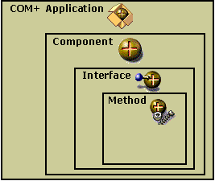

# COM+ Application Overview

A COM+ application is the primary unit of administration and security for Component Services and consists of a group of COM components that generally perform related functions. These components further consist of interfaces and methods, as shown in the following illustration.

You can use the Component Services administrative tool to create new COM+ applications, add components to applications, and set the attributes for an application and its components.

By creating logical groups of COM components as COM+ applications, you can take advantage of the following benefits of COM+:

-   A deployment scope for COM components.
-   A common configuration scope for COM components, including security boundaries and queuing.
-   Storage of component attributes not provided by the component developer (for example, transactions and synchronization).
-   Component dynamic-link libraries (DLLs) loaded into processes (DLLHost.exe) on demand.
-   Managed server processes to host components.
-   Creation and management of threads used by components.
-   Access to the context object for resource dispensers, allowing acquired resources to be automatically associated with the context. (For more information on COM components and contexts, see [COM+ Contexts](com--contexts.md).)

## Related topics

<dl> <dt>

[Developing COM+ Applications](developing-com--applications.md)
</dt> <dt>

[Parts of a COM+ Application](parts-of-a-com--application.md)
</dt> <dt>

[Types of COM+ Applications](types-of-com--applications.md)
</dt> </dl>

 

 

