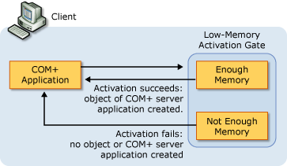

# COM+ Low-Memory Activation Gates Concepts

Generally, synchronization is not required when you have a single-threaded apartment (STA) because the apartment provides the synchronization for you. Synchronization becomes important when you have a multithreaded apartment (MTA) and a free-threaded object. In the past, free-threaded objects have had to handle locking. You can eliminate the need to use locking by setting the synchronization attribute for a component.

Reliability problems often occur when a server's resources cannot react efficiently to peak loads. When a server doesn't have enough physical resources to meet peak demand, it can exhaust virtual memory. This becomes a problem if the user code or system code does not properly handle memory allocation failures. The server begins to slow down, and as memory is exhausted, memory allocations fail. The server executes error paths to handle the allocation failures. If an error path contains a bug in the system or user code running on the server, it's extremely difficult to trap and handle safely.

COM+ attempts to prevent situations in which these error paths have to be executed on a server. Through the low-memory activation gates feature, COM+ proactively monitors memory load in the system and ensures that a reasonable amount of memory is available before executing user code. If the percentage of virtual memory available to the application falls below a fixed threshold, the activation fails before a COM+ server application or object is created (as shown in the illustration below). By failing these activations that would normally run, the low-memory activation gates feature minimizes the problems associated with memory allocations in user code, which significantly enhances system reliability.

The low-memory activation gates feature applies only to configured COM components that are installed in a COM+ application.

## How the Low-Memory Activation Gates Feature Works

The low-memory activation gates feature uses a different fixed threshold level depending on the type of activation. When creating a COM+ server application, COM+ allows the activation if more than 10 percent of virtual memory is available. If less than 10 percent is available, COM+ makes a test allocation to find out if the paging file can expand to accommodate the new memory load. If the paging file expands, the server application is created. If the paging file cannot be expanded, the activation fails and memory is not allocated.

The process is similar when creating an object. In this case, COM+ allows the activation if more than 5 percent of virtual memory is available. If less than 5 percent is available, COM+ proceeds with a test allocation. Again, if the test allocation expands the paging file, the object is created. If not, the activation fails.

The fixed threshold levels for low-memory activation gates are currently not configurable. For this reason, there are no tasks associated with this feature.

 

 

