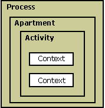

# COM+ Threading Models

COM+ threading models are designed around an object collection called an apartment. An apartment is a collection of contexts contained in a process, as shown in the following illustration.

Calls within an apartment are direct, while calls across apartments (out-of-process) are indirect and require proxy and stub code. Apartments allow for objects with different synchronization and reentrancy properties and have two categories: single-threaded and multithreaded. Objects in a single-threaded apartment (STA) execute on the particular thread in which they were created. STAs allow only one method to execute at a time. They are designed for user interfaces and rely on the Microsoft Windows message queue to process incoming calls.

Objects in a multithreaded apartment (MTA) execute on any thread and allow any number of methods to occur simultaneously. MTAs support reentrance implicitly.

COM+ classes are marked with a **ThreadingModel** property that allows COM+ to create the object in the proper apartment. To determine which apartment an object is created in, [**CoCreateInstance**](/windows/desktop/api/combaseapi/nf-combaseapi-cocreateinstance) uses the **ThreadingModel** property.

Threads must call [**CoInitializeEx**](/windows/desktop/api/combaseapi/nf-combaseapi-coinitializeex) before they can use COM+. This creates them inside the correct apartment and context. The main thread apartment is determined to be the first STA called by **CoInitializeEx**. This is usually associated with the main thread of a process. **CoInitializeEx** indicates the type of apartment required by the thread by setting the following flags:

-   **COINIT\_MULTITHREADED**—Locates the thread in the single multithreaded apartment.
-   **COINIT\_APARTMENTTHREADED**—Places the thread into a new STA.

The following topics in this section provide more information about using threading models and apartments in COM+:

-   [Threading Model Attribute](threading-model-attribute.md)
-   [Neutral Apartments](neutral-apartments.md)

## Related topics

<dl> <dt>

[Processes, Threads, and Apartments](/windows/desktop/com/processes--threads--and-apartments)
</dt> <dt>

[**ThreadingModel**](components.md)
</dt> </dl>

 

 
