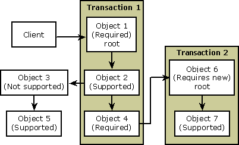

# Configuring Transactions

The *transaction attribute* is a declarative property that automatically manages transactions for the component developer. By setting this attribute, you eliminate the need to use explicit transaction controls in your component.

COM+ uses the component's transaction attribute to determine the type of transaction protection required for each object it activates. Depending on its requirement, an object can share its caller's transaction, require a new transaction, or operate without transaction protection.

COM+ provides the following transaction attribute values:

<dl> <dt>

Disabled
</dt> <dd>

In general, you should set this attribute value only when you are sure that the component never accesses a resource manager. When you disable the transaction attribute, COM+ ignores the transactional requirements of the component in determining context placement of the object. As a result, the object can share its caller's context (and transaction). When migrating a COM component to COM+, you must disable the transaction attribute to maintain the same transactional behavior as the unconfigured COM component.

> [!Note]  
> An *unconfigured component* is a COM component that has not been installed in a COM+ application.

 

</dd> <dt>

Not Supported
</dt> <dd>

When you set this attribute value, COM+ ensures that any object created from the component never participates in a transaction, regardless of the transactional status of its caller. By declaring this value, you ensure that an object does not vote in its caller's transaction nor can it begin a transaction of its own. Not Supported is the default value for all components.

</dd> <dt>

Supported
</dt> <dd>

When you set this attribute value, COM+ ensures that any object created from the component participates in a transaction if one exists. You declare this value when you want an object to share in its caller's transaction without requiring a transaction of its own.

</dd> <dt>

Required
</dt> <dd>

When you set this attribute value, COM+ ensures that any object created from the component is transactional. When COM+ activates an object with the Required setting, it looks at the transactional status of its caller. If the caller has a transaction, the new object is included in the current transaction. Otherwise, COM+ begins a transaction, making the new object the root of the transaction. This is the preferred setting for a component that performs resource activities because it helps provide transaction protection for those activities.

</dd> <dt>

Requires New
</dt> <dd>

When you set this attribute value, COM+ ensures that any objects created from the component must participate in a new transaction as the root of the transaction, regardless of the transactional status of the caller. COM+ automatically initiates a new transaction that is distinct from the caller's transaction.

> [!Note]  
> COM+ does not support nested transactions. When one transactional object calls another component marked as Requires New, COM+ creates an independent transactional boundary for the newly activated object. The second transaction cannot affect the first transaction unless the first transaction explicitly notes the results of the second transaction and modifies its vote based on those results.

 

</dd> </dl>

## Transaction Attribute Dependencies

The following table shows the characteristics of each COM+ transaction attribute value, including the value's effect on transaction characteristics. COM+ enforces [JIT activation](com--just-in-time-activation.md) and [Synchronization](com--synchronization.md) for all transaction components.

| Attribute Value          | New Transaction   | Client's Transaction                 | Transaction Root                        | JIT Activation      | Synchronization     |
|--------------------------|-------------------|--------------------------------------|-----------------------------------------|---------------------|---------------------|
| Disabled       | Never   | Maybe                      | Never                         | Optional  | Optional  |
| Not Supported  | Never   | Never                      | Never                         | Optional  | Optional  |
| Supported      | Never   | If client has transaction  | Never                         | Required  | Required  |
| Required       | Maybe   | If client has transaction  | If client has no transaction  | Required  | Required  |
| Requires New   | Always  | Never                      | Always                        | Required  | Required  |

 

## Transaction Boundaries

A transaction has a beginning, an end, and occurs exactly once. During its execution, a transaction may call on a resource, such as a database or queue, to accomplish one or more tasks. Each resource falls within the *transaction boundary*. All resources within a transaction boundary, which can span multiple process and computer boundaries, share a single transaction. Managing consistency across these process and computer boundaries is important.

COM+ ensures consistency by managing transaction boundaries automatically, based on the value of the transaction attribute that you set for each component. A COM+ transaction automatically flows to objects instructed to participate in a transaction and bypasses objects instructed to execute outside a transaction. COM+ does not support nested transactions. Instead, COM+ transactions are distinct and short-lived.

The first object in a transaction boundary is special to the transaction and is called the *root object* of the transaction. There can be only one root object in a transaction. All other objects in the transactional hierarchy under the root object are called *interior objects*.

## Mapping Transactions

One way to ensure that an object is included in the correct transaction boundary is to map your transactions before you start writing your components. By mapping transactions, you can determine the best setting for each component you write. The more certain you are about how your components are to be used, the easier it is to select the correct transaction attribute value.

At run time, COM+ looks at the transaction attribute to determine whether an object should be the root of a new transaction, be created in an existing transaction, or be created as a non-transactional object.

The following illustration shows a possible transaction mapping. In the illustration, the client creates Object  1, which requires a transaction. Because no transaction exists, COM+ creates Transaction 1 and places Object 1 in it as the root object. Object 1 creates Object 2, which supports transactions and is therefore placed in Transaction 1. Object 2 creates Object 3, which does not support transactions and therefore is placed outside all transactions. Object 2 also creates Object 4, which requires a transaction and is therefore placed in Transaction  1. Object 3 creates Object 5, which supports transactions. However, because Object 5 is created by an object that does not exist within a transaction, it also is placed outside all transactions. Object 4 creates Object 6, which requires a new transaction, so COM+ creates Transaction 2 and places Object 6 in it as the root object. Object 6 creates Object 7, which supports transactions and is therefore placed in Transaction 2.

The preceding illustration shows two potential problem areas. First, the majority of work is split between two distinct transactions. If Transaction 1 fails after Object 4 creates Object 6, Transaction 2 runs unaffected by the outcome of Transaction 1. If this outcome is unintended, you might prefer to fold the operations of both transactions into a single transaction, which you can accomplish by changing the transaction attribute of Object  6 to Required.

The mapping illustration also shows that Object 3 and Object 5 are non-transactional, running completely outside the scope of Transactions 1 and 2. If Object 5 updates persistent data, you might want to reconsider its non-transactional status. Object 5 can be placed within a transaction by changing its transaction attribute to Required.

## Related topics

<dl> <dt>

[Setting the Transaction Attribute](setting-the-transaction-attribute.md)
</dt> </dl>

 

 

