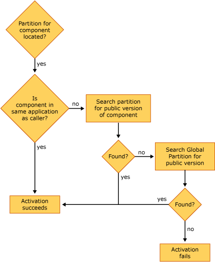

# Locating a Component for Activation

When COM+ has located the correct partition—through the user identity's default partition set, a partition moniker, or the partition ID in the object's context—COM+ must then locate the correct component within that partition. The following illustration shows how a component is found and activated when that component resides in a partition.

> [!Note]  
> Prior to any component activation, COM+ performs a validation to verify that the user identity attempting to activate the component has rights to access the partition set in which the component resides.

 

The preceding illustration shows the following:

-   If the component being called resides in a partition and is in the same application as the calling component, the component is activated whether the component being called is marked as public or private.
-   If the component being called resides in a partition but does not exist in the same application as the calling component, COM+ checks to see whether the component is marked as public. If no public version is found, COM+ searches the Global Partition to find a public version of the component. If no public version of the component is found in the Global Partition or if the user identity has no rights to the partition, the activation fails.

## Related topics

<dl> <dt>

[Locating Partitions During Activation](locating-partitions-during-activation.md)
</dt> </dl>

 

 

