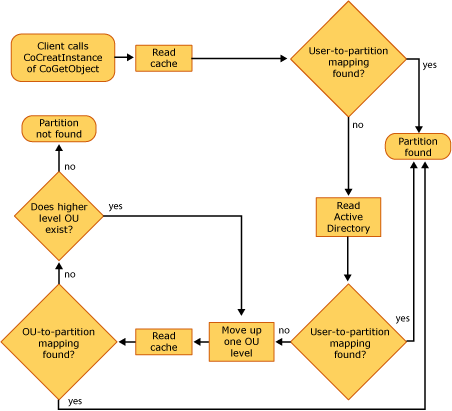

# Locating Partitions During Activation

Locating the correct partition in which to activate a component depends on the following:

-   The function call and parameters used in the calling program to activate the component
-   Whether the component being activated is local or remote
-   The internal use of the partition cache

## The Calling Program

COM+ selects the partition for component activation based on how the calling program activates the component.

There are three different actions that COM+ can take when selecting a partition for component activation. The action taken depends on how the calling program instantiates the object that is, whether the function call includes a partition moniker, which consists of a partition ID and a CLSID, or includes a CLSID only.

The following table shows the various actions that COM+ can take, in order of precedence, to locate a partition.


| Function call                                                  | Parameter                                                      | COM+ action                                                                                                                                                                                    |
|----------------------------------------------------------------|----------------------------------------------------------------|------------------------------------------------------------------------------------------------------------------------------------------------------------------------------------------------|
| [**CoGetObject**](/windows/desktop/api/objbase/nf-objbase-cogetobject) or **GetObject**<br/> | Partition moniker (includes partition ID and CLSID)<br/> | Uses the partition ID specified in the partition moniker.<br/>                                                                                                                           |
| [**CoCreateInstance**](/windows/desktop/api/combaseapi/nf-combaseapi-cocreateinstance)<br/>        | CLSID<br/>                                               | Uses either the partition ID of the user identity's default partition or the partition ID that was added to the context during a previous component activation in the same process.<br/> |


 

The COM+ actions listed in the preceding table are explained in the following sections.

## Use of Partition Monikers

A partition can be selected explicitly within a function call by using a *partition moniker*. A partition moniker is used within code to explicitly specify the partition of the activated component. If a partition moniker is used to locate the partition, the activation occurs from that partition. That is, the partition ID included in the moniker takes precedence over the user's default partition or over a partition ID that exists in the caller's context.

In C++ code, the syntax for the use of a partition moniker is as follows:


```C++
HRESULT CoGetObject(
  L"partition:partitionGUID/new:clsid",
  pBindOptions,
  IID_IUnknown,
  (void**)&pIUnknown);
```


The following example shows a snippet of C++ code, in which a partition moniker is being used as an argument to the [**CoGetObject**](/windows/desktop/api/objbase/nf-objbase-cogetobject) function:


```C++
// Create CLSID1 configured in the Production partition.
HRESULT hr = CoGetObject(
  L"partition:{35056070-D5B7-4b59-9FBF-0D23417F6937}/new:CLSID1",
  pBindOptions, IID_IUnknown, (void**)&pIUnknown);
```


In Visual Basic code, the syntax for a partition moniker is as follows:


```VB
GetObject("partition:partitionGUID/new:CLSID") As Object
```


The following example shows a snippet of Visual Basic code, in which a partition moniker is being used as an argument to the **GetObject** function:


```VB
Dim objCLSID1 As Object
Set objCLSID1 = GetObject( _
   "partition:{35056070-D5B7-4b59-9FBF-0D23417F6937}/new:CLSID1")
```


## Use of Default Mapping

When the [**CoCreateInstance**](/windows/desktop/api/combaseapi/nf-combaseapi-cocreateinstance) function is used to activate a component, using the component's CLSID, COM+ uses the default user-identity mapping that is, the partition set that the user is mapped to within Active Directory. However, if the user is not mapped to a partition set within Active Directory, the Global Partition is selected.

## Use of Partition IDs and Object Context

One of the five properties assigned to a new partition is the partition ID. When the client program calls the [**CoCreateInstance**](/windows/desktop/api/combaseapi/nf-combaseapi-cocreateinstance) function to instantiate an object, the partition ID is added to the context. Using the partition ID from the context to locate the partition is important because it ensures that after a chain of activations has begun, the partition ID remains the same unless it is changed explicitly through a partition moniker.

For additional information on locating partitions during activation, see [COM+ Queued Components and Partitions](com--queued-components-and-partitions.md).

## Local and Remote Activation

-   If the component being called exists on another computer, the partition properties (including the partition ID) are marshaled to the other computer and the component is activated from the marshaled partition. If no partition ID was marshaled, COM+ uses the default partition set mapped to the user identity within Active Directory.

## The Partition Cache

In a domain environment, COM+ uses the mappings in Active Directory to locate the correct partition for component activation. However, frequent lookups in Active Directory can result in excessive network traffic. To minimize network traffic resulting from frequent lookups of user-to-partition-set mapping in Active Directory, COM+ uses a *partition cache*.

The partition cache contains the mappings that were made in Active Directory between user identities or OUs and their partition sets. This partition cache is located on the application server on which the COM+ applications reside.

When COM+ needs to determine a user's default partition or validate a user's access rights to a partition, it checks the partition cache locally to look up the user's mapping, instead of checking Active Directory remotely.

If the lookup in the partition cache fails, COM+ then checks Active Directory. If the lookup is successful in Active Directory, COM+ stores that mapping in the partition cache. The next time a lookup is done for that user-to-partition mapping, COM+ will find it in the partition cache.

The following illustration shows the process that COM+ uses to locate a partition for component activation.



The size of the cache and the expiration time for the cache entries are set via registry keys. For information on configuring these registry keys, see [Creating and Configuring COM+ Partitions](creating-and-configuring-com--partitions.md).

> [!Note]  
> If a server computer is disconnected from the network and the user-to-partition mapping is changed while the server is disconnected, the partition cache might contain outdated user-to-partition mapping. This could result in an activation error if user-to-partition mapping is the mechanism used to activate a component.

 

## Related topics

<dl> <dt>

[Locating a Component for Activation](locating-a-component-for-activation.md)
</dt> </dl>

 

