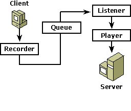

# Queued Components Architecture

The COM+ queued components service enhances the COM programming model by providing an environment in which a component can be invoked either synchronously (real-time) or asynchronously (queued). A component need not be aware of whether it is employed in a real-time or a queued context.

Messaging applications are like email transactions between programs. The requester sends a message to the server; when the server gets to it, the message is processed. Like email, a messaging system must handle the network details and ensure that the message moves from the client to the server. In the queued components framework, Message Queuing is responsible for this.

The COM+ queued components service consists of the following parts:

-   Recorder (for the client or send side)
-   Listener (for the server or receive side)
-   Player (for the server or receive side)

## The Recorder

In a typical queued components scenario, the client calls a queued component. The call is made to the queued components recorder, which packages it as part of a message to the server and puts it in a queue. The recorder marshals the client's security context into the message and records all of the client's method calls. In its role as proxy for the server component, the recorder selects interfaces from the queuable interfaces in the COM+ catalog.

A representation of the recording is sent to Message Queuing as a message to be sent to a server. When the queued component has the transaction attribute setting of Required or Supported, Message Queuing accepts delivery of the message only if the client-side transaction commits and the Message Queuing queue is transactional, which is the default normally established. When the transaction attribute setting is Requires New, Message Queuing can accept the message even if the client-side transaction aborts. For more information on transactions, see [Transactional Message Queuing](transactional-message-queuing.md).

## The Listener

The queued components listener retrieves the message from the queue and passes it to the queued components player.

## The Player

The player unmarshals the client's security context at the server side and then invokes the server component and makes the same method calls. The method calls are not played back by the player until the client component completes and the transaction that recorded the method calls commits.

## The Message Mover

The queued components message mover is a utility that moves all failed Message Queuing messages from one queue to another so that they can be retried. The message mover utility is an Automation object that can be invoked with a VBScript; for more information, see [Handling Errors](handling-errors-in-queued-components.md).

 

 

