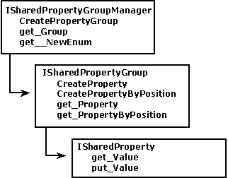

# Shared Property Groups

To prevent name collisions among properties created by different objects, the shared property manager (SPM) uses shared property groups. A shared property group is simply a namespace for a set of shared properties. Each property within a shared property group consists of a name, a value, and a position within the shared property group. Either the name or the position can be used to retrieve the property value. You can access and create shared property groups through the shared property group manager.

The SPM object model is shown in the following illustration.

The following are interfaces of the shared property manager:

-   [**ISharedPropertyGroupManager**](isharedpropertygroupmanager.md) is used to create shared property groups and to obtain access to existing shared property groups. You can access the **ISharedPropertyGroupManager** interface by creating an instance of the [**SharedPropertyGroupManager**](sharedpropertygroupmanager.md) object by using either [**IObjectContext::CreateInstance**](iobjectcontext-createinstance.md) or [**CoCreateInstance**](https://msdn.microsoft.com/library/windows/desktop/ms686615).

-   [**ISharedPropertyGroup**](isharedpropertygroup.md) is used to create and access the shared properties in a shared property group. You can access the **ISharedPropertyGroup** interface by creating a [**SharedPropertyGroup**](sharedpropertygroup.md) object with the [**ISharedPropertyGroupManager::CreatePropertyGroup**](isharedpropertygroupmanager-createpropertygroup.md) method. As with any COM object, you must release a **SharedPropertyGroup** object when you have finished using it.

-   [**ISharedProperty**](isharedproperty.md) is used to set or retrieve the value of a shared property. A shared property can contain any data type that can be represented by a Variant. You can access the **ISharedProperty** interface by creating a [**SharedProperty**](sharedproperty.md) object with the [**ISharedPropertyGroup::CreateProperty**](isharedpropertygroup-createproperty.md) method or the [**ISharedPropertyGroup::CreatePropertyByPosition**](isharedpropertygroup-createpropertybyposition.md) method. A **SharedProperty** object can be created or accessed only from within a [**SharedPropertyGroup**](sharedpropertygroup.md) object. Again, you must release a **SharedProperty** object when you have finished using it.

## Related topics

<dl> <dt>

[COM+ Shared Property Manager](com--shared-property-manager.md)
</dt> </dl>

 

 

