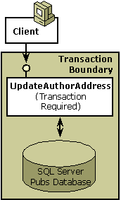

# Step 1: Creating a Transactional Component

## Objectives

In this step, you will learn the following:

-   How to write a transactional component in Microsoft Visual Basic
-   What the default settings for COM+ services are
-   How to configure COM+ services

## Description

The UpdateAuthorAddress component, the component to be created in this section, updates the address of an existing author in the Pubs database. The Pubs database is a sample database that ships with Microsoft SQL Server. It contains publishing information such as author names, addresses, and book titles.

> [!Note]  
> Pubs is the data store that is used throughout this primer.

 

Because UpdateAuthorAddress updates a data store, it is advisable to include the work in a transaction, as shown in the following illustration, so that when a client calls the component, COM+ automatically starts a transaction and enlists the database (resource manager) in that transaction. (For detailed information about transactions in COM+, see [COM+ Transactions](com--transactions.md).)



To make UpdateAuthorAddress a transactional component, the following steps are required:

1.  The component must be written. For extra protection, a subroutine is added, verifying that COM+ created the object in a transaction. Also, basic error handling is included in the component to simplify error recovery. Transaction verification and error handling enhance the reliability of the component. (See Step 1 Sample Code for a complete listing of the UpdateAuthorAddress component.)
2.  After adding the component to a COM+ application and installing the application, the transaction attribute must be set to **Required**, which guarantees that COM+ creates each UpdateAuthorAddress object in a transaction. For instructions on how to set the transaction attribute for a component, see [Setting the Transaction Attribute](setting-the-transaction-attribute.md).
    > [!Note]  
    > Setting the transaction attribute on a component defines how COM+ creates each object with regard to transactions. Transaction attribute values are **Ignored**, **Not Supported**, **Supported**, **Required**, and **Requires New**. The **Required** value is not one of a component's default attribute values.

     

COM+ binds the transaction service with just-in-time (JIT) activation and concurrency. When you declare a component to be transactional, COM+ also enforces JIT activation and concurrency protection (synchronization).

## Sample code

The UpdateAuthorAddress component opens a connection to the Pubs database, allowing the user to modify an author's name, address, or contract status. It also calls a second component, which is discussed in [Step 2: Extending a Transaction Across Multiple Components](step-2--extending-a-transaction-across-multiple-components.md).

To use the following code in a Microsoft Visual Basic project, open a new ActiveX.dll project and add references to the Microsoft ActiveX Data Objects Library and the COM+ Services Type Library.

> [!Note]  
> The sample code in this primer is for purposes of illustration and may not be the most efficient for actual staging and production.

 


```VB
Option Explicit
'
'  Purpose:   This class is used for updating an author's address.
'
'  Notes:     IMPT:  This component implicitly assumes that it will 
'             always run in a transaction. Undefined results may 
'             otherwise occur.
'

'----------------------------------------------------------
'  VerifyInTxn subroutine
'      Verifies that this component is in a transaction.
'      Throws an error if it is not.
'
Private Sub VerifyInTxn()
  If Not GetObjectContext.IsInTransaction Then
    ' Transactions turned off. 
    Err.Raise 99999, "This component", "I need a transaction!"
  End If
  ' Component is in a transaction.
End Sub

'----------------------------------------------------------
'  UpdateAuthorAddress subroutine
'      Procedure to update an author's address.
'
Public Sub UpdateAuthorAddress( _
                        ByVal strAuthorID As String, _
                        ByVal strPhone As String, _
                       ByVal strAddress As String, _
                        ByVal strCity As String, _
                        ByVal strState As String, _
                        ByVal strZip As String)
  ' Handle any errors.
  On Error GoTo UnexpectedError
  
  ' Verify that component is in a transaction.
  VerifyInTxn
  
  ' Get object context.
  Dim objcontext As COMSVCSLib.ObjectContext
  Set objcontext = GetObjectContext
  
  ' Get the IContextState object.
  Dim contextstate As COMSVCSLib.IContextState
  Set contextstate = objcontext
  
  ' Validate the new address information.
  ' The ValidateAuthorAddress function is described in Step 2.
  Dim oValidateAuthAddr As Object
  Dim bValidAddr As Boolean
  Set oValidateAuthAddr = _
    CreateObject("ComplusPrimer.ValidateAuthorAddress") 
  bValidAddr = oValidateAuthAddr.ValidateAuthorAddress( _
    strAddress, strCity, strState, strZip)
  If Not bValidAddr Then
    Err.Raise 99999, "The UpdateAuthorAddress component", _
      "The address of the author is incorrect!"
  End If
  
  ' Open the connection to the database.
  Dim conn As ADODB.Connection
  Set conn = CreateObject("ADODB.Connection")

  ' Specify the OLE DB provider.
  conn.Provider = "SQLOLEDB"

  ' Connect using Windows Authentication.
  Dim strProv As String
  strProv = "Server=MyDBServer;Database=pubs;Trusted_Connection=yes"

  ' Open the database.
  conn.Open strProv

  ' Execute the query.
  conn.Execute "update authors set phone= '" & strPhone & "'" & _
               " set address= '" & strAddress & "'" & _
               " set city= '" & strCity & "'" & _
               " set state= '" & strState & "'" & _
               " set zip= '" & strZip & "'" & _
               " where au_id = '" & strAuthorID & "'"
               
  ' Close the connection.
  conn.Close
  
  ' Get rid of the connection.
  Set conn = Nothing
                 
  ' Everything works--commit the transaction.
  contextstate.SetMyTransactionVote TxCommit
  contextstate.SetDeactivateOnReturn True
  Exit Sub
  
UnexpectedError:
  ' There's an error.
  contextstate.SetMyTransactionVote TxAbort
  contextstate.SetDeactivateOnReturn True
End Sub

```


## Summary

-   COM+ assigns default attribute values. You can reconfigure most service attributes.
-   Setting a component's transaction attribute to **Required** guarantees that COM+ must create each instance of that component in a transaction but doesn't necessarily start a new transaction.
-   Verifying the presence of a transaction confirms that the component's transaction attribute value wasn't inadvertently reset to a non-transactional value, such as **Ignore** or **Not Supported**.
-   Handling errors makes your component more reliable and easier to troubleshoot.
-   COM+ enforces [JIT activation](com--just-in-time-activation.md) and [concurrency protection](com--synchronization.md) services for transactional components.
-   Closing the database connection when you are done with it allows another component in the same transaction to reuse the connection from the connection pool. (Connection pooling should not be confused with [object pooling](com--object-pooling.md).)

## Related topics

<dl> <dt>

[Step 2: Extending a Transaction Across Multiple Components](step-2--extending-a-transaction-across-multiple-components.md)
</dt> <dt>

[Step 3: Reusing Components](step-3--reusing-components.md)
</dt> <dt>

[COM+ Just-in-Time Activation](com--just-in-time-activation.md)
</dt> <dt>

[COM+ Synchronization](com--synchronization.md)
</dt> <dt>

[Configuring Transactions](configuring-transactions.md)
</dt> <dt>

[Creating COM+ Applications](creating-com--applications.md)
</dt> <dt>

[Setting the Transaction Attribute](setting-the-transaction-attribute.md)
</dt> </dl>

 

 


