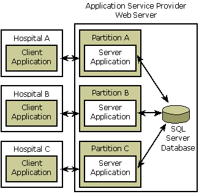

# What Are COM+ Partitions?

A COM+ partition is a logical container that allows applications to run independently of other configurations of those applications. Each configuration of an application is installed into a separate partition and can be separately managed, according to the specific needs of its users.

During activation of a COM+ component, the partitions service determines which configuration of the component to activate, based on the identity of the user requesting the component activation. For example, a single organization that has two separate groups, Production and Training, could implement COM+ partitions as a way to allow the two groups to use different configurations of a COM+ application on the same computer.

**Windows XP:** The ability to create, configure, or delegate COM+ partitions is not available. The global partition is the only COM+ partition available.

**Windows 2000:** The COM+ partitions service is not available in Windows 2000.

## Benefits of Using COM+ Partitions

The use of COM+ partitions offers several advantages, including the following:

-   Organizations can lower their total cost of ownership (TCO) by using fewer physical application servers to support users who need multiple application configurations.
-   Administrative overhead is reduced. Instead of having to configure and manage multiple computers, administrators need only configure and manage multiple partitions on the same computer. Furthermore, partitions can be managed programmatically through the addition of a new COM+ programming interface.
-   Security can be implemented and managed on a partition-by-partition basis for local users, domain users, and organizational units (OUs).
-   Programmers and administrators can use Microsoft's development and administrative tools—such as the Windows SDK, Active Directory Users and Computers, and Component Services administrative tool—to manage COM+ partitions. The partitions feature is fully integrated into these tools.

## Primary Usage Scenario

A primary reason for customers to deploy the COM+ partitions feature is to host Web-based applications. For example, suppose a small software company develops a COM+ application for use by hospital personnel. The application, which is a distributed Web-based application, provides a way for hospitals to store and retrieve patient medical records using a SQL Server database.

Suppose the software company has three customers: Hospital A, Hospital B, and Hospital C. While each customer runs the client side of the COM+ application locally on its desktop computers, the server side of the COM+ application resides on the software company's in-house web server and is accessed by its customers via the Web.

Because each hospital has its own set of storage and retrieval requirements and its own set of customized patient data, the software company must provide a way for multiple configurations of the server part of the application to be executed simultaneously on the web server. COM+ partitions provide a solution to this problem.

The following illustration shows the partitions scenario for the software company's COM+ application.

## Related topics

<dl> <dt>

[Application Design Restrictions](application-design-restrictions.md)
</dt> <dt>

[COM+ Queued Components and Partitions](com--queued-components-and-partitions.md)
</dt> <dt>

[Partition Implementation](partition-implementation.md)
</dt> <dt>

[Registering and Activating Components in Partitions](registering-and-activating-components-in-partitions.md)
</dt> </dl>

 

 

