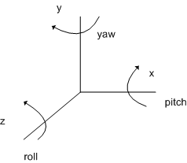

# D3DXMatrixRotationYawPitchRoll function

Builds a matrix with a specified yaw, pitch, and roll.

## Syntax


```C++
D3DXMATRIX* D3DXMatrixRotationYawPitchRoll(
  _Inout_ D3DXMATRIX *pOut,
  _In_    FLOAT      Yaw,
  _In_    FLOAT      Pitch,
  _In_    FLOAT      Roll
);
```


## Parameters

<dl> <dt>

*pOut* \[in, out\]
</dt> <dd>

Type: **[**D3DXMATRIX**](https://msdn.microsoft.com/windows/desktop/0911088b-50cf-4c4a-996e-351386fc359b)\***

Pointer to the [**D3DXMATRIX**](d3d10-d3dxmatrix.md) structure that is the result of the operation.

</dd> <dt>

*Yaw* \[in\]
</dt> <dd>

Type: **[**FLOAT**](https://msdn.microsoft.com/windows/desktop/4553cafc-450e-4493-a4d4-cb6e2f274d46)**

Yaw around the y-axis, in radians.

</dd> <dt>

*Pitch* \[in\]
</dt> <dd>

Type: **[**FLOAT**](https://msdn.microsoft.com/windows/desktop/4553cafc-450e-4493-a4d4-cb6e2f274d46)**

Pitch around the x-axis, in radians.

</dd> <dt>

*Roll* \[in\]
</dt> <dd>

Type: **[**FLOAT**](https://msdn.microsoft.com/windows/desktop/4553cafc-450e-4493-a4d4-cb6e2f274d46)**

Roll around the z-axis, in radians.

</dd> </dl>

## Return value

Type: **[**D3DXMATRIX**](https://msdn.microsoft.com/windows/desktop/0911088b-50cf-4c4a-996e-351386fc359b)\***

Pointer to a D3DXMATRIX structure with the specified yaw, pitch, and roll.

## Remarks

The return value for this function is the same value returned in the pOut parameter. In this way, the D3DXMatrixRotationYawPitchRoll function can be used as a parameter for another function.

The order of transformations is roll first, then pitch, then yaw. Relative to the object's local coordinate axis, this is equivalent to rotation around the z-axis, followed by rotation around the x-axis, followed by rotation around the y-axis, as shown in the following illustration.



## Requirements


|                    |                                                                                         |
|--------------------|-----------------------------------------------------------------------------------------|
| Header<br/>  | <dl> <dt>D3DX10Math.h</dt> </dl> |
| Library<br/> | <dl> <dt>D3DX10.lib</dt> </dl>   |


## See also

<dl> <dt>

[Math Functions](d3d10-graphics-reference-d3dx10-functions-math.md)
</dt> </dl>

 

 


