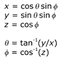

# D3DXSHEvalDirection function (D3DX10.h)

> [!Note]
> The D3DX (D3DX 9, D3DX 10, and D3DX 11) utility library is deprecated and is not supported for Windows Store apps.

> [!Note]
> Instead of using this function, we recommend that you use the [Spherical Harmonics Math](https://github.com/Microsoft/DirectXMath/tree/main/SHMath) library function **XMSHEvalDirection**.

Evaluates the spherical harmonic (SH) basis functions from an input direction vector.

## Syntax


```C++
FLOAT* D3DXSHEvalDirection(
  _In_       FLOAT       *pOut,
  _In_       UINT        Order,
  _In_ const D3DXVECTOR3 *pDir
);
```


## Parameters

<dl> <dt>

*pOut* \[in\]
</dt> <dd>

Type: **[**FLOAT**](../winprog/windows-data-types.md)\***

Pointer to Spherical harmonic (SH) output coefficients. The evaluation generates Order² coefficients. See Remarks.

</dd> <dt>

*Order* \[in\]
</dt> <dd>

Type: **[**UINT**](../winprog/windows-data-types.md)**

Order of the SH evaluation. Must be in the range of D3DXSH\_MINORDER to D3DXSH\_MAXORDER, inclusive. The evaluation generates Order² coefficients. The degree of the evaluation is Order - 1.

</dd> <dt>

*pDir* \[in\]
</dt> <dd>

Type: **const [**D3DXVECTOR3**](../direct3d9/d3dxvector3.md)\***

(x, y, z) direction vector in which to evaluate the SH basis functions. Must be normalized. See Remarks.

</dd> </dl>

## Return value

Type: **[**FLOAT**](../winprog/windows-data-types.md)\***

Pointer to SH output coefficients. See Remarks.

## Remarks

Each coefficient of the basis function Yₗₘ is stored at memory location l² + m + l, where:

-   l is the degree of the basis function.
-   m is the basis function index for the given l value and ranges from -l to l, inclusive.

On the sphere with unit radius, as shown in the following illustration, direction can be specified simply with theta, the angle about the z-axis in the right-handed direction, and phi, the angle from z.


The following equations show the relationship between Cartesian (x, y, z) and spherical (theta, phi) coordinates on the unit sphere. The angle theta varies over the range of 0 to 2 pi, while phi varies from 0 to pi.



## Requirements


| Requirement | Value |
|--------------------|---------------------------------------------------------------------------------------|
| Header<br/>  | <dl> <dt>D3DX10.h</dt> </dl>   |
| Library<br/> | <dl> <dt>D3DX10.lib</dt> </dl> |


## See also

<dl> <dt>

[Math Functions](d3d10-graphics-reference-d3dx10-functions-math.md)
</dt> </dl>

 

 
