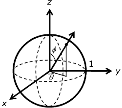

# D3DXSHEvalHemisphereLight function (D3DX10.h)

Evaluates a light that is a linear interpolation between two colors over the sphere.

## Syntax


```C++
HRESULT D3DXSHEvalHemisphereLight(
  _In_       UINT        Order,
  _In_ const D3DXVECTOR3 *pDir,
  _In_       D3DXCOLOR   Top,
  _In_       D3DXCOLOR   Bottom,
  _In_       FLOAT       *pROut,
  _In_       FLOAT       *pGOut,
  _In_       FLOAT       *pBOut
);
```


## Parameters

<dl> <dt>

*Order* \[in\]
</dt> <dd>

Type: **[**UINT**](../winprog/windows-data-types.md)**

Order of the spherical harmonic (SH) evaluation. Must be in the range of D3DXSH\_MINORDER to D3DXSH\_MAXORDER, inclusive. The evaluation generates Order² coefficients. The degree of the evaluation is Order - 1.

</dd> <dt>

*pDir* \[in\]
</dt> <dd>

Type: **const [**D3DXVECTOR3**](../direct3d9/d3dxvector3.md)\***

Pointer to the (x, y, z) hemisphere axis direction vector in which to evaluate the SH basis functions. See Remarks.

</dd> <dt>

*Top* \[in\]
</dt> <dd>

Type: **[**D3DXCOLOR**](../direct3d9/d3dxcolor.md)**

The sky color.

</dd> <dt>

*Bottom* \[in\]
</dt> <dd>

Type: **[**D3DXCOLOR**](../direct3d9/d3dxcolor.md)**

The ground color.

</dd> <dt>

*pROut* \[in\]
</dt> <dd>

Type: **[**FLOAT**](../winprog/windows-data-types.md)\***

Pointer to the output SH vector for the red component.

</dd> <dt>

*pGOut* \[in\]
</dt> <dd>

Type: **[**FLOAT**](../winprog/windows-data-types.md)\***

Pointer to the output SH vector for the green component.

</dd> <dt>

*pBOut* \[in\]
</dt> <dd>

Type: **[**FLOAT**](../winprog/windows-data-types.md)\***

Pointer to the output SH vector for the blue component.

</dd> </dl>

## Return value

Type: **[**HRESULT**](https://msdn.microsoft.com/library/Bb401631(v=MSDN.10).aspx)**

If the function succeeds, the return value is D3D\_OK. If the function fails, the return value can be: D3DERR\_INVALIDCALL.

## Remarks

The interpolation is done linearly between the two points, not over the surface of the sphere (that is, if the axis was (0,0,1) it is linear in Z, not in the azimuthal angle). The resulting spherical lighting function is normalized so that a point on a perfectly diffuse surface with no shadowing and a normal pointed in the direction pDir would result in exit radiance with a value of 1 (if the top color was white and the bottom color was black). This is a very simple model where Top represents the intensity of the "sky" and Bottom represents the intensity of the "ground."

On the sphere with unit radius, as shown in the following illustration, direction can be specified simply with theta, the angle about the z-axis in the right-handed direction, and phi, the angle from z.



The following equations show the relationship between Cartesian (x, y, z) and spherical (theta, phi) coordinates on the unit sphere. The angle theta varies over the range of 0 to 2 pi, while phi varies from 0 to pi.


## Requirements


| Requirement | Value |
|--------------------|---------------------------------------------------------------------------------------|
| Header<br/>  | <dl> <dt>D3DX10.h</dt> </dl>   |
| Library<br/> | <dl> <dt>D3DX10.lib</dt> </dl> |


## See also

<dl> <dt>

[Math Functions](d3d10-graphics-reference-d3dx10-functions-math.md)
</dt> </dl>

 

 
