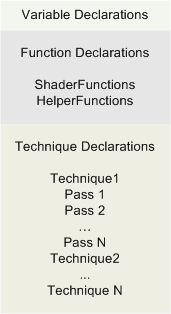

# Effect Format (Direct3D 10)

An effect (which is often stored in a file with a .fx file extension) declares the pipeline state set by an effect. Effect state can be roughly broken down into three categories:

-   [Variables](d3d10-effect-variable-syntax.md), which are usually declared at the top of an effect.
-   [Functions](d3d10-effect-function-syntax.md), which implement shader code, or are used as helper functions by other functions.
-   [A technique](d3d10-effect-technique-syntax.md), which implements rendering sequences using one or more effect passes. Each pass sets one or more [state groups](d3d10-effect-states.md) and calls shader functions.

The preceding diagram shows the categories of effect state.

## Related topics

<dl> <dt>

[Effect Reference](d3d10-graphics-reference-effect.md)
</dt> </dl>

 

 

