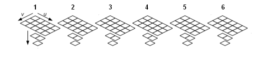
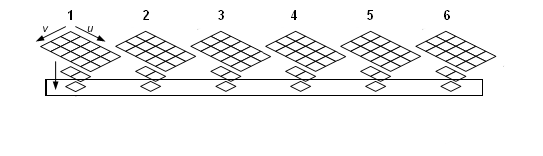

# Texture Views (Direct3D 10)

In Direct3D 10, texture resources are accessed with a view, which is a mechanism for hardware interpretation of a resource in memory. A view allows a particular pipeline stage to access only the [subresources](d3d10-graphics-programming-guide-resources-types.md) it needs, in the representation desired by the application.

A view supports the notion of a type-less resource. A type-less resource is a resource created with a specific size but not a specific data type. The data is interpreted dynamically when it is bound to the pipeline.

The following illustration shows an example of binding a 2D texture array with 6 textures as a shader resource by creating a shader resource view for it. The resource is then addressed as an array of textures. (Note: a subresource cannot be bound as both input and output to the pipeline simultaneously.)

When using a 2D texture array as a render target, the resource can be viewed as an array of 2D textures (6 in this example) with mipmap levels (3 in this example).

Create a view object for a render target by calling CreateRenderTargetView. Then call OMSetRenderTargets to set the render target view to the pipeline. Render into the render targets by calling Draw and using the RenderTargetArrayIndex to index into the proper texture in the array. You can use a subresource (a mipmap level, array index combination) to bind to any array of subresources. So you could bind to the second mipmap level and only update this particular mipmap level if you wanted, as in the following illustration.

Differences between Direct3D 9 and Direct3D 10:

- In Direct3D 10, you no longer bind a resource directly to the pipeline, you create a view of a resource, and then set the view to the pipeline. This allows validation and mapping in the runtime and driver to occur at view creation, minimizing type checking at bind-time.

 

## Related topics

<dl> <dt>

[Resources (Direct3D 10)](d3d10-graphics-programming-guide-resources.md)
</dt> </dl>

 

 

