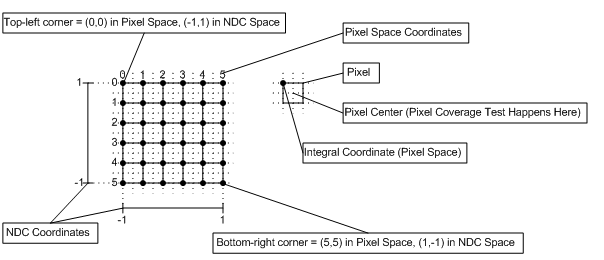
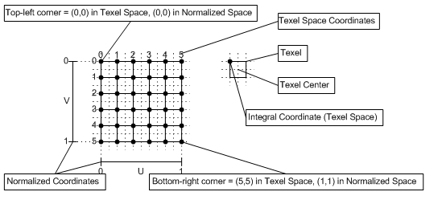

# Coordinate Systems (Direct3D 10)

Coordinate systems for Direct3D 10 are defined for pixels and texels.

|                                                                                                                                                                                                                                                                              |
|------------------------------------------------------------------------------------------------------------------------------------------------------------------------------------------------------------------------------------------------------------------------------|
| Differences between Direct3D 9 and Direct3D 10:  Direct3D 10 defines the upper-left corner of the upper-left pixel as the origin of a render target.  Direct3D 9 defines the center of the upper-left pixel as the origin of a render target.  |

 

-   [Pixel Coordinate System](#pixel-coordinate-system)
    -   [Pixel Coordinate System for Direct3D 9](#pixel-coordinate-system-for-direct3d-9)
-   [Texel Coordinate System](#texel-coordinate-system)
    -   [Texel Coordinate System](#texel-coordinate-system)
-   [Related topics](#related-topics)

## Pixel Coordinate System

The pixel coordinate system in Direct3D 10 defines the origin of a render target at the upper-left corner. as shown in the following diagram. Pixel centers are offset by (0.5f,0.5f) from integer locations.

### Pixel Coordinate System for Direct3D 9

For reference, here is the pixel coordinate system for Direct3D 9, which defined the origin or a render target as the center of the upper-left pixel, (0.5,0.5) away from the upper left corner, as shown in the following diagram. In Direct3D 9, pixel centers are at integer locations.

## Texel Coordinate System

The texel coordinate system has its origin at the top-left corner of the texture, as shown in the following diagram. This makes rendering screen-aligned textures trivial (in Direct3D 10), as the pixel coordinate system is aligned with the texel coordinate system.

### Texel Coordinate System

Texture coordinates are represented with either a normalized or a scaled number; each texture coordinate is mapped to a specific texel as follows:

For a normalized coordinate:

-   Point sampling: Texel \# = floor(U \* Width)
-   Linear sampling: Left Texel \# = floor(U \* Width), Right Texel \# = Left Texel \# + 1

For a scaled coordinate:

-   Point sampling: Texel \# = floor(U)
-   Linear sampling: Left Texel \# = floor(U - 0.5), Right Texel \# = Left Texel \# + 1

Where the width, is the width of the texture (in texels).

Texture address wrapping occurs after the texel location is computed.

## Related topics

<dl> <dt>

[Resources (Direct3D 10)](d3d10-graphics-programming-guide-resources.md)
</dt> </dl>

 

 

