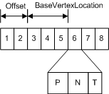
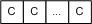

# Resource Types (Direct3D 10)

All resources used by the Direct3D pipeline derive from two basic resource types: [buffers](#buffer-resources) and [textures](#texture-resources). A buffer is a collection of raw data (elements); a texture is a collection of texels (texture elements).

-   [Buffer Resources](#buffer-resources)
    -   [Buffer Types](#buffer-types)
-   [Texture Resources](#texture-resources)
    -   [Texture Types](#texture-types)
    -   [Subresources](#subresources)
    -   [Strong vs. Weak Typing](#strong-vs-weak-typing)
-   [Related topics](#related-topics)

There are two ways to fully specify the layout (or memory footprint) of a resource:

| Item                                                                                                 | Description                                                                   |
|------------------------------------------------------------------------------------------------------|-------------------------------------------------------------------------------|
| Typed              | Fully specify the type when the resource is created.                |
| Typeless  | Fully specify the type when the resource is bound to the pipeline.  |

 

## Buffer Resources

A buffer resource is a collection of fully typed data; internally, a buffer contains elements. An element is made up of 1 to 4 components. Examples of element data types include: a packed data value (like R8G8B8A8), a single 8-bit integer, four 32-bit float values. These data types are used to store data, such as a position vector, a normal vector, a texture coordinate in a vertex buffer, an index in an index buffer, or device state.

A buffer is created as an unstructured resource. Because it is unstructured, a buffer cannot contain any mipmap levels, is not filtered when read, and cannot be multisampled.

### Buffer Types

-   [Vertex Buffer](#vertex-buffer)
-   [Index Buffer](#index-buffer)
-   [Constant Buffer](#constant-buffer)

### Vertex Buffer

A buffer is a collection of elements; a vertex buffer contains per-vertex data. The simplest example is a vertex buffer that contains one type of data, such as position data. It can be visualized like the following illustration.

More often, a vertex buffer contains all the data needed to fully specify 3D vertices. An example of this could be a vertex buffer that contains per-vertex position, normal and texture coordinates. This data is usually organized as sets of per-vertex elements, as shown in the following illustration.

This vertex buffer contains per-vertex data for eight vertices; each vertex stores three elements (position, normal, and texture coordinates). The position and normal are each typically specified using three 32-bit floats (DXGI\_FORMAT\_R32G32B32\_FLOAT) and the texture coordinates using two 32-bit floats (DXGI\_FORMAT\_R32G32\_FLOAT).

To access data from a vertex buffer, you need to know which vertex to access and these other buffer parameters:

-   Offset - the number of bytes from the start of the buffer to the data for the first vertex. The offset is supplied to [**IASetVertexBuffers**](/windows/desktop/api/D3D10/nf-d3d10-id3d10device-iasetvertexbuffers).
-   BaseVertexLocation - the number of bytes from the offset to the first vertex used by the appropriate draw call (see [Draw Methods](../direct3d11/d3d10-graphics-programming-guide-input-assembler-stage-getting-started.md)).

Before you create a vertex buffer, you need to define its layout by creating an [**input-layout object**](/windows/win32/api/d3d10/nn-d3d10-id3d10inputlayout); this is done by calling [**CreateInputLayout**](/windows/desktop/api/D3D10/nf-d3d10-id3d10device-createinputlayout). Once the input-layout object is created, bind it to the input-assembler stage by calling [**IASetInputLayout**](/windows/desktop/api/D3D10/nf-d3d10-id3d10device-iasetinputlayout).

To create a vertex buffer, call [**CreateBuffer**](/windows/desktop/api/D3D10/nf-d3d10-id3d10device-createbuffer).

### Index Buffer

An index buffer contains a sequential set of 16-bit or 32-bit indices; each index is used to identify a vertex in a vertex buffer. Using an index buffer with one or more vertex buffers to supply data to the IA stage is called indexing. An index buffer can be visualized like the following illustration.

The sequential indices stored in an index buffer are located with the following parameters:

-   Offset - the number of bytes from the start of the buffer to the first index. The offset is supplied to [**IASetIndexBuffer**](/windows/desktop/api/D3D10/nf-d3d10-id3d10device-iasetindexbuffer).
-   StartIndexLocation - the number of bytes from the offset to the first vertex used by the appropriate draw call (see [Draw Methods](../direct3d11/d3d10-graphics-programming-guide-input-assembler-stage-getting-started.md)).
-   IndexCount - the number of indices to render.

To create an index buffer, call [**CreateBuffer**](/windows/desktop/api/D3D10/nf-d3d10-id3d10device-createbuffer).

An index buffer can stitch together multiple [line or triangle strips](../direct3d11/d3d10-graphics-programming-guide-primitive-topologies.md) by separating each with a strip-cut index. A strip-cut index allows multiple line or triangle strips to be drawn with a single draw call. A strip-cut index is simply the maximum possible value for the index (0xffff for a 16-bit index, 0xffffffff for a 32-bit index). The strip-cut index resets the winding order in indexed primitives and can be used to remove the need for degenerate triangles that may otherwise be required to maintain proper winding order in a triangle strip. The following illustration shows an example of a strip-cut index.

### Constant Buffer

Direct3D 10 introduced a new buffer for supplying shader constants called a shader-constant buffer or simply a constant buffer. Conceptually, it looks just like a single-element vertex buffer, as shown in the following illustration.

Each element stores a 1-to-4 component constant, determined by the format of the data stored.

Constant buffers reduce the bandwidth required to update shader constants by allowing shader constants to be grouped together and committed at the same time rather than making individual calls to commit each constant separately.

To create a shader-constant buffer, call [**CreateBuffer**](/windows/desktop/api/D3D10/nf-d3d10-id3d10device-createbuffer) and specify the constant-buffer bind flag D3D10\_BIND\_CONSTANT\_BUFFER (see [**D3D10\_BIND\_FLAG**](/windows/desktop/api/D3D10/ne-d3d10-d3d10_bind_flag)).

To bind a shader-constant buffer to the pipeline, call one of these methods: [**GSSetConstantBuffers**](/windows/desktop/api/D3D10/nf-d3d10-id3d10device-gssetconstantbuffers), [**PSSetConstantBuffers**](/windows/desktop/api/D3D10/nf-d3d10-id3d10device-pssetconstantbuffers), or [**VSSetConstantBuffers**](/windows/desktop/api/D3D10/nf-d3d10-id3d10device-vssetconstantbuffers).

Note that when using the [**ID3D10Effect Interface**](/windows/desktop/api/D3D10Effect/nn-d3d10effect-id3d10effect) interface the process of creating, binding and comitting a constant buffer is handled by the **ID3D10Effect Interface** instance. In that case it is only nescesary to get the variable from the effect with one of the GetVariable methods such as [**GetVariableByName**](/windows/desktop/api/D3D10Effect/nf-d3d10effect-id3d10effect-getvariablebyname) and update the variable with one of the SetVariable methods such as [**SetMatrix**](/windows/desktop/api/D3D10Effect/nf-d3d10effect-id3d10effectmatrixvariable-setmatrix). For an example of using **ID3D10Effect Interface** to manage a constant buffer see [tutorial 07](https://msdn.microsoft.com/library/Ee416442(v=VS.85).aspx).

A shader continues to read variables in a constant buffer directly by variable name in the same manner variables that are not part of a constant buffer are read.

Each shader stage allows up to 15 shader-constant buffers; each buffer can hold up to 4096 constants.

Use a constant buffer to store the results of the stream-output stage.

See [Shader Constants (DirectX HLSL)](../direct3dhlsl/dx-graphics-hlsl-constants.md) for an example of declaring a constant buffer in a shader.

## Texture Resources

A texture resource is a structured collection of data designed to store texels. Unlike buffers, textures can be filtered by texture samplers as they are read by shader units. The type of texture impacts how the texture is filtered. A texel represents the smallest unit of a texture that can be read or written to by the pipeline. Each texel contains 1 to 4 components, arranged in one of the DXGI formats (see [**DXGI\_FORMAT**](/windows/win32/api/dxgiformat/ne-dxgiformat-dxgi_format)).

Textures are created as a structured resource so that their size is known. However, each texture may be typed or type less at resource-creation time, as long as the type is fully specified using a view when the texture is bound to the pipeline.

-   [Texture Types](#texture-types)
-   [Subresources](#subresources)
-   [Strong vs. Weak Typing](#strong-vs-weak-typing)

### Texture Types

There are several types of textures: 1D, 2D, 3D, each of which can be created with or without mipmaps. Direct3D 10 also supports texture arrays and multisampled textures.

-   [1D Texture](#1d-texture)
-   [1D Texture Array](#1d-texture-array)
-   [2D Texture and 2D Texture Array](#2d-texture-and-2d-texture-array)
-   [3D Texture](#3d-texture)

### 1D Texture

A 1D texture in its simplest form contains texture data that can be addressed with a single texture coordinate; it can be visualized as an array of texels, as shown in the following illustration.

Each texel contains a number of color components depending on the format of the data stored. Adding more complexity, you can create a 1D texture with mipmap levels, as shown in the following illustration.

A mipmap level is a texture that is a power-of-two smaller than the level above it. The top-most level contains the most detail, each subsequent level is smaller; for a 1D mipmap, the smallest level contains one texel. The differing levels are identified by an index called a LOD (level-of-detail); you can use the LOD to access a smaller texture when rendering geometry that is not as close to the camera.

### 1D Texture Array

Direct3D 10 also has a new data structure for an array of textures. An array of 1D textures looks conceptually like the following illustration.

This texture array contains three textures. Each of the three textures has a texture width of 5 (which is the number of elements in the first layer). Each texture also contains a 3 layer mipmap.

All texture arrays in Direct3D are a homogeneous array of textures; this means that every texture in a texture array must have the same data format and size (including texture width and number of mipmap levels). You may create texture arrays of different sizes, as long as all the textures in each array match in size.

### 2D Texture and 2D Texture Array

A Texture2D resource contains a 2D grid of texels. Each texel is addressable by a u, v vector. Because it is a texture resource, it may contain mipmap levels, and subresources. A fully populated 2D texture resource looks like the following illustration.

This texture resource contains a single 3x5 texture with three mipmap levels.

A Texture2DArray resource is a homogeneous array of 2D textures; that is, each texture has the same data format and dimensions (including mipmap levels). It has a similar layout as the 1D texture array except that the textures now contain 2D data, and therefore looks like the following illustration.

This texture array contains three textures; each texture is 3x5 with two mipmap levels.

### Using a Texture2DArray as a Texture Cube

A texture cube is a 2D texture array that contains 6 textures, one for each face of the cube. A fully populated texture cube looks like the following illustration.

A 2D texture array that contains 6 textures may be read from within shaders with the cube map intrinsic functions, after they are bound to the pipeline with a cube-texture view. Texture cubes are addressed from the shader with a 3D vector pointing out from the center of the texture cube.

### 3D Texture

A Texture3D resource (also known as a volume texture) contains a 3D volume of texels. Since it is a texture resource, it may contain mipmap levels. A fully populated [**3D texture**](/windows/desktop/api/D3D10/nn-d3d10-id3d10texture3d) looks like the following illustration.

When a 3D texture mipmap slice is bound as a render target output (with a render-target view), the 3D texture behaves identically to a 2D texture array with n slices. The particular render slice is chosen from the geometry-shader stage, by declaring a scalar component of output data as the SV\_RenderTargetArrayIndex system-value.

There is no concept of a 3D texture array; therefore a 3D texture subresource is a single mipmap level.

### Subresources

The Direct3D 10 API references entire resources or subsets of resources. To specify portion of resources, Direct3D has coined the term subresources which means a subset of a resource.

A buffer is defined as a single subresource. Textures are a little more complicated as there are several different texture types (1D, 2D, etc.) some of which support mipmap levels and/or texture arrays. Beginning with the simplest case, a 1D texture is defined as a single subresource, as shown in the following illustration.

This means that the array of texels that make up a 1D texture are contained in a single subresource.

If you expand a 1D texture with three mipmap levels, it can be visualized like this.

Think of this as a single texture that is made up of three subtextures. Each subtexture is counted as a subresource, so this 1D texture contains 3 subresources. A subtexture (or subresource) can be indexed using the level-of-detail (LOD) for a single texture. When using an array of textures, accessing a particular subtexture requires both the LOD and the particular texture. Alternately, the API combines these two pieces of information into a single zero-based subresource index as shown here.

### Selecting Subresources

Some API's access an entire resource (for example [**CopyResource**](/windows/desktop/api/D3D10/nf-d3d10-id3d10device-copyresource)), others access a portion of a resource (for example [**UpdateSubresource**](/windows/desktop/api/D3D10/nf-d3d10-id3d10device-updatesubresource) or [**CopySubresourceRegion**](/windows/desktop/api/D3D10/nf-d3d10-id3d10device-copysubresourceregion)). The API's that access a portion of a resource generally use a view description (such as [**D3D10\_TEX2D\_ARRAY\_DSV**](/windows/desktop/api/D3D10/ns-d3d10-d3d10_tex2d_array_dsv)) to specify the subresources to access.

These figures illustrate the terms used by a view description when accessing an array of textures.

### Array Slice

Given an array of textures, each texture with mipmaps, an array slice (represented by the white rectangle) includes one texture and all of its subtextures, as shown in the following illustration.

### Mip Slice

A mip slice (represented by the white rectangle) includes one mipmap level for every texture in an array, as shown in the following illustration.

### Selecting a Single Subresource

You can use these two types of slices to choose a single subresource, as shown in the following illustration.

### Selecting Multiple Subresources

Or you can use these two types of slices with the number of mipmap levels and/or number of textures, to choose multiple subresources.

Regardless of what texture type you are using, with or without mipmaps, with or without a texture array, you can use the helper function, [**D3D10CalcSubresource**](/windows/desktop/api/D3D10/nf-d3d10-d3d10calcsubresource), to compute the index of a particular subresource.

### Strong vs. Weak Typing

Creating a fully-typed resource restricts the resource to the format it was created with. This enables the runtime to optimize access, especially if the resource is created with flags indicating that it cannot be [mapped](d3d10-graphics-programming-guide-resources-mapping.md) by the application. Resources created with a specific type cannot be reinterpreted using the view mechanism.

In a type less resource, the data type is unknown when the resource is first created. The application must choose from the available type less formats (see [**DXGI\_FORMAT**](/windows/win32/api/dxgiformat/ne-dxgiformat-dxgi_format)). You must specify the size of the memory to allocate and whether the runtime will need to generate the subtextures in a mipmap. However, the exact data format (whether the memory will be interpreted as integers, floating point values, unsigned integers etc.) is not determined until the resource is bound to the pipeline with a view. As the texture format remains flexible until the texture is bound to the pipeline, the resource is referred to as weakly typed storage. Weakly typed storage has the advantage that it can be reused or reinterpreted (in another format) as long as the component bit of the new format matches the bit count of the old format.

A single resource can be bound to multiple pipeline stages as long as each has a unique view, which fully qualifies the formats at each location. For example, a resource created with the format DXGI\_FORMAT\_R32G32B32A32\_TYPELESS could be used as an DXGI\_FORMAT\_R32G32B32A32\_FLOAT and an DXGI\_FORMAT\_R32G32B32A32\_UINT at different locations in the pipeline simultaneously.

## Related topics

<dl> <dt>

[Resources (Direct3D 10)](d3d10-graphics-programming-guide-resources.md)
</dt> </dl>

 

 
