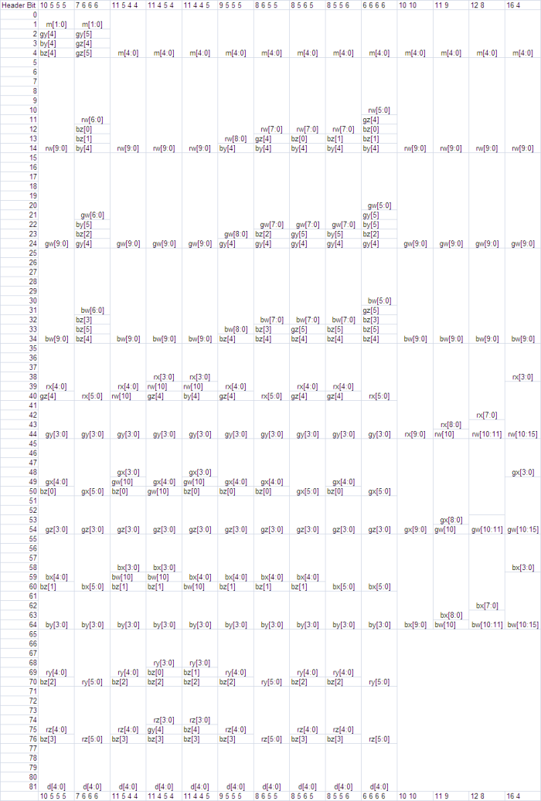

# BC6H Format

The BC6H format is a texture compression format designed to support high-dynamic range (HDR) color spaces in source data.

-   [About BC6H/DXGI\_FORMAT\_BC6H](/windows)
-   [BC6H Implementation](#bc6h-implementation)
-   [Decoding the BC6H Format](#decoding-the-bc6h-format)
-   [BC6H Compressed Endpoint Format](#bc6h-compressed-endpoint-format)
-   [Sign Extension for Endpoint Values](#sign-extension-for-endpoint-values)
-   [Transform Inversion for Endpoint Values](#transform-inversion-for-endpoint-values)
-   [Unquantization of Color Endpoints](#unquantization-of-color-endpoints)
-   [Related topics](#related-topics)

## About BC6H/DXGI\_FORMAT\_BC6H

The BC6H format provides high-quality compression for images that use three HDR color channels, with a 16-bit value for each color channel of the value (16:16:16). There is no support for an alpha channel.

BC6H is specified by the following DXGI\_FORMAT enumeration values:

-   **DXGI\_FORMAT\_BC6H\_TYPELESS**.
-   **DXGI\_FORMAT\_BC6H\_UF16**. This BC6H format does not use a sign bit in the 16-bit floating point color channel values.
-   **DXGI\_FORMAT\_BC6H\_SF16**.This BC6H format uses a sign bit in the 16-bit floating point color channel values.

> [!Note]  
> The 16 bit floating point format for color channels is often referred to as a "half" floating point format. This format has the following bit layout:
>
> |  Format                     | Bit layout                                                |
> |-----------------------|-------------------------------------------------|
> | UF16 (unsigned float) | 5 exponent bits + 11 mantissa bits              |
> | SF16 (signed float)   | 1 sign bit + 5 exponent bits + 10 mantissa bits |
>
> 
>
>  

 

The BC6H format can be used for [Texture2D](/windows/desktop/direct3d10/d3d10-graphics-reference-resource-structures) (including arrays), Texture3D, or TextureCube (including arrays) texture resources. Similarly, this format applies to any MIP-map surfaces associated with these resources.

BC6H uses a fixed block size of 16 bytes (128 bits) and a fixed tile size of 4x4 texels. As with previous BC formats, texture images larger than the supported tile size (4x4) are compressed by using multiple blocks. This addressing identity applies also to three-dimensional images, MIP-maps, cubemaps, and texture arrays. All image tiles must be of the same format.

Some important notes about the BC6H format:

-   BC6H supports floating point denormalization, but does not support INF (infinity) and NaN (not a number). The exception is the signed mode of BC6H (DXGI\_FORMAT\_BC6H\_SF16), which supports -INF (negative infinity). Note that this support for -INF is merely an artifact of the format itself, and is not specifically supported by encoders for this format. In general, when encoders encounter INF (positive or negative) or NaN input data, they should \\ convert that data to the maximum allowable non-INF representation value, and map NaN to 0 prior to compression.
-   BC6H does not support an alpha channel.
-   The BC6H decoder performs decompression before it performs texture filtering.
-   BC6H decompression must be bit accurate; that is, the hardware must return results that are identical to the decoder described in this documentation.

## BC6H Implementation

A BC6H block consists of mode bits, compressed endpoints, compressed indices, and an optional partition index. This format specifies 14 different modes.

An endpoint color is stored as an RGB triplet. BC6H defines a palette of colors on an approximate line across a number of defined color endpoints. Also, depending on the mode, a tile can be divided into two regions or treated as a single region, where a two-region tile has a separate set of color endpoints for each region. BC6H stores one palette index per texel.

In the two-region case, there are 32 possible partitions.

## Decoding the BC6H Format

The pseudocode below shows the steps to decompress the pixel at (x,y) given the 16 byte BC6H block.

``` syntax
decompress_bc6h(x, y, block)
{
    mode = extract_mode(block);
    endpoints;
    index;
    
    if(mode.type == ONE)
    {
        endpoints = extract_compressed_endpoints(mode, block);
        index = extract_index_ONE(x, y, block);
    }
    else //mode.type == TWO
    {
        partition = extract_partition(block);
        region = get_region(partition, x, y);
        endpoints = extract_compressed_endpoints(mode, region, block);
        index = extract_index_TWO(x, y, partition, block);
    }
    
    unquantize(endpoints);
    color = interpolate(index, endpoints);
    finish_unquantize(color);
}
```

The following table contains the bit count and values for each of the 14 possible formats for BC6H blocks. 

| Mode | Partition Indices | Partition | Color Endpoints                  | Mode Bits      |
|------|-------------------|-----------|----------------------------------|----------------|
| 1    | 46 bits           | 5 bits    | 75 bits (10.555, 10.555, 10.555) | 2 bits (00)    |
| 2    | 46 bits           | 5 bits    | 75 bits (7666, 7666, 7666)       | 2 bits (01)    |
| 3    | 46 bits           | 5 bits    | 72 bits (11.555, 11.444, 11.444) | 5 bits (00010) |
| 4    | 46 bits           | 5 bits    | 72 bits (11.444, 11.555, 11.444) | 5 bits (00110) |
| 5    | 46 bits           | 5 bits    | 72 bits (11.444, 11.444, 11.555) | 5 bits (01010) |
| 6    | 46 bits           | 5 bits    | 72 bits (9555, 9555, 9555)       | 5 bits (01110) |
| 7    | 46 bits           | 5 bits    | 72 bits (8666, 8555, 8555)       | 5 bits (10010) |
| 8    | 46 bits           | 5 bits    | 72 bits (8555, 8666, 8555)       | 5 bits (10110) |
| 9    | 46 bits           | 5 bits    | 72 bits (8555, 8555, 8666)       | 5 bits (11010) |
| 10   | 46 bits           | 5 bits    | 72 bits (6666, 6666, 6666)       | 5 bits (11110) |
| 11   | 63 bits           | 0 bits    | 60 bits (10.10, 10.10, 10.10)    | 5 bits (00011) |
| 12   | 63 bits           | 0 bits    | 60 bits (11.9, 11.9, 11.9)       | 5 bits (00111) |
| 13   | 63 bits           | 0 bits    | 60 bits (12.8, 12.8, 12.8)       | 5 bits (01011) |
| 14   | 63 bits           | 0 bits    | 60 bits (16.4, 16.4, 16.4)       | 5 bits (01111) |


 

Each format in this table can be uniquely identified by the mode bits. The first ten modes are used for two-region tiles, and the mode bit field can be either two or five bits long. These blocks also have fields for the compressed color endpoints (72 or 75 bits), the partition (5 bits), and the partition indices (46 bits).

For the compressed color endpoints, the values in the preceding table note the precision of the stored RGB endpoints, and the number of bits used for each color value. For example, mode 3 specifies a color endpoint precision level of 11, and the number of bits used to store the delta values of the transformed endpoints for the red, blue and green colors (5, 4, and 4 respectively). Mode 10 does not use delta compression, and instead stores all four color endpoints explicitly.

The last four block modes are used for one-region tiles, where the mode field is 5 bits. These blocks have fields for the endpoints (60 bits) and the compressed indices (63 bits). Mode 11 (like Mode 10) does not use delta compression, and instead stores both color endpoints explicitly.

Modes 10011, 10111, 11011, and 11111 (not shown) are reserved. Do not use these in your encoder. If the hardware is passed blocks with one of these modes specified, the resulting decompressed block must contain all zeroes in all channels except for the alpha channel.

For BC6H, the alpha channel must always return 1.0 regardless of the mode.

### BC6H Partition Set

There are 32 possible partition sets for a two-region tile, and which are defined in the table below. Each 4x4 block represents a single shape.


In this table of partition sets, the bolded and underlined entry is the location of the fix-up index for subset 1 (which is specified with one less bit). The fix-up index for subset 0 is always index 0, as the partitioning is always arranged such that index 0 is always in subset 0. Partition order goes from top-left to bottom-right, moving left to right and then top to bottom.

## BC6H Compressed Endpoint Format



This table shows the bit fields for the compressed endpoints as a function of the endpoint format, with each column specifying an encoding and each row specifying a bit field. This approach takes up 82 bits for two-region tiles and 65 bits for one-region tiles. As an example, the first 5 bits for the one-region \[16 4\] encoding above (specifically the right-most column) are bits m\[4:0\], the next 10 bits are bits rw\[9:0\], and so on with the last 6 bits containing bw\[10:15\].

The field names in the table above are defined as follows:

| Field | Variable          |
|-------|-------------------|
| m     | mode              |
| d     | shape index       |
| rw    | endpt\[0\].A\[0\] |
| rx    | endpt\[0\].B\[0\] |
| ry    | endpt\[1\].A\[0\] |
| rz    | endpt\[1\].B\[0\] |
| gw    | endpt\[0\].A\[1\] |
| gx    | endpt\[0\].B\[1\] |
| gy    | endpt\[1\].A\[1\] |
| gz    | endpt\[1\].B\[1\] |
| bw    | endpt\[0\].A\[2\] |
| bx    | endpt\[0\].B\[2\] |
| by    | endpt\[1\].A\[2\] |
| bz    | endpt\[1\].B\[2\] |


 

Endpt\[i\], where i is either 0 or 1, refers to the 0th or 1st set of endpoints respectively.

## Sign Extension for Endpoint Values

For two-region tiles, there are four endpoint values that can be sign extended. Endpt\[0\].A is signed only if the format is a signed format; the other endpoints are signed only if the endpoint was transformed, or if the format is a signed format. The code below demonstrates the algorithm for extending the sign of two-region endpoint values.

``` syntax
static void sign_extend_two_region(Pattern &p, IntEndpts endpts[NREGIONS_TWO])
{
    for (int i=0; i<NCHANNELS; ++i)
    {
      if (BC6H::FORMAT == SIGNED_F16)
        endpts[0].A[i] = SIGN_EXTEND(endpts[0].A[i], p.chan[i].prec);
      if (p.transformed || BC6H::FORMAT == SIGNED_F16)
      {
        endpts[0].B[i] = SIGN_EXTEND(endpts[0].B[i], p.chan[i].delta[0]);
        endpts[1].A[i] = SIGN_EXTEND(endpts[1].A[i], p.chan[i].delta[1]);
        endpts[1].B[i] = SIGN_EXTEND(endpts[1].B[i], p.chan[i].delta[2]);
      }
    }
}
```

For one-region tiles, the behavior is the same, only with endpt\[1\] removed.

``` syntax
static void sign_extend_one_region(Pattern &p, IntEndpts endpts[NREGIONS_ONE])
{
    for (int i=0; i<NCHANNELS; ++i)
    {
    if (BC6H::FORMAT == SIGNED_F16)
        endpts[0].A[i] = SIGN_EXTEND(endpts[0].A[i], p.chan[i].prec);
    if (p.transformed || BC6H::FORMAT == SIGNED_F16) 
        endpts[0].B[i] = SIGN_EXTEND(endpts[0].B[i], p.chan[i].delta[0]);
    }
}
```

## Transform Inversion for Endpoint Values

For two-region tiles, the transform applies the inverse of the difference encoding, adding the base value at endpt\[0\].A to the three other entries for a total of 9 add operations. In the image below, the base value is represented as "A0" and has the highest floating point precision. "A1," "B0," and "B1" are all deltas calculated from the anchor value, and these delta values are represented with lower precision. (A0 corresponds to endpt\[0\].A, B0 corresponds to endpt\[0\].B, A1 corresponds to endpt\[1\].A, and B1 corresponds to endpt\[1\].B.)


For one-region tiles there is only one delta offset, and therefore only 3 add operations.

The decompressor must ensure that that the results of the inverse transform will not overflow the precision of endpt\[0\].a. In the case of an overflow, the values resulting from the inverse transform must wrap within the same number of bits. If the precision of A0 is "p" bits, then the transform algorithm is:

`B0 = (B0 + A0) & ((1 << p) - 1)`

For signed formats, the results of the delta calculation must be sign extended as well. If the sign extension operation considers extending both signs, where 0 is positive and 1 is negative, then the sign extension of 0 takes care of the clamp above. Equivalently, after the clamp above, only a value of 1 (negative) needs to be sign extended.

## Unquantization of Color Endpoints

Given the uncompressed endpoints, the next step is to perform an initial unquantization of the color endpoints. This involves three steps:

-   An unquantization of the color palettes
-   Interpolation of the palettes
-   Unquantization finalization

Separating the unquantization process into two parts (color palette unquantization before interpolation and final unquantization after interpolation) reduces the number of multiplication operations required when compared to a full unquantization process before palette interpolation.

The code below illustrates the process for retrieving estimates of the original 16-bit color values, and then using the supplied weight values to add 6 additional color values to the palette. The same operation is performed on each channel.

``` syntax
int aWeight3[] = {0, 9, 18, 27, 37, 46, 55, 64};
int aWeight4[] = {0, 4, 9, 13, 17, 21, 26, 30, 34, 38, 43, 47, 51, 55, 60, 64};

// c1, c2: endpoints of a component
void generate_palette_unquantized(UINT8 uNumIndices, int c1, int c2, int prec, UINT16 palette[NINDICES])
{
    int* aWeights;
    if(uNumIndices == 8)
        aWeights = aWeight3;
    else  // uNumIndices == 16
        aWeights = aWeight4;

    int a = unquantize(c1, prec); 
    int b = unquantize(c2, prec);

    // interpolate
    for(int i = 0; i < uNumIndices; ++i)
        palette[i] = finish_unquantize((a * (64 - aWeights[i]) + b * aWeights[i] + 32) >> 6);
}
```

The next code sample demonstrates the interpolation process, with the following observations:

-   Since the full range of color values for the **unquantize** function (below) are from -32768 to 65535, the interpolator is implemented using 17-bit signed arithmetic.
-   After interpolation, the values are passed to the **finish\_unquantize** function (described in the third sample in this section), which applies the final scaling.
-   All hardware decompressors are required to return bit-accurate results with these functions.

``` syntax
int unquantize(int comp, int uBitsPerComp)
{
    int unq, s = 0;
    switch(BC6H::FORMAT)
    {
    case UNSIGNED_F16:
        if(uBitsPerComp >= 15)
            unq = comp;
        else if(comp == 0)
            unq = 0;
        else if(comp == ((1 << uBitsPerComp) - 1))
            unq = 0xFFFF;
        else
            unq = ((comp << 16) + 0x8000) >> uBitsPerComp;
        break;

    case SIGNED_F16:
        if(uBitsPerComp >= 16)
            unq = comp;
        else
        {
            if(comp < 0)
            {
                s = 1;
                comp = -comp;
            }

            if(comp == 0)
                unq = 0;
            else if(comp >= ((1 << (uBitsPerComp - 1)) - 1))
                unq = 0x7FFF;
            else
                unq = ((comp << 15) + 0x4000) >> (uBitsPerComp-1);

            if(s)
                unq = -unq;
        }
        break;
    }
    return unq;
}
```

**finish\_unquantize** is called after palette interpolation. The **unquantize** function postpones the scaling by 31/32 for signed, 31/64 for unsigned. This behavior is required to get the final value into valid half range(-0x7BFF ~ 0x7BFF) after the palette interpolation is completed in order to reduce the number of necessary multiplications. **finish\_unquantize** applies the final scaling and returns an **unsigned short** value that gets reinterpreted into **half**.

``` syntax
unsigned short finish_unquantize(int comp)
{
    if(BC6H::FORMAT == UNSIGNED_F16)
    {
        comp = (comp * 31) >> 6;                                         // scale the magnitude by 31/64
        return (unsigned short) comp;
    }
    else // (BC6H::FORMAT == SIGNED_F16)
    {
        comp = (comp < 0) ? -(((-comp) * 31) >> 5) : (comp * 31) >> 5;   // scale the magnitude by 31/32
        int s = 0;
        if(comp < 0)
        {
            s = 0x8000;
            comp = -comp;
        }
        return (unsigned short) (s | comp);
    }
}
```

## Related topics

<dl> <dt>

[Texture Block Compression in Direct3D 11](texture-block-compression-in-direct3d-11.md)
</dt> </dl>

 

 