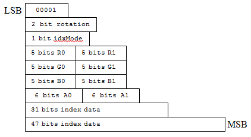

# BC7 Format Mode Reference

This documentation contains a list of the 8 block modes and bit allocations for BC7 texture compression format blocks.

The colors for each subset within a block are represented by two explicit endpoint colors and a set of interpolated colors between them. Depending on the block's index precision, each subset can have 4, 8 or 16 possible colors.

-   [Mode 0](#mode-0)
-   [Mode 1](#mode-1)
-   [Mode 2](#mode-2)
-   [Mode 3](#mode-3)
-   [Mode 4](#mode-4)
-   [Mode 5](#mode-5)
-   [Mode 6](#mode-6)
-   [Mode 7](#mode-7)
-   [Remarks](#remarks)
-   [Related topics](#related-topics)

## Mode 0

BC7 Mode 0 has the following characteristics:

-   Color components only (no alpha)
-   3 subsets per block
-   RGBP 4.4.4.1 endpoints with a unique P-bit per endpoint
-   3-bit indices
-   16 partitions

## Mode 1

BC7 Mode 1 has the following characteristics:

-   Color components only (no alpha)
-   2 subsets per block
-   RGBP 6.6.6.1 endpoints with a shared P-bit per subset)
-   3-bit indices
-   64 partitions

## Mode 2

BC7 Mode 2 has the following characteristics:

-   Color components only (no alpha)
-   3 subsets per block
-   RGB 5.5.5 endpoints
-   2-bit indices
-   64 partitions

## Mode 3

BC7 Mode 3 has the following characteristics:

-   Color components only (no alpha)
-   2 subsets per block
-   RGBP 7.7.7.1 endpoints with a unique P-bit per subset)
-   2-bit indices
-   64 partitions

## Mode 4

BC7 Mode 4 has the following characteristics:

-   Color components with separate alpha component
-   1 subset per block
-   RGB 5.5.5 color endpoints
-   6-bit alpha endpoints
-   16 x 2-bit indices
-   16 x 3-bit indices
-   2-bit component rotation
-   1-bit index selector (whether the 2- or 3-bit indices are used)

## Mode 5

BC7 Mode 5 has the following characteristics:

-   Color components with separate alpha component
-   1 subset per block
-   RGB 7.7.7 color endpoints
-   8-bit alpha endpoints
-   16 x 2-bit color indices
-   16 x 2-bit alpha indices
-   2-bit component rotation

## Mode 6

BC7 Mode 6 has the following characteristics:

-   Combined color and alpha components
-   One subset per block
-   RGBAP 7.7.7.7.1 color (and alpha) endpoints (unique P-bit per endpoint)
-   16 x 4-bit indices

## Mode 7

BC7 Mode 7 has the following characteristics:

-   Combined color and alpha components
-   2 subsets per block
-   RGBAP 5.5.5.5.1 color (and alpha) endpoints (unique P-bit per endpoint)
-   2-bit indices
-   64 partitions

## Remarks

Mode 8 (the least significant byte is set to 0x00) is reserved. Don't use it in your encoder. If you pass this mode to the hardware, a block initialized to all zeroes is returned.

In BC7, you can encode the alpha component in one of the following ways:

-   Block types without explicit alpha component encoding. In these blocks, the color endpoints have an RGB-only encoding, with the alpha component decoded to 1.0 for all texels.
-   Block types with combined color and alpha components. In these blocks, the endpoint color values are specified in the RGBA format, and the alpha component values are interpolated along with the color values.
-   Block types with separated color and alpha components. In these blocks the color and alpha values are specified separately, each with their own set of indices. As a result, they have an effective vector and a scalar channel separately encoded, where the vector commonly specifies the color channels \[R, G, B\] and the scalar specifies the alpha channel \[A\]. To support this approach, a separate 2-bit field is provided in the encoding, which permits the specification of the separate channel encoding as a scalar value. As a result, the block can have one of the following four different representations of this alpha encoding (as indicated by the 2-bit field):
    -   RGB\|A: alpha channel separate
    -   AGB\|R: "red" color channel separate
    -   RAB\|G: "green" color channel separate
    -   RGA\|B: "blue" color channel separate

    The decoder reorders the channel order back to RGBA after decoding, so the internal block format is invisible to the developer. Blocks with separate color and alpha components also have two sets of index data: one for the vectored set of channels, and one for the scalar channel. (In the case of Mode 4, these indices are of differing widths \[2 or 3 bits\]. Mode 4 also contains a 1-bit selector that specifies whether the vector or the scalar channel uses the 3-bit indices.)

## Related topics

<dl> <dt>

[BC7 Format](bc7-format.md)
</dt> </dl>

 

 

