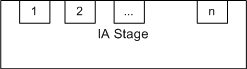

# Getting Started with the Input-Assembler Stage

There are a few steps necessary to initialize the input-assembler (IA) stage. For example, you need to create buffer resources with the vertex data that the pipeline needs, tell the IA stage where the buffers are and what type of data they contain, and specify the type of primitives to assemble from the data.

The basic steps involved in setting up the IA stage, shown in the following table, are covered in this topic.


| Step                                                                                    | Description                                                                                           |
|-----------------------------------------------------------------------------------------|-------------------------------------------------------------------------------------------------------|
| [Create Input Buffers](#create-input-buffers)                                           | Create and initialize input buffers with input vertex data.                                           |
| [Create the Input-Layout Object](#create-the-input-layout-object)                       | Define how the vertex buffer data will be streamed into the IA stage by using an input-layout object. |
| [Bind Objects to the Input-Assembler Stage](#bind-objects-to-the-input-assembler-stage) | Bind the created objects (input buffers and the input-layout object) to the IA stage.                 |
| [Specify the Primitive Type](#specify-the-primitive-type)                               | Identify how the vertices will be assembled into primitives.                                          |
| [Call Draw Methods](#call-draw-methods)                                                 | Send the data bound to the IA stage through the pipeline.                                             |


 

After you understand these steps, move on to [Using System-Generated Values](d3d10-graphics-programming-guide-input-assembler-stage-using.md).

## Create Input Buffers

There are two types of input buffers: [vertex buffers](/windows/desktop/direct3d10/d3d10-graphics-programming-guide-resources-types) and index buffers. Vertex buffers supply vertex data to the IA stage. Index buffers are optional; they provide indices to vertices from the vertex buffer. You may create one or more vertex buffers and, optionally, an index buffer.

After you create the buffer resources, you need to create an input-layout object to describe the data layout to the IA stage, and then you need to bind the buffer resources to the IA stage. Creating and binding buffers is not necessary if your shaders don't use buffers. For an example of a simple vertex and pixel shader that draws a single triangle, see [Using the Input-Assembler Stage without Buffers](d3d10-graphics-programming-guide-input-assembler-stage-no-buffers.md).

For help with creating a vertex buffer, see [Create a Vertex Buffer](/windows/desktop/direct3d10/d3d10-graphics-programming-guide-resources-creating). For help with creating an index buffer, see Create an Index Buffer.

## Create the Input-Layout Object

The input-layout object encapsulates the input state of the IA stage. This includes a description of the input data that is bound to the IA stage. The data is streamed into the IA stage from memory, from one or more vertex buffers. The description identifies the input data that is bound from one or more vertex buffers and gives the runtime the ability to check the input data types against the shader input parameter types. This type checking not only verifies that the types are compatible, but also that each of the elements that the shader requires is available in the buffer resources.

An input-layout object is created from an array of input-element descriptions and a pointer to the compiled shader (see [**ID3D11Device::CreateInputLayout**](/windows/desktop/api/D3D11/nf-d3d11-id3d11device-createinputlayout)). The array contains one or more input elements; each input element describes a single vertex-data element from a single vertex buffer. The entire set of input-element descriptions describes all of the vertex-data elements from all of the vertex buffers that will be bound to the IA stage.

The following layout description describes a single vertex buffer that contains three vertex-data elements:


```
D3D11_INPUT_ELEMENT_DESC layout[] =
{
    { L"POSITION", 0, DXGI_FORMAT_R32G32B32_FLOAT, 0, 0, 
          D3D11_INPUT_PER_VERTEX_DATA, 0 },
    { L"TEXCOORD", 0, DXGI_FORMAT_R32G32_FLOAT, 0, 12, 
          D3D11_INPUT_PER_VERTEX_DATA, 0 },
    { L"NORMAL", 0, DXGI_FORMAT_R32G32B32_FLOAT, 0, 20, 
          D3D11_INPUT_PER_VERTEX_DATA, 0 },
};
```


An input-element description describes each element contained by a single vertex in a vertex buffer, including size, type, location, and purpose. Each row identifies the type of data by using the semantic, the semantic index, and the data format. A [semantic](/windows/desktop/direct3dhlsl/dx-graphics-hlsl-semantics) is a text string that identifies how the data will be used. In this example, the first row identifies 3-component position data (*xyz*, for example); the second row identifies 2-component texture data (*UV*, for example); and the third row identifies normal data.

In this example of an input-element description, the semantic index (which is the second parameter) is set to zero for all three rows. The semantic index helps distinguish between two rows that use the same semantics. Since there are no similar semantics in this example, the semantic index can be set to its default value, zero.

The third parameter is the *format*. The format (see [**DXGI\_FORMAT**](/windows/desktop/api/dxgiformat/ne-dxgiformat-dxgi_format)) specifies the number of components per element, and the data type, which defines the size of the data for each element. The format can be fully typed at the time of resource creation, or you may create a resource by using a **DXGI\_FORMAT**, which identifies the number of components in an element, but leaves the data type undefined.

### Input Slots

Data enters the IA stage through inputs called *input slots*, as shown in the following illustration. The IA stage has *n* input slots, which are designed to accommodate up to *n* vertex buffers that provide input data. Each vertex buffer must be assigned to a different slot; this information is stored in the input-layout declaration when the input-layout object is created. You may also specify an offset from the start of each buffer to the first element in the buffer to be read.



The next two parameters are the *input slot* and the *input offset*. When you use multiple buffers, you can bind them to one or more input slots. The input offset is the number of bytes between the start of the buffer and the beginning of the data.

### Reusing Input-Layout Objects

Each input-layout object is created based on a shader signature; this allows the API to validate the input-layout-object elements against the shader-input signature to make sure that there is an exact match of types and semantics. You can create a single input-layout object for many shaders, as long as all of the shader-input signatures exactly match.

## Bind Objects to the Input-Assembler Stage

After you create vertex buffer resources and an input layout object, you can bind them to the IA stage by calling [**ID3D11DeviceContext::IASetVertexBuffers**](/windows/desktop/api/D3D11/nf-d3d11-id3d11devicecontext-iasetvertexbuffers) and [**ID3D11DeviceContext::IASetInputLayout**](/windows/desktop/api/D3D11/nf-d3d11-id3d11devicecontext-iasetinputlayout). The following example shows the binding of a single vertex buffer and an input-layout object to the IA stage:


```
UINT stride = sizeof( SimpleVertex );
UINT offset = 0;
g_pd3dDevice->IASetVertexBuffers( 
    0,                // the first input slot for binding
    1,                // the number of buffers in the array
    &g_pVertexBuffer, // the array of vertex buffers
    &stride,          // array of stride values, one for each buffer
    &offset );        // array of offset values, one for each buffer

// Set the input layout
g_pd3dDevice->IASetInputLayout( g_pVertexLayout );
```


Binding the input-layout object only requires a pointer to the object.

In the preceding example, a single vertex buffer is bound; however, multiple vertex buffers can be bound by a single call to [**ID3D11DeviceContext::IASetVertexBuffers**](/windows/desktop/api/D3D11/nf-d3d11-id3d11devicecontext-iasetvertexbuffers), and the following code shows such a call to bind three vertex buffers:


```
UINT strides[3];
strides[0] = sizeof(SimpleVertex1);
strides[1] = sizeof(SimpleVertex2);
strides[2] = sizeof(SimpleVertex3);
UINT offsets[3] = { 0, 0, 0 };
g_pd3dDevice->IASetVertexBuffers( 
    0,                 //first input slot for binding
    3,                 //number of buffers in the array
    &g_pVertexBuffers, //array of three vertex buffers
    &strides,          //array of stride values, one for each buffer
    &offsets );        //array of offset values, one for each buffer
```


An index buffer is bound to the IA stage by calling [**ID3D11DeviceContext::IASetIndexBuffer**](/windows/desktop/api/D3D11/nf-d3d11-id3d11devicecontext-iasetindexbuffer).

## Specify the Primitive Type

After the input buffers have been bound, the IA stage must be told how to assemble the vertices into primitives. This is done by specifying the [primitive type](/windows/desktop/direct3d11/d3d10-graphics-programming-guide-primitive-topologies) by calling [**ID3D11DeviceContext::IASetPrimitiveTopology**](/windows/desktop/api/D3D11/nf-d3d11-id3d11devicecontext-iasetprimitivetopology); the following code calls this function to define the data as a triangle list without adjacency:


```
g_pd3dDevice->IASetPrimitiveTopology( D3D_PRIMITIVE_TOPOLOGY_TRIANGLELIST );
```


The rest of the primitive types are listed in [**D3D\_PRIMITIVE\_TOPOLOGY**](/windows/desktop/api/D3DCommon/ne-d3dcommon-d3d_primitive_topology).

## Call Draw Methods

After input resources have been bound to the pipeline, an application calls a draw method to render primitives. There are several draw methods, which are shown in the following table; some use index buffers, some use instance data, and some reuse data from the streaming-output stage as input to the input-assembler stage.


| Draw Methods                                                                                  | Description                                                                                            |
|-----------------------------------------------------------------------------------------------|--------------------------------------------------------------------------------------------------------|
| [**ID3D11DeviceContext::Draw**](/windows/desktop/api/D3D11/nf-d3d11-id3d11devicecontext-draw)                                 | Draw non-indexed, non-instanced primitives.                                                            |
| [**ID3D11DeviceContext::DrawInstanced**](/windows/desktop/api/D3D11/nf-d3d11-id3d11devicecontext-drawinstanced)               | Draw non-indexed, instanced primitives.                                                                |
| [**ID3D11DeviceContext::DrawIndexed**](/windows/desktop/api/D3D11/nf-d3d11-id3d11devicecontext-drawindexed)                   | Draw indexed, non-instanced primitives.                                                                |
| [**ID3D11DeviceContext::DrawIndexedInstanced**](/windows/desktop/api/D3D11/nf-d3d11-id3d11devicecontext-drawindexedinstanced) | Draw indexed, instanced primitives.                                                                    |
| [**ID3D11DeviceContext::DrawAuto**](/windows/desktop/api/D3D11/nf-d3d11-id3d11devicecontext-drawauto)                         | Draw non-indexed, non-instanced primitives from input data that comes from the streaming-output stage. |


 

Each draw method renders a single topology type. During rendering, incomplete primitives (those without enough vertices, lacking indices, partial primitives, and so on) are silently discarded.

## Related topics

<dl> <dt>

[Input-Assembler Stage](d3d10-graphics-programming-guide-input-assembler-stage.md)
</dt> </dl>

 

 