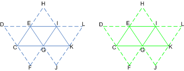

# Using System-Generated Values

System-generated values are generated by the IA stage (based on user-supplied input [semantics](/windows/desktop/direct3dhlsl/dx-graphics-hlsl-semantics)) to allow certain efficiencies in shader operations.

By attaching data, such as an instance id (visible to VS), a vertex id (visible to VS), or a primitive id (visible to GS/PS), a subsequent shader stage may look for these system values to optimize processing in that stage. For instance, the VS stage may look for the instance id to grab additional per-vertex data for the shader or to perform other operations; the GS and PS stages may use the primitive id to grab per-primitive data in the same way.

-   [VertexID](#vertexid)
-   [PrimitiveID](#primitiveid)
-   [InstanceID](#instanceid)
-   [Example](#example)
-   [Related topics](#related-topics)

## VertexID

A vertex id is used by each shader stage to identify each vertex. It is a 32-bit unsigned integer whose default value is 0. It is assigned to a vertex when the primitive is processed by the IA stage. Attach the vertex-id semantic to the shader input declaration to inform the IA stage to generate a per-vertex id.

The IA will add a vertex id to each vertex for use by shader stages. For each draw call, the vertex id is incremented by 1. Across indexed draw calls, the count resets back to the start value. For [**ID3D11DeviceContext::DrawIndexed**](/windows/desktop/api/D3D11/nf-d3d11-id3d11devicecontext-drawindexed) and [**ID3D11DeviceContext::DrawIndexedInstanced**](/windows/desktop/api/D3D11/nf-d3d11-id3d11devicecontext-drawindexedinstanced), the vertex id represents the index value. If the vertex id overflows (exceeds 2³²– 1), it wraps to 0.

For all primitive types, vertices have a vertex id associated with them (regardless of adjacency).

## PrimitiveID

A primitive id is used by each shader stage to identify each primitive. It is a 32-bit unsigned integer whose default value is 0. It is assigned to a primitive when the primitive is processed by the IA stage. To inform the IA stage to generate a primitive id, attach the primitive-id semantic to the shader input declaration.

The IA stage will add a primitive id to each primitive for use by the geometry shader or the pixel shader stage (whichever is the first stage active after the IA stage). For each indexed draw call, the primitive id is incremented by 1, however, the primitive id resets to 0 whenever a new instance begins. All other draw calls do not change the value of the instance id. If the instance id overflows (exceeds 2³²– 1), it wraps to 0.

The pixel shader stage does not have a separate input for a primitive id; however, any pixel shader input that specifies a primitive id uses a constant interpolation mode.

There is no support for automatically generating a primitive id for adjacent primitives. For primitive types with adjacency, such as a triangle strip with adjacency, a primitive id is only maintained for the interior primitives (the non-adjacent primitives), just like the set of primitives in a triangle strip without adjacency.

## InstanceID

An instance id is used by each shader stage to identify the instance of the geometry that is currently being processed. It is a 32-bit unsigned integer whose default value is 0.

The IA stage will add an instance id to each vertex if the vertex shader input declaration includes the instance id semantic. For each indexed draw call, instance id is incremented by 1. All other draw calls do not change the value of instance id. If instance id overflows (exceeds 2³²– 1), it wraps to 0.

## Example

The following illustration shows how system values are attached to an instanced triangle strip in the IA stage.

These tables show the system values generated for both instances of the same triangle strip. The first instance (instance U) is shown in blue, the second instance (instance V) is shown in green. The solid lines connect the vertices in the primitives, the dashed lines connect the adjacent vertices.

The following tables show the system-generated values for the instance U.

| Vertex Data    | C,U | D,U | E,U | F,U | G,U | H,U | I,U | J,U | K,U | L,U |
|----------------|-----|-----|-----|-----|-----|-----|-----|-----|-----|-----|
| **VertexID**   | 0   | 1   | 2   | 3   | 4   | 5   | 6   | 7   | 8   | 9   |
| **InstanceID** | 0   | 0   | 0   | 0   | 0   | 0   | 0   | 0   | 0   | 0   |

 

|                 | Value    | Value    | Value    |
|-----------------|-----|-----|-----|
| **PrimitiveID** | 0   | 1   | 2   |
| **InstanceID**  | 0   | 0   | 0   |

 

The following tables show the system-generated values for the instance V.

| Vertex Data    | C,V | D,V | E,V | F,V | G,V | H,V | I,V | J,V | K,V | L,V |
|----------------|-----|-----|-----|-----|-----|-----|-----|-----|-----|-----|
| **VertexID**   | 0   | 1   | 2   | 3   | 4   | 5   | 6   | 7   | 8   | 9   |
| **InstanceID** | 1   | 1   | 1   | 1   | 1   | 1   | 1   | 1   | 1   | 1   |

 

|                 |Value     | Value    |  Value   |
|-----------------|-----|-----|-----|
| **PrimitiveID** | 0   | 1   | 2   |
| **InstanceID**  | 1   | 1   | 1   |

 

The input assembler generates the ids (vertex, primitive, and instance); notice also that each instance is given a unique instance id. The data ends with the strip cut, which separates each instance of the triangle strip.

## Related topics

<dl> <dt>

[Input-Assembler Stage](d3d10-graphics-programming-guide-input-assembler-stage.md)
</dt> </dl>

 

 