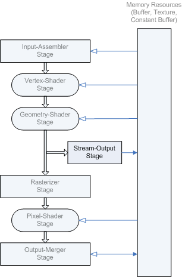

# Stream-Output Stage

The purpose of the stream-output stage is to continuously output (or stream) vertex data from the geometry-shader stage (or the vertex-shader stage if the geometry-shader stage is inactive) to one or more buffers in memory (see [Getting Started with the Stream-Output Stage](d3d10-graphics-programming-guide-output-stream-stage-getting-started.md)).

The stream-output stage (SO) is located in the pipeline right after the geometry-shader stage and just before the rasterization stage, as shown in the following diagram.

Data streamed out to memory can be read back into the pipeline in a subsequent rendering pass, or can be copied to a staging resource (so it can be read by the CPU). The amount of data streamed out can vary; the [**ID3D11DeviceContext::DrawAuto**](/windows/desktop/api/D3D11/nf-d3d11-id3d11devicecontext-drawauto) API is designed to handle the data without the need to query (the GPU) about the amount of data written.

When a triangle or line strip is bound to the input-assembler stage, each strip is converted into a list before they are streamed out. Vertices are always written out as complete primitives (for example, 3 vertices at a time for triangles); incomplete primitives are never streamed out. Primitive types with adjacency discard the adjacency data before streaming data out.

There are two ways to feed stream-output data into the pipeline:

-   Stream-output data can be fed back into the input-assembler stage.
-   Stream-output data can be read by programmable shaders using load functions (such as [Load](/windows/desktop/direct3dhlsl/dx-graphics-hlsl-to-load)).

To use a buffer as a stream-output resource, create the buffer with the [**D3D11\_BIND\_STREAM\_OUTPUT**](/windows/desktop/api/D3D11/ne-d3d11-d3d11_bind_flag) flag. The stream-output stage supports up to 4 buffers simultaneously.

-   If you are streaming data into multiple buffers, each buffer can only capture a single element (up to 4 components) of per-vertex data, with an implied data stride equal to the element width in each buffer (compatible with the way single element buffers can be bound for input into shader stages). Furthermore, if the buffers have different sizes, writing stops as soon as any one of the buffers is full.
-   If you are streaming data into a single buffer, the buffer can capture up to 64 scalar components of per-vertex data (256 bytes or less) or the vertex stride can be up to 2048 bytes.

## In this section

| Topic                                                                                                                               | Description                                                                                  |
|-------------------------------------------------------------------------------------------------------------------------------------|----------------------------------------------------------------------------------------------|
| [Getting Started with the Stream-Output Stage](d3d10-graphics-programming-guide-output-stream-stage-getting-started.md)  | This section describes how to use a geometry shader with the stream output stage.  |

 

## Related topics

<dl> <dt>

[Graphics Pipeline](overviews-direct3d-11-graphics-pipeline.md)
</dt> <dt>

[Pipeline Stages (Direct3D 10)](/windows/desktop/direct3d10/d3d10-graphics-programming-guide-pipeline-stages)
</dt> </dl>

 

