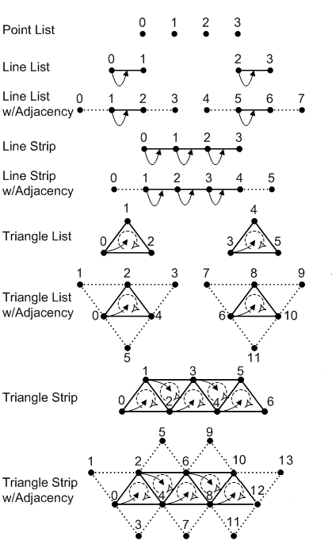
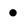
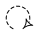
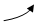

# Primitive Topologies

Direct3D 10 and higher supports several primitive types (or topologies) that are represented by the [**D3D\_PRIMITIVE\_TOPOLOGY**](/windows/desktop/api/D3DCommon/ne-d3dcommon-d3d_primitive_topology) enumerated type. These types define how vertices are interpreted and rendered by the pipeline.

-   [Basic Primitive Types](#basic-primitive-types)
-   [Primitive Adjacency](#primitive-adjacency)
-   [Winding Direction and Leading Vertex Positions](#winding-direction-and-leading-vertex-positions)
-   [Generating Multiple Strips](#generating-multiple-strips)
-   [Related topics](#related-topics)

## Basic Primitive Types

The following basic primitive types are supported:

-   [Point List](/windows/desktop/direct3d9/point-lists)
-   [Line List](/windows/desktop/direct3d9/line-lists)
-   [Line Strip](/windows/desktop/direct3d9/line-strips)
-   [Triangle List](/windows/desktop/direct3d9/triangle-lists)
-   [Triange Strip](/windows/desktop/direct3d9/triangle-strips)

For a visualization of each primitive type, see the diagram later in this topic in [Winding Direction and Leading Vertex Positions](#winding-direction-and-leading-vertex-positions).

The input-assembler stage reads data from vertex and index buffers, assembles the data into these primitives, and then sends the data to the remaining pipeline stages. (You can use the [**ID3D11DeviceContext::IASetPrimitiveTopology**](/windows/desktop/api/D3D11/nf-d3d11-id3d11devicecontext-iasetprimitivetopology) method to specify the primitive type for the input-assembler stage.)

## Primitive Adjacency

All Direct3D 10 and higher primitive types (except the point list) are available in two versions: one primitive type with adjacency and one primitive type without adjacency. Primitives with adjacency contain some of the surrounding vertices, while primitives without adjacency contain only the vertices of the target primitive. For example, the line list primitive (represented by the **D3D\_PRIMITIVE\_TOPOLOGY\_LINELIST** value) has a corresponding line list primitive that includes adjacency (represented by the **D3D\_PRIMITIVE\_TOPOLOGY\_LINELIST\_ADJ** value.)

Adjacent primitives are intended to provide more information about your geometry and are only visible through a geometry shader. Adjacency is useful for geometry shaders that use silhouette detection, shadow volume extrusion, and so on.

For example, suppose you want to draw a triangle list with adjacency. A triangle list that contains 36 vertices (with adjacency) will yield 6 completed primitives. Primitives with adjacency (except line strips) contain exactly twice as many vertices as the equivalent primitive without adjacency, where each additional vertex is an adjacent vertex.

## Winding Direction and Leading Vertex Positions

As shown in the following illustration, a leading vertex is the first non-adjacent vertex in a primitive. A primitive type can have multiple leading vertices defined, as long as each one is used for a different primitive. For a triangle strip with adjacency, the leading vertices are 0, 2, 4, 6, and so on. For a line strip with adjacency, the leading vertices are 1, 2, 3, and so on. An adjacent primitive, on the other hand, has no leading vertex.

The following illustration shows the vertex ordering for all of the primitive types that the input assembler can produce.

The symbols in the preceding illustration are described in the following table.

| Symbol                                                                                   | Name              | Description                                                                                                                                                                                        |
|------------------------------------------------------------------------------------------|-------------------|----------------------------------------------------------------------------------------------------------------------------------------------------------------------------------------------------|
|                      | Vertex            | A point in 3D space.                                                                                                                                                                               |
|  | Winding Direction | The vertex order when assembling a primitive. Can be clockwise or counterclockwise; specify this by calling [**ID3D11Device1::CreateRasterizerState1**](/windows/desktop/api/D3D11_1/nf-d3d11_1-id3d11device1-createrasterizerstate1). |
|        | Leading Vertex    | The first non-adjacent vertex in a primitive that contains per-constant data.                                                                                                                      |

 

## Generating Multiple Strips

You can generate multiple strips through strip cutting. You can perform a strip cut by explicitly calling the [RestartStrip](/windows/desktop/direct3dhlsl/dx-graphics-hlsl-so-restartstrip) HLSL function, or by inserting a special index value into the index buffer. This value is –1, which is 0xffffffff for 32-bit indices or 0xffff for 16-bit indices. An index of –1 indicates an explicit 'cut' or 'restart' of the current strip. The previous index completes the previous primitive or strip and the next index starts a new primitive or strip. For more info about generating multiple strips, see [Geometry-Shader Stage](/previous-versions//bb205146(v=vs.85)).

> [!Note]  
> You need [feature level](overviews-direct3d-11-devices-downlevel-intro.md) 10.0 or higher hardware because not all 10level9 hardware implements this functionality.

 

## Related topics

<dl> <dt>

[Getting Started with the Input-Assembler Stage](d3d10-graphics-programming-guide-input-assembler-stage-getting-started.md)
</dt> <dt>

[Pipeline Stages (Direct3D 10)](/windows/desktop/direct3d10/d3d10-graphics-programming-guide-pipeline-stages)
</dt> </dl>

 

 