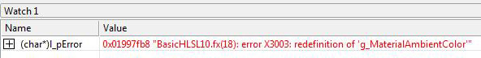

# Compile an Effect (Direct3D 11)

After an effect has been authored, the next step is to compile the code to check for syntax problems.

You do so by calling one of the compile APIs ([**D3DX11CompileFromFile**](d3dx11compilefromfile.md), [**D3DX11CompileFromMemory**](d3dx11compilefrommemory.md), or [**D3DX11CompileFromResource**](d3dx11compilefromresource.md) ). These APIs invoke the effect compiler fxc.exe, which compiles HLSL code. This is why the syntax for code in an effect looks very much like HLSL code. (There are a few exceptions that will be handled later). The effect compiler/hlsl compiler, fxc.exe, is available in the SDK in the utilities folder so that shaders (or effects) can be compiled offline if you choose. See the documentation for running the compiler from the command line.

-   [Example](#example)
-   [Includes](#includes)
-   [Searching for Include Files](#searching-for-include-files)
-   [Macros](#macros)
-   [HLSL Shader Flags](#hlsl-shader-flags)
-   [FX Flags](#fx-flags)
-   [Checking Errors](#checking-errors)
-   [Related topics](#related-topics)

## Example

Here's an example of compiling an effect file.


```
WCHAR str[MAX_PATH];
DXUTFindDXSDKMediaFileCch( str, MAX_PATH, L"BasicHLSL10.fx" );

hr = D3DX11CompileFromFile( str, NULL, NULL, pFunctionName, pProfile, D3D10_SHADER_ENABLE_STRICTNESS, NULL, NULL, &pBlob, &pErrorBlob, NULL );
```


## Includes

One parameter of the compile APIs is an include interface. Generate one of these if you want to include a customized behavior when the compiler reads an include file. The compiler executes this custom behavior each time it creates or compiles an effect (that uses the include pointer). To implement customized include behavior, derive a class from the [**ID3DInclude**](/windows/desktop/api/D3Dcommon/nn-d3dcommon-id3dinclude) interface. This provides your class with two methods: [**Open**](/windows/desktop/api/D3DCommon/nf-d3dcommon-id3dinclude-open) and [**Close**](/windows/desktop/api/D3DCommon/nf-d3dcommon-id3dinclude-close). Implement the custom behavior in these methods.

## Searching for Include Files

The pointer that the compiler passes in the *pParentData* parameter to your include handler's [**Open**](/windows/desktop/api/D3DCommon/nf-d3dcommon-id3dinclude-open) method might not point to the container that includes the \#include file that the compiler needs to compile your shader code. That is, the compiler might pass **NULL** in *pParentData*. Therefore, we recommend that your include handler search its own list of include locations for content. Your include handler can dynamically add new include locations as it receives those locations in calls to its **Open** method.

In the following example, suppose that the shader code's include files are both stored in the *somewhereelse* directory. When the compiler calls the include handler's [**Open**](/windows/desktop/api/D3DCommon/nf-d3dcommon-id3dinclude-open) method to open and read the contents of *somewhereelse\\foo.h*, the include handler can save the location of the **somewhereelse** directory. Later, when the compiler calls the include handler's **Open** method to open and read the contents of *bar.h*, the include handler can automatically search in the *somewhereelse* directory for *bar.h*.


```
Main.hlsl:
#include "somewhereelse\foo.h"

Foo.h:
#include "bar.h"
```


## Macros

Effect compilation can also take a pointer to macros that are defined elsewhere. For example, suppose you want to modify the effect in BasicHLSL10, to use two macros: zero and one. The effect code that uses the two macros is shown here.


```
if( bAnimate )
    vAnimatedPos += float4(vNormal, zero) *  
        (sin(g_fTime+5.5)+0.5)*5;
        
    Output.Diffuse.a = one;         
```


Here is the declaration for the two macros.


```
D3D10_SHADER_MACRO Shader_Macros[3] = { "zero", "0", "one", "1.0f", NULL, NULL };
```


The macros are a NULL-terminated array of macros; where each macro is defined by using a [**D3D10\_SHADER\_MACRO**](/windows/desktop/api/d3dcommon/ns-d3dcommon-d3d_shader_macro) struct.

Modify the compile effect call to take a pointer to the macros.


```
D3DX11CompileFromFile( str, Shader_Macros, NULL, pFunctionName, 
                       pProfile, D3D10_SHADER_ENABLE_STRICTNESS, NULL, 
                       NULL, &pBlob, &pErrorBlob, NULL );    
```


## HLSL Shader Flags

Shader flags specify shader constraints to the HLSL compiler. These flags affect the code generated by the shader compiler in the following ways:

-   Optimize the code size.
-   Including debug information, which prevents flow control.
-   Affects the compile target and whether a shader can run on legacy hardware.

These flags can be logically combined if you have not specified two conflicting characteristics. For a listing of the flags see [D3D10\_SHADER Constants](/windows/desktop/direct3d10/d3d10-shader).

## FX Flags

Use these flags when you create an effect to define either compilation behavior or runtime effect behavior. For a listing of the flags see [D3D10\_EFFECT Constants](/windows/desktop/direct3d10/d3d10-effect).

## Checking Errors

If during compilation an error occurs, the API returns an interface that contains the errors from the effect compiler. This interface is called [**ID3DBlob**](/previous-versions/windows/desktop/legacy/ff728743(v=vs.85)). It is not directly readable; however, by returning a pointer to the buffer that contains the data (which is a string), you can see any compilation errors.

This example contains an error in the BasicHLSL.fx, the first variable declaration occurs twice.


```
//-------------------------------------------------------------------
// Global variables
//-------------------------------------------------------------------
float4 g_MaterialAmbientColor;      // Material's ambient color

// Declare the same variable twice
float4 g_MaterialAmbientColor;      // Material's ambient color
```


This error causes the compiler to return the following error, as shown in the following screen shot of the Watch window in Microsoft Visual Studio.



Because the compiler returns the error in a LPVOID pointer, cast it to a character string in the Watch window.

Here is the code that returns the error from the failed compile.


```
// Read the D3DX effect file
WCHAR str[MAX_PATH];
ID3DBlob*   l_pBlob_Effect = NULL;
ID3DBlob*   l_pBlob_Errors = NULL;
hr = DXUTFindDXSDKMediaFileCch( str, MAX_PATH, L"BasicHLSL10.fx" );
hr = D3DX11CompileFromFile( str, NULL, NULL, pFunctionName, 
                       pProfile, D3D10_SHADER_ENABLE_STRICTNESS, NULL, 
                       NULL, &pBlob, &pErrorBlob, NULL );      

LPVOID l_pError = NULL;
if( pErrorBlob )
{
    l_pError = pErrorBlob->GetBufferPointer();
    // then cast to a char* to see it in the locals window
}
```


## Related topics

<dl> <dt>

[Rendering an Effect (Direct3D 11)](d3d11-graphics-programming-guide-effects-render.md)
</dt> </dl>

 

 